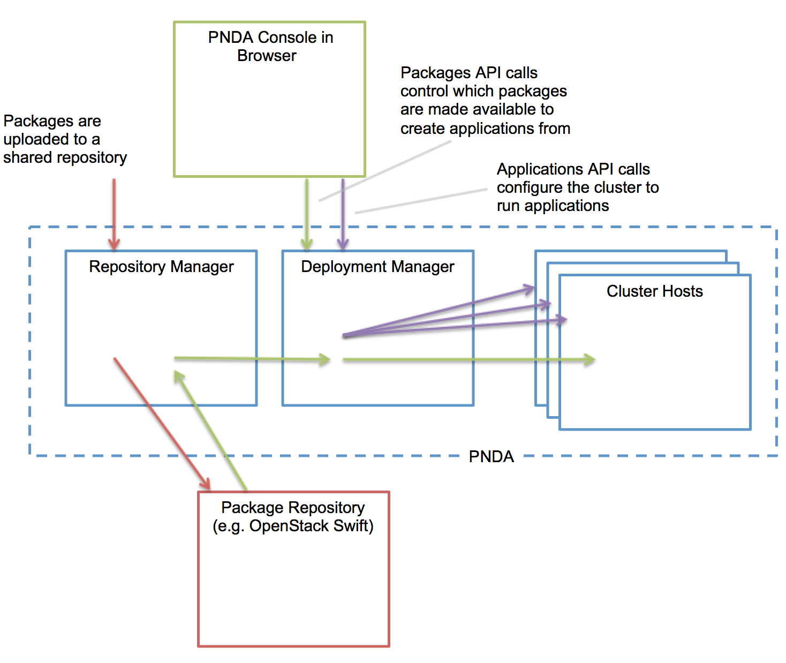

# Applications on PNDA #

Packages are independently deployable units of application layer functionality. Each package consists of one or more components, each of which has a defined type.

Applications are instances of packages.

The following diagram shows an overview of the purpose of the Deployment Manager.



## Package Convention ##

- The driving principle for packages and deployment is convention over configuration. 
- All packages are deployable and functional without any additional operator configuration.
- Package structure is metadata. This metadata is used by the Deployment Manager to determine naming, paths and other deployment time concerns.
- Non-conforming packages are rejected on deployment.

## Lifecycle Overview ##

The lifecyle of packages and applications is as follows. You can manage [packages](../console/packages.md) and [applications](../console/applications.md) in the console, or using the [API](https://github.com/pndaproject/platform-deployment-manager/blob/master/README.md#api-documentation).

- Packages are uploaded to a repository. The repository is just a file store, and the deployment manager has modules that retrieve packages from different kinds of repositories so that different storage solutions can be used to hold the tar.gz package files.
- Packages are deployed from the repository to a PNDA cluster. They are copied from the repository to local storage on the cluster, validated and parsed for metadata.
- Applications are created from deployed packages. Property overrides may be set at this time.
- Applications can be started once created, and paused / restarted once running.
- Applications can be destroyed to completely uninstall them from the cluster.
- Packages can be undeployed from the cluster, at which point no new applications can be created from them but existing applications will continue to run.


## Package Structure ##

The basic package structure is as follows: 

	artefact-version.tar.gz

    package name
        component type A
            component A1
        component type B
            component B1
            component B2

- Packages are archived and compressed using tar and gzip and take the name of the associated artefact and version, following [strict versioning](http://legacy.python.org/dev/peps/pep-0386).
- Packages must have a three part version number, e.g. `my-package-1.2.3.tar.gz`.
- The folder inside the package tar must have the same name as the archive (minus `.tar.gz`).
- The component types are taken from a controlled list, as described in the following sections.
- Component names are chosen by the package developer and will be used by the Deployment Manager.
- Each component type has a distinct structure specification, as described in the following sections.

### Example ###

 my-etl-process-1.0.23.tar.gz
    
	my-etl-process
    	oozie
    		etl-app


## Component Types ##

The following component types currently are supported.

- **oozie**
 - An oozie application, consisting of a workflow and/or coordinator plus a set of supporting libraries and/or scripts (e.g. a Pig or Spark application). A coordinator runs periodically on a defined schedule, whereas a workflow must be manually run by using the start application API each time you want to run it.
 - The job properties will automatically include all variables known to the deployment manager. 
- **sparkStreaming**	
 - A spark streaming application.
 - A text file named `application.properties` will be automatically appended with all variables known the the deployment manager and made available on the classpath. 
- **jupyter**	
 - A set of one or more notebook .ipynb files are deployed to Jupyter. They are not run automatically.
 
## Descriptors ##

All component types may contain the following optional descriptors.

### Properties ###

Component level settings may be defined in a json format text file called `properties.json` with the following contents:

````
{
    "name": "value",
    ...
}
````

Component level variables will be created for each item in this file, named `component_name` and referenced as expansion variables in other descriptor files as `${component_name}`. These variables may be overridden at application creation time, in the PUT body.

### HDFS ###

Folders may be created in HDFS by including a json format text file called `hdfs.json` with the following contents:
````
[
    {
        "name": "my_hdfs_path",
        "path": "/path/to/${component_package}/directory",
        "delete_on_undeploy": 2
    },
    {
        ...
    }
]
````

Expansion variables may be used at any point in this file.

A variable named hdfspath_name will be created for each defined path.

`delete_on_undeploy` specifies the number of directories to delete when the application is destroyed. In this example `/path/to/${component_package}` would be deleted from `/path/to`.

### HBase ###

Tables may be created in hbase by including a json format text file called `hbase.json` with the following contents:
````
[
    {
        "col_family": "cf",
        "hive_schema": [
            "DROP TABLE ${component_table}",
            "CREATE EXTERNAL TABLE ${component_table}  (id STRING, field STRING) STORED BY \"org.apache.hadoop.hive.hbase.HBaseStorageHandler\" WITH SERDEPROPERTIES (\"hbase.columns.mapping\" = \":key,cf:field\") TBLPROPERTIES(\"hbase.table.name\" = \"${component_table}\")"
        ],
        "table": "${component_derived_metrics_table}"
    },
    {
        ...
    }
]
````
Expansion variables may be used at any point in this file.

hive_schema is optional but may be included to allow the table to be queried with Impala. This is an array of SQL DDL statements to execute.

### OpenTSDB ###

Metric series may be created in OpenTSDB by including a json format text file called `opentsdb.json` with the following contents:
````
[
    {
        "name": "my_time_series_name"
    },
    {
        ...
    }
]
````

Expansion variables may be used at any point in this file.

## Runtime metrics ##

Metrics can be reported from running applications and viewed in the PNDA console.

Metrics should be posted to the metric logger interface using HTTP according to this specification using names of the form:

    application.kpi.application-name.metric-name

The URL to post metrics to is available in the `environment_metric_logger_url` variable and the application name in the `component_application` variable.

