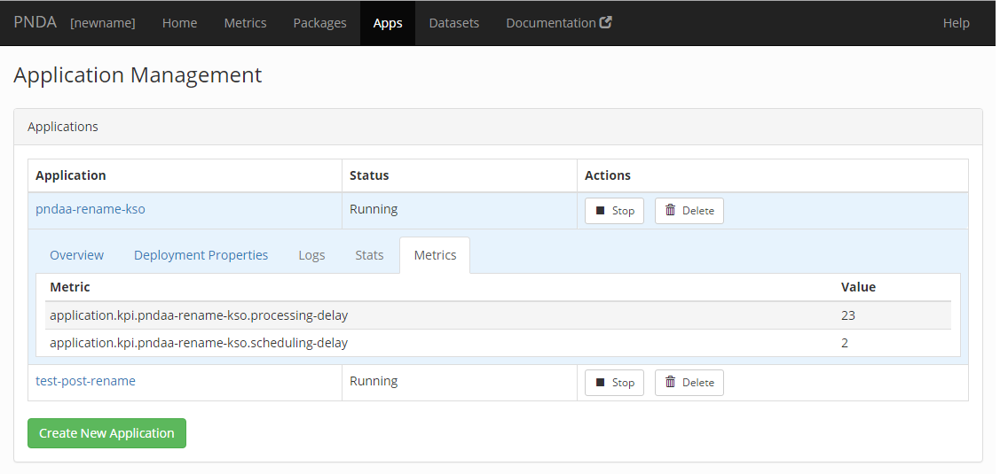
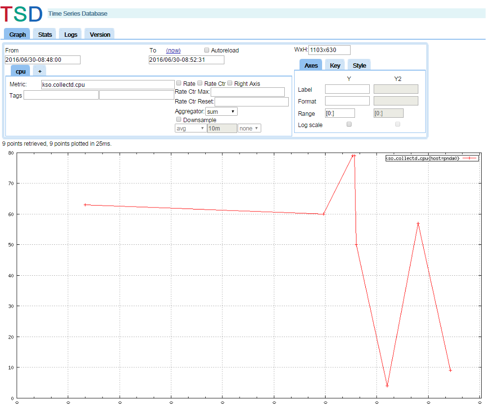

# Spark Streaming and OpenTSDB tutorial

## Objectives

In this lab, you will discover how to compile and deploy a [Spark Streaming](https://github.com/pndaproject/example-applications/tree/master/kafka-spark-opentsdb) application and then use [OpenTSDB](../timeseries/opentsdb.md) to query the data which have been written in [HBase](https://hbase.apache.org/).

Applications that run on PNDA are packaged as `tar.gz` archives and pushed to an application repository. The `tar` archive contains all the binaries and configuration required to run the application. 

You'll learn how to use the [Deployment Manager API](https://github.com/pndaproject/platform-deployment-manager) to deploy a  package from the package repository and run it on the cluster.

# Prerequisites

Make sure you are familiar with the following before proceeding with the lab:

- The [getting started](../gettingstarted/README.md) guide will introduce you to many concepts used in this lab.
- The [console](../console/README.md) is your starting point for interacting with a PNDA cluster. All of the main features of PNDA can be accessed from the console.
- The [Deployment Manager API](https://github.com/pndaproject/platform-deployment-manager) provides a mechanism for discovering available packages and deploying & undeploying functionality. It works with a well-defined package structure to make it fast and straightforward to get real scalable analytics running on the platform.
- Make sure that your package repository is correctly configured as described in the [platform requirements](../provisioning/platform_requirements.md).
- The [platform-package-repository](https://github.com/pndaproject/platform-package-repository) tool lets you upload packages to OpenStack Swift. 
- Read the technical notes in the [example repository](https://github.com/pndaproject/example-applications/tree/master/kafka-spark-opentsdb).


## Requirements

Make sure you have the following installed on your development computer: 

- a REST client such as [Poster](https://addons.mozilla.org/en-US/firefox/addon/poster/)
- [Scala SBT](http://www.scala-sbt.org) interactive build tool

## Running the application

### Download the application code base

The PNDA distribution is available on GitHub at:

 * [https://github.com/pndaproject](https://github.com/pndaproject)

Clone the [example-applications](https://github.com/pndaproject/example-applications/tree/master/kafka-spark-opentsdb) repository. 

### Compile with sbt

In the root folder, run the command:
```
sbt assembly
```

### Package your application

To build the release 1.0.0 of your application, run:

```
cd app/src/main/resources/
mkdir darkvader-1.0.0
cp -r sparkStreaming darkvader-1.0.0

tar zcf darkvader-1.0.0.tar.gz darkvader-1.0.0
```

### Upload the app package to the PNDA app repository

Use the [platform-package-repository](https://github.com/pndaproject/platform-package-repository) tool to upload the application tar.gz file to your application repository.

### Run the application

Use the graphical interface in the console to deploy [packages](../console/packages.md) and start [applications](../console/applications.md). 

## Producing test data

The technical notes in the [example repository](https://github.com/pndaproject/example-applications/tree/master/kafka-spark-opentsdb) describe how to set up a test producer that will create suitable test data for consumption by this example application.

## Understanding what the application is doing

The messages on Kafka are [Avro](https://avro.apache.org/docs/current/) encoded and look like this:
``` 
 src: "collectd"
 timestamp: 1453480869657
 host_ip: "bb80:0:1:2:a00:bbff:bbee:b123"
 rawdata: "{'host':'pnda0','collectd_type':'cpu','value':'90','timestamp':'2016-02-15T13:00:12.000Z'}"
```
 - src is indicating that this is a collectd agent
 - raw data is containing dynamic value of CPU usage for a set of pnda hosts


The Spark Streaming app uses raw data. Create a new structure and push it to the OpenTSDB timeseries database like this:
```
  - timestamp
  - kso.collectd.cpu as the OpenTSDB metric
  - host as a tag
  - value
```

The Spark Streaming code is located [here](https://github.com/pndaproject/example-applications/blob/master/kafka-spark-opentsdb/src/main/scala/com/cisco/pnda/PndaConsumer.scala).
```
kafka-spark-opentsdb/src/main/scala/com/cisco/pnda/PndaConsumer.scala
```
You can learn more about these Spark Streaming API calls and the rest of the API by reading the [Spark Streaming documentation](http://spark.apache.org/docs/1.3.0/streaming-programming-guide.html).


## Checking the output

Once running and consuming data the example application will display some KPIs in the console.



[OpenTSDB](../timeseries/opentsdb.md) offers a number of means to extract data, such as CLI tools, an HTTP API and as a GnuPlot graph. Querying with OpenTSDB's tag based system can be a bit tricky, so read through this document and checkout the [OpenTSDB HTTP API format](thttp://opentsdb.net/docs/build/html/user_guide/query/index.html) page for further information.

Use the [Main console](../console/README.md) to navigate to the OpenTSDB UI. Try entering a current time window and experiment with the autocompleting "Metric" field to find data to display.




### Query the data using API

You can also use the OpenTSDB API in order to retrieve data in an efficient way according to your needs. Here are some examples:

Get all points of a time series for a specific period:
```
GET /api/query?start=2016/02/05-00:00:00&end=2016/02/05-00:30:00&m=sum:kso.collectd.cpu{host=pnda0}
```
This will return a response such as:
```
[{"metric":"kso.collectd.cpu","tags":{"host":"pnda0"},"aggregateTags":[],"dps":{"1454630401":32.0,"1454630462":49.0,"1454630521":0.0,"1454630582":39.0,"1454630642":13.0,"1454630701":9.0,"1454630762":11.0,"1454630821":6.0,"1454630882":69.0,"1454630942":29.0,"1454631001":27.0,"1454631062":77.0,"1454631121":73.0,"1454631182":12.0,"1454631241":2.0,"1454631302":5.0,"1454631362":48.0,"1454631421":14.0,"1454631482":46.0,"1454631541":93.0,"1454631602":75.0,"1454631661":3.0,"1454631722":26.0,"1454631781":33.0,"1454631842":9.0,"1454631901":67.0,"1454631962":55.0,"1454632021":90.0,"1454632082":10.0,"1454632141":64.0}}]
```

## Cleaning up

If you no longer need it, stop the application and undeploy the package via the console.
