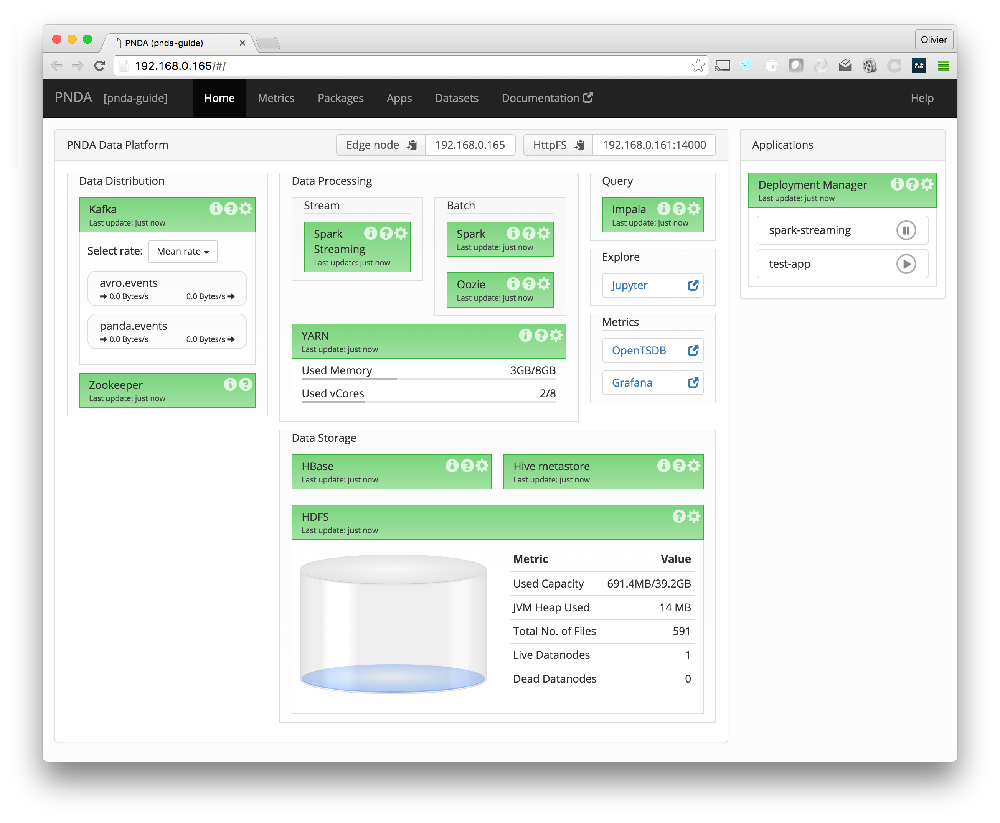

# PNDA Console

The PNDA console provides a real-time overview of all the components in a PNDA cluster.

See the following pages for a description of features available on other tabs:

  * [Metrics](metrics.md)
  * [Packages](packages.md)
  * [Applications](applications.md)
  * [Datasets](datasets.md)

### Connecting

Once you have provisioned a cluster, you can connect to the PNDA console at `http://clustername-cdh-edge`, where `clustername` is the name of your cluster.

# Home

The home page shows health statistics of various different components which make up PNDA. Components are grouped into categories, including data distribution, data processing, data storage, applications, etc.

Components are displayed in green if everything is functioning properly, yellow if there is a warning, or red if there is an error. Some components show additional details on the home page, such as the amount of data in the [HDFS](#hdfs) file system. 

## Contextual links

Components have buttons that perform various functions:

* Click on the `(i)` icon to open a popup with detailed metrics for a component.
* Click on the `(?)` icon for contextual help for a component.
* Click on the gear icon to configure a component. 

There is also a Help link in the toolbar that explains how to use each page in the console. 

## Resolving issues

When all is well everything will be green, but if problems arise then you may see some components with warnings or errors.  

If a component is in a warning or error state, the `(i)` icon will be replaced by an exclamation mark `(!)` icon, which you can click to see more detailed information about the problem. 

For example, if the HDFS component is in an error state, the popup will show the causes of the problem, and a link to the configuration page for the component so that you can resolve the problem.

# Components

This section describes each of the components on the home page of the console, and the role it plays in PNDA. 

## Data distribution

### Kafka

[Apache Kafka](http://kafka.apache.org/) is a high-throughput, distributed, publish-subscribe messaging system.

In PNDA, it is used to collect data ready for processing. It decouples data aggregation (publishers) from data analysis (consumers), allowing any application to consume data present on Kafka.

### Zookeeper

[Apache Zookeeper](http://zookeeper.apache.org/) provides an open source distributed configuration service, synchronization service, and naming registry for large distributed systems.

It is used by [Kafka](#kafka) for coordination of its distributed operations, to track leadership and to store topic metadata.

## Data processing

### Spark

[Apache Spark](http://spark.apache.org) is framework and engine for distributed, large scale data processing.

In PNDA, it allows for both batch mode and streaming computation.

### Batch: Oozie

[Apache Oozie](https://oozie.apache.org) is a workflow scheduler system to manage Apache Hadoop jobs.

In PNDA, batch mode Spark jobs are run on a regular schedule by Oozie.

### YARN

Apache Hadoop [YARN](http://hadoop.apache.org/docs/current/hadoop-yarn/hadoop-yarn-site/YARN.html) (Yet Another Resource Negotiator) is a cluster management technology.

It coordinates running of jobs and their component tasks on a cluster, allocating memory and cores to those tasks.

## Query

### Impala

[Apache Impala](http://impala.io) is a parallel execution engine for SQL queries. It supports low-latency access and interactive exploration of data in [HDFS](#hdfs) and [HBase](#hbase).

Impala allows data to be stored in a raw form in [HDFS](#hdfs) and [HBase](#hbase), with aggregation performed at query time without requiring upfront aggregation of data.

## Explore

### Jupyter

The [Jupyter Notebook](../repos/example-jupyter-notebooks/README.md) is a web application that allows you to create and share documents that contain live code, equations, visualizations and explanatory text.

In PNDA, it supports exploration and presentation of data from [HDFS](#hdfs) and [HBase](#hbase).

## Metrics

### OpenTSDB

[OpenTSDB](../timeseries/opentsdb.md) is a scalable time series database that lets you store and serve massive amounts of time series data, without losing granularity.

In PNDA, a custom application (reading data from [Kafka](#kafka) or [HDFS](#hdfs) for example) could write time series and store them in OpenTSDB.

### Grafana

[Grafana](../timeseries/grafana.md) is a graph and dashboard builder for visualizing time series metrics.

It is pre-configured to connect to OpenTSDB as its data source. It is much easier to create dashboards in Grafana than using the OpenTSDB user interface.

## Data Storage

### HBase

[HBase](http://hbase.apache.org/) is a distributed, scalable data store, designed for fast, random access to very large data sets, i.e. millions of columns and billions of rows.

In PNDA, a custom application (reading data from [Kafka](#kafka) or [HDFS](#hdfs) for example) could write arbitrary key/value data into HBase.

### Hive metastore

The [Hive metastore](http://www.cloudera.com/documentation/archive/cdh/4-x/4-2-0/CDH4-Installation-Guide/cdh4ig_topic_18_4.html) service stores the metadata for Hive tables and partitions in a relational database, and provides clients access to this information via the metastore service API.

In PNDA, the [Hive metastore](http://www.cloudera.com/documentation/archive/cdh/4-x/4-2-0/CDH4-Installation-Guide/cdh4ig_topic_18_4.html) sits on top of [HDFS](#hdfs) to provide a relational schema mapping that allows data to be queried through [Impala](#impala).

### HDFS

[HDFS](http://hadoop.apache.org/) is a fault tolerant and self-healing distributed file system, suited to large-scale data processing workloads.

In PNDA, [gobblin](../repos/gobblin/README.md) runs every half an hour to copy all data from [Kafka](#kafka) into the master dataset in HDFS. The master dataset is a historical store of all data. Applications can also output data in HDFS.

## Applications

This section shows an overview of applications that have been deployed, and lets you launch apps. For more information, see the [applications](applications.md) page.

## Console

### Backend

#### Data Logger

The data logger is a service that collects all the data displayed in the console. It has POST APIs for collecting metrics, as well as package and application data.

#### Data Manager

The data manager is a service providing data to the console front-end or other clients. It has REST APIs for retrieving data about metrics, packages and applications, and also a web sockets API for real-time notifications.

### Front-end

The console front-end (often referred to as the Console itself) is a web application providing an overview of all the components in a PNDA cluster.