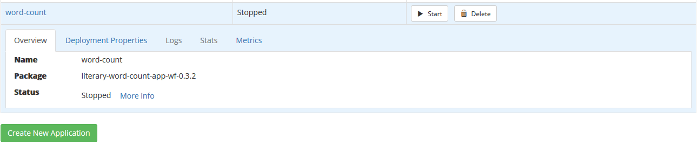
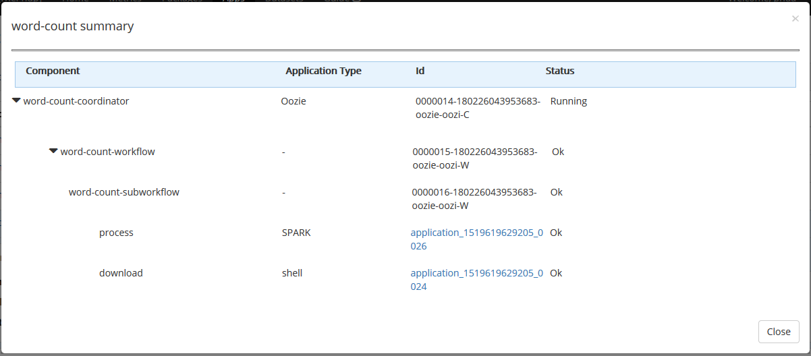
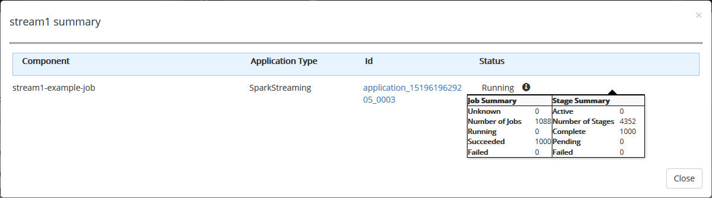
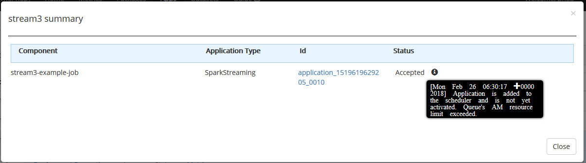
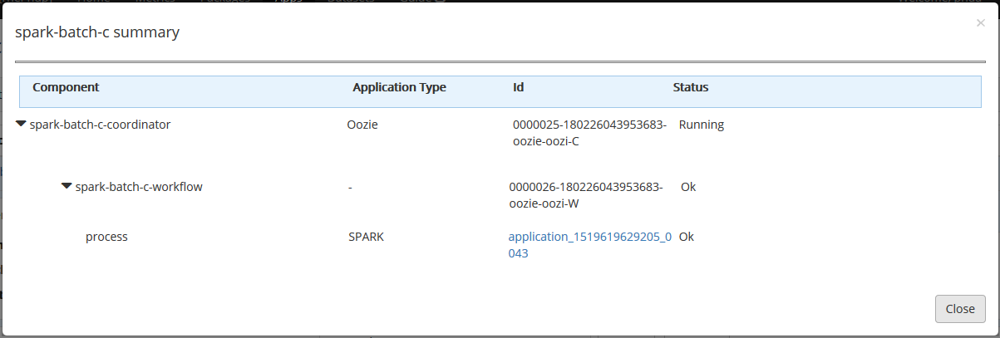
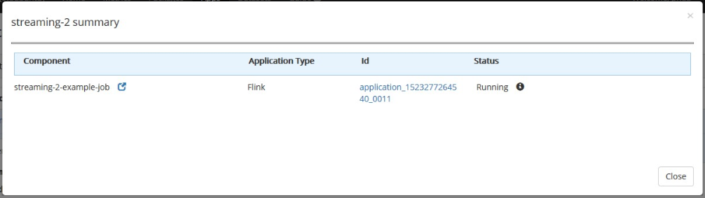

# Applications

The apps page lets you manage the lifecycle of [applications](../applications/README.md), which are instances of packages. You can create a new application from a deployed package, see the status of each application, and start, pause or delete them.

Click an application for more detailed information. There are tabs that show the overview, deployment properties, logs, statistics and metrics (application key performance indicators, or KPIs). 

## Creating applications

Click the "Create New Application" button to create a new application from a package that has been deployed. If your package is not listed, you should deploy it first on the [Packages](packages.md) page. 

First, choose a deployed package and version to use from the list. 

Next, the default application properties for the package will be displayed. Click on any default value to modify it. When you are done, click "Next".

Finally, enter a name for your new application, and click "Confirm". The new app will then be displayed in the list.

## Working with applications

By default, a new app is not running. Click the "Start" button next to an app to start it, or click the "Pause" button next to a running app to pause it. You can also click the "Delete" button next to an app to delete it.

## Application Detailed Summary

Once the application starts, status is shown as Running. To know the actual status of jobs which are spawned by that applicaition, click "More info" link.

On clicking that, the details are shown as below.

### Detailed summary - SparkStreaming

For Spark Streaming applications, job status will be queried from YARN and Spark server.
Different status in Spark Streaming application are:

- CREATED - SparkStreaming Application is created
- ACCEPTED - Application is with YARN, in accepted state
- RUNNING - Application running and spark server returned all jobs as succeeded (last 1000 jobs)
- RUNNING_WITH_ERROS - Application is running and spark server returned with one or more jobs failed (last 1000 jobs)
- FINISHED_FAILED - Application execution completed with yarn state as FINISHED and finalStatus as FAILED
- FINISHED_KILLED - Application execution completed with yarn state as FINISHED and finalStatus as KILLED
- FAILED - Application execution completed with yarn state and finalStatus as FAILED
- KILLED - Application execution completed with yarn state and finalStatus as KILLED

Summary data provides a link to the application which leads to Application overview and Metrics page of YARN.
In cases of ACCEPTED, FAILED and KILLED, summary data will provide a diagnostic information from YARN (in information tool tip).

### Detailed summary - OOZIE

For OOZIE applications, job status will be queried from OOZIE and YARN. Depending on the end job type, respective component will be queried (like Spark Server for Spark job).
Different status in OOZIE application are:

- CREATED - Oozie application is created and is not yet started
- STARTING - Oozie application is getting started
- RUNNING - Running properly with all jobs in running or succeeded state
- RUNNING_WITH_ERRORS - Running, but one or more end jobs in failed state
- SUSPENDED - User stops the oozie application when all workflows/jobs are in succeeded state
- SUSPENDED_WITH_FAILURES - User stops the oozie application when one or more workflows/jobs are in failed state
- KILLED - User kills the oozie application when all workflows/jobs are in succeeded state
- KILLED_WITH_FAILURES - User kills the oozie application when one or more workflows/jobs are in failed state
- COMPLETED - OOZIE application finished all its workflows/jobs and all are in succeeded state
- COMPLETED_WITH_FAILURES - OOZIE application finished all its workflows/jobs and one or more in failed state

### Detailed summary - Flink Streaming

For Flink applications, job status will be queried from YARN and Flink server. Different status in Flink applications are:

- CREATED - Flink Streaming Application is created
- ACCEPTED - Application is with YARN, in accepted state
- RUNNING - Application running properly with all vertices in running or succeeded state
- RUNNING_WITH_ERRORS -  Running but one or more vertices in failed state
- FINISHED_SUCCEDED - Application execution completed with yarn state as FINISHED and final status as SUCCEEDED
- FAILED - Application execution completed with yarn state and final status as FAILED
- KILLED - Application execution completed with yarn state and final status as KILLED

