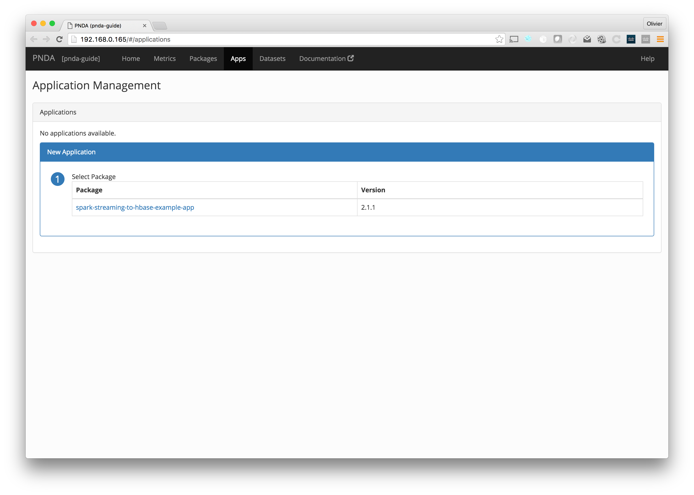
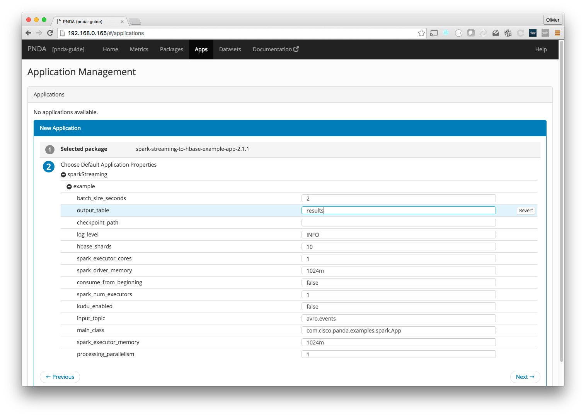
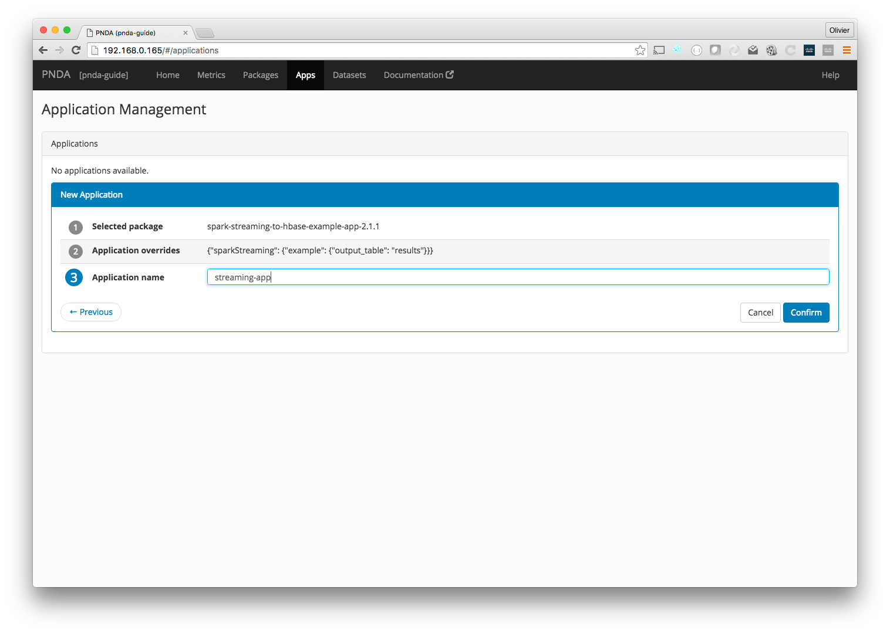
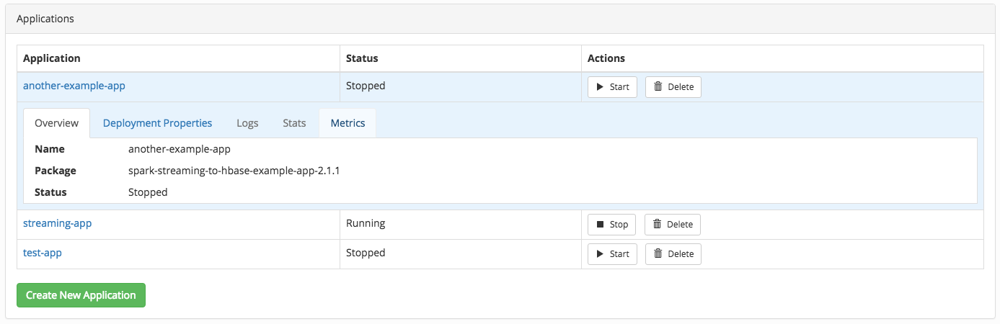

# Applications

The apps page lets you manage the lifecycle of [applications](../applications/README.md), which are instances of packages. You can create a new application from a deployed package, see the status of each application, and start, pause or delete them.

Click an application for more detailed information. There are tabs that show the overview, deployment properties, logs, statistics and metrics (application key performance indicators, or KPIs). 

## Creating applications

Click the "Create New Application" button to create a new application from a package that has been deployed. If your package is not listed, you should deploy it first on the [Packages](packages.md) page. 

First, choose a deployed package and version to use from the list. 

Next, the default application properties for the package will be displayed. Click on any default value to modify it. When you are done, click "Next".

Finally, enter a name for your new application, and click "Confirm". The new app will then be displayed in the list.

## Working with applications

By default, a new app is not running. Click the "Start" button next to an app to start it, or click the "Pause" button next to a running app to pause it. You can also click the "Delete" button next to an app to delete it.

