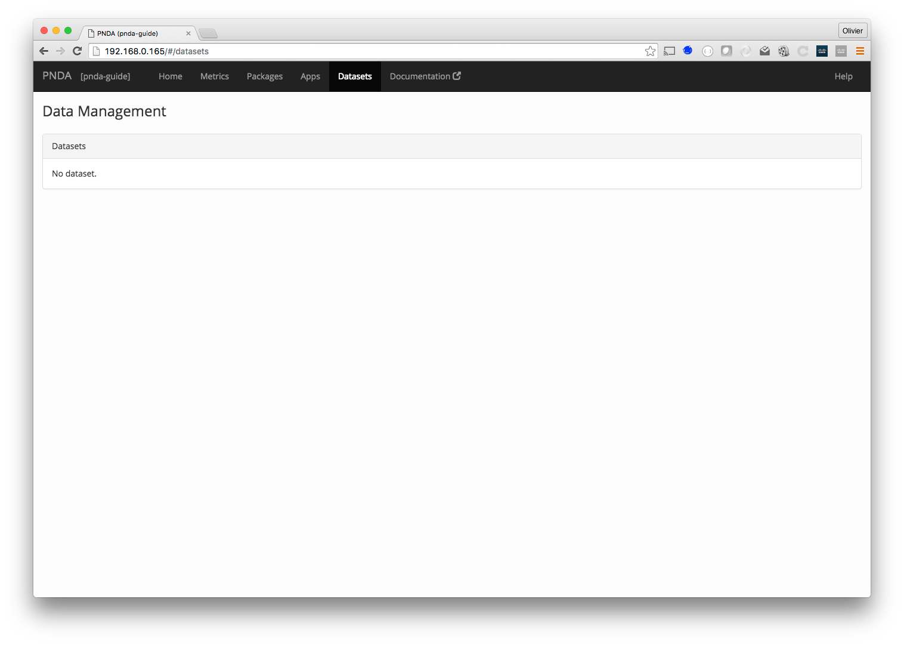

# Datasets

The datasets page lets you manage the data retention policy of each dataset in the cluster. As a big data system, PNDA is capable of storing a large amount of data. However, to manage your data storage costs you can choose to put an upper limit on the amount of data that is retained. 

All data stored in PNDA is divided into datasets. Each dataset has a unique identifier, such as `netflow`, `telemetry`, etc. You can customize the data retention policy for each dataset individually, as your needs may be different for each kind of data. 

If you need to retain data indefinitely, you can choose to keep it. Otherwise you can choose what happens to data when it has reached the limit. If you need to retain the data after it is removed from PNDA, you can choose to have it archived. If you no longer need the data, you can have it deleted. 

You can limit the amount of data by age or by size. If you choose to limit the data by age, you can specify the maximum age in days. Alternatively if you choose to limit the data by size, you can specify the maximum size in gigabytes. 



## Setting policies

The datasets page contains a table that lists all datasets in the current cluster, showing the current data retention policy. You cannot add datasets on this page, only modify the policy for existing datasets.

- From the mode popup menu, choose whether you want to keep data indefinitely, or archive or delete data that has exceeded the limit. 
- From the policy popup menu, choose whether you want to limit data by age or by size. 
- In the limit column, you can enter the maximum age in days, or size in gigabytes, depending upon the policy.  

After you have made changes, click the Save button to review and confirm the changes that will be made. For example, if you are changing the limit from 30 to 20 gigabytes, the message will confirm that up to 10 gigabytes of data could be archived or deleted.

## Creating datasets

Datasets are automatically created based on the name of the `source` field in Kafka messages by [gobblin](https://github.com/pndaproject/platform-gobblin-modules). See the [getting started](../gettingstarted/README.md#producer-integration) for more information on how datasets are created.  

## Dataset Compaction

To consolidate files in a dataset, [Gobblin Compaction](https://gobblin.readthedocs.io/en/latest/user-guide/Compaction/) can be used.  Compaction schedule is defined at the time of PNDA cluster creation.  Compaction can be enabled and set to run on hourly, daily, monthly or yearly schedule.

Consider below compaction job config snippet for daily run of compaction job, scheduled to run at  01:00:00 hours as a cron.
```
Input directory: /user/pnda/PNDA_datasets/datasets
compaction directory: /user/PNDA_datasets/compacted
compaction schedule: daily
folder pattern: “year=YYYY/month=MM/day=dd”
min.time.ago = 1h
max.time.ago = 1d2h
```
All datasets in the input directory are considered for compaction
For example if /user/pnda/PNDA_datasets/datasets/ has dataset directories "source
=dir1" and "source=dir2".  Contents of both directories are considered for compaction.


List of input files for compaction from a dataset is selected based on **min.time.ago** and **max.time.ago**, as illustrated above.  Only late arrivals are picked up for compaction, from those folders which were part of the previous compaction cycle.

For example, daily compaction for day 2018-03-12 will start at 2018-03-12 01:00:00 hours.

It will consider all files in the dataset directories, starting from:
```
/user/pnda/PNDA_datasets/datasets/source=dir1/year=2018/month=03/day=10/hour=23
/user/pnda/PNDA_datasets/datasets/source=dir1/year=2018/month=03/day=11/hour=00
...
...
/user/pnda/PNDA_datasets/datasets/source=dir1/year=2018/month=03/day=11/hour=23
/user/pnda/PNDA_datasets/datasets/source=dir1/year=2018/month=03/day=12/hour=00
```
Only those files with a modification time > 2018-03-11 01:00 hrs, are selected from directory “day=10/hour=23” and “day=11/hour=00”.  Other files in these directories were part of the previous compaction cycle and hence are not selected.

After compaction, the compacted files are kept in the output directory (directory structure will follow the pattern defined in “folder pattern”.  In addition to the compacted file, this directory will also have \_COMPACTION\_COMPLETE and _SUCCESS.  \_COMPACTION\_COMPLETE contains the timestamp of when the compaction job started.  All files in the input folders with earlier modification timestamps have been compacted.  Next run of compaction will only consider the files in the input folders with the later timestamps.  _SUCCESS is created only when the compaction is successfully completed.  Compacted filename has the following pattern:

**part-m{RecordCount}.{SystemCurrentTimeInMills}.{RandomInteger}.avro**

After compaction on 2018-03-12 01:00 hrs, the compacted folder will have the following files:
```
/user/pnda/PNDA_datasets/compacted/source=dir1/year=2018/month=03/day=11
/user/pnda/PNDA\_datasets/compacted/source=dir1/year=2018/month=03/day=11/\_COMPACTION_COMPLETE
/user/pnda/PNDA\_datasets/compacted/source=dir1/year=2018/month=03/day=11/\_SUCCESS
/user/pnda/PNDA_datasets/compacted/source=dir1/year=2018/month=03/day=11/part-m-89561.  1520869721000.794208420.avro
```

## Kafka

Kafka has its own data retention policy that affects how long data from producers stays in the queue for consumers to consume it. By default, Kafka keeps data for 24 hours for each topic. You can use the Kafka Manager to override the default data retention policy on a time or size basis. 
