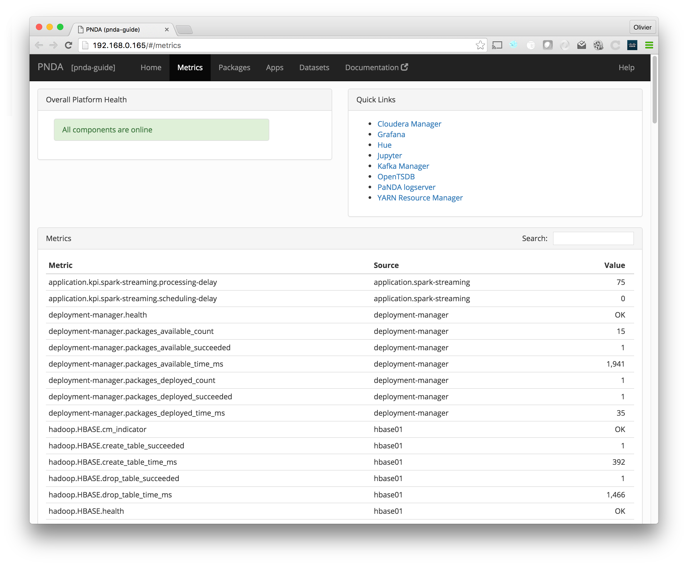
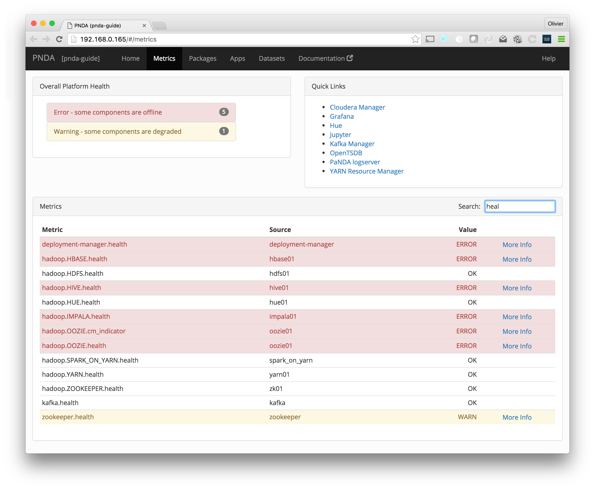
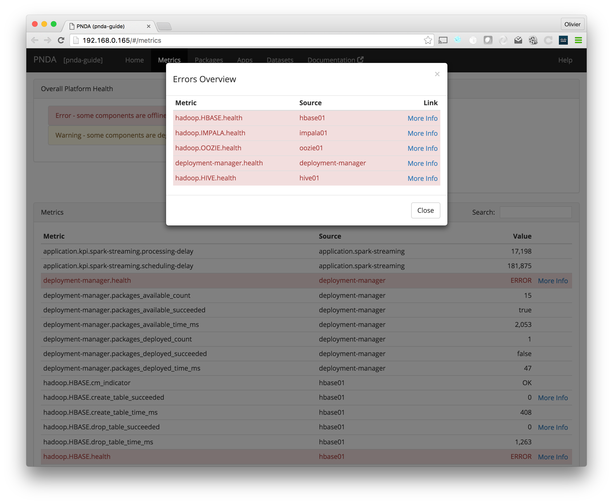

# Metrics

The metrics page lists the metrics for all components in a single table. In addition, it includes key performance indicators (KPIs) for installed applications. 

Metrics have a hierarchical namespace, such as `hadoop.HDFS.health` or `kafka.brokers.1.system.ProcessCpuLoad`.

You can filter the list by typing part of a metric name into the search field. For example, type `HDFS` to match `hadoop.HDFS.health`, `hadoop.HDFS.files_total`, etc. 

Most components have a `health` metric that can be `OK`, `WARN` or `ERROR`. You can, for example, filter the list by `health` to see the health status for all components. 

Any warnings will be displayed in yellow, and any errors will be displayed in red. The overall platform health section at the top of the page shows an overview of all warnings and errors. 

Click the More Info link for more information about a warning or error. 

## See also

- See the [home page](README.md) for a graphical view of these metrics, organized by component. 
- See the metrics section in the [Apps page](applications.md) for application-specific key performance indicators (KPIs). 

# Quick Links

The page also has links to the following other components:

- [Flink](http://flink.apache.org/)
- [Cloudera Manager](https://www.cloudera.com/products/cloudera-manager.html) (CDH only)
- [Ambari](https://ambari.apache.org/) (HDP only)
- [Grafana](http://grafana.org)
- [Hue](http://gethue.com/)
- [Jupyter](http://jupyter.org)
- [Kafka Manager](http://kafka.apache.org/)
- [OpenTSDB](http://opentsdb.net/)
- [PNDA logserver](../log-aggregation/README.md)
- [YARN Resource Manager](http://hadoop.apache.org/docs/current/hadoop-yarn/hadoop-yarn-site/YARN.html)

