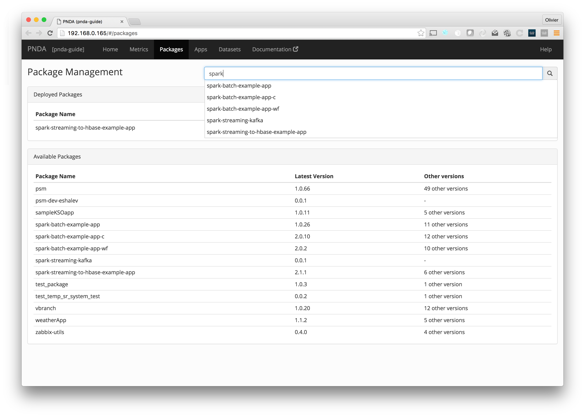
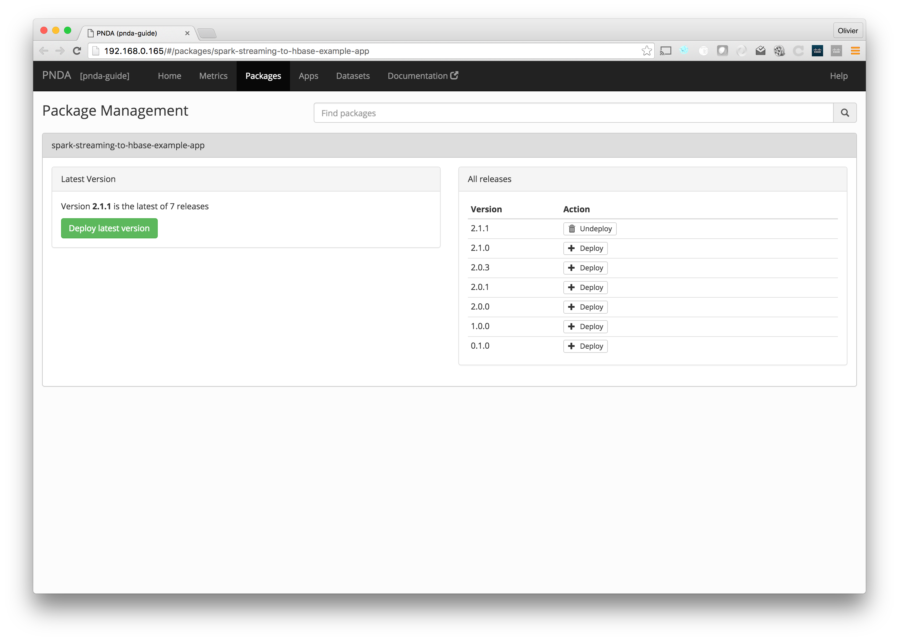

# Packages

The packages page lets you browse available packages, and packages that have been deployed. You can deploy or undeploy an individual package. Packages are independently deployable units of application layer functionality. Each package consists of one or more components, each of which has a defined type.

## Deployed packages

This table lists all packages that have been deployed on the cluster, with their name and deployed version. Applications can be created from deployed packages on the [Apps](applications.md) page.

### Undeploying a package

Click the Undeploy button to undeploy the package. You'll see that it is removed from the list of deployed packages.

## Available packages

This table lists all packages that are available in the package repository for deployment to the cluster, with their name and latest version. If there is more than one version available, then the number of versions is listed.

For more info on uploading packages to the package repository, see the [getting started](../gettingstarted/README.md#packages-and-applications) page.

### Deploying a package

Click a package to deploy it. Click the "Deploy latest version" button to deploy the latest version, or click the "Deploy" button next to another version. Click "OK" to confirm, and then a message will tell you when the package has been deployed. You'll see that it is added to the list of deployed packages. 

