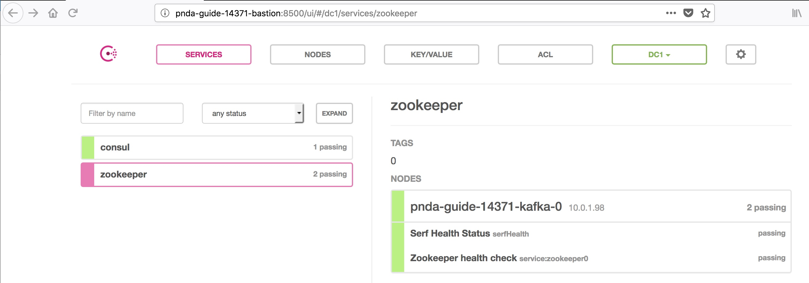

# Consul Overview

Each node in a PNDA Cluster includes a Consul agent. These agents register with a Consul server - a single one running on the Kafka instance for the pico flavor and a quorum running on the Zookeeper instances for standard. The agents automatically keep the DNS entries in the server up to date with any changes.

Consul can be queried on port 8500 using the IP address of any node. To see a quick overview of the current cluster topology use the following command:

```
[ec2-user@pnda-guide-14371-bastion ~]$ consul members -http-addr 10.0.0.205:8500
Node                           Address          Status  Type    Build  Protocol  DC   Segment
pnda-guide-14371-kafka-0       10.0.1.98:8301   alive   server  1.0.3  2         dc1  <all>
pnda-guide-14371-bastion       10.0.0.205:8301  alive   client  1.0.3  2         dc1  <default>
pnda-guide-14371-hadoop-dn-0   10.0.1.110:8301  alive   client  1.0.3  2         dc1  <default>
pnda-guide-14371-hadoop-edge   10.0.1.187:8301  alive   client  1.0.3  2         dc1  <default>
```

The base configuration file for Consul is located under /etc/consul.d/config.json and is automatically generated by the SaltStack Consul formula in the platform-salt repository. The key elements of the configuration are the datacenter & domain, which will be used for DNS. It also defines the IP address to listen on with the parameter bind_addr and client_addr.

Here is a sample configuration file:

```
[root@pnda-guide-14371-bastion ec2-user]# cat /etc/consul.d/config.json 
{
  "bind_addr": "10.0.0.205",
  "client_addr": "10.0.0.205",
  "data_dir": "/var/consul",
  "datacenter": "dc1",
  "domain": "pnda.local",
  "enable_debug": false,
  "enable_script_checks": true,
  "encrypt": "",
  "log_level": "info",
  "ports": [
    {
      "dns": 53
    }
  ],
  "retry_interval": "30s",
  "retry_join": [
    "10.0.1.98"
  ],
  "server": false,
  "ui": true
}
```

Consul hosts a Web UI that can be accessed on port 8500 on any node.
Here is a screenshot of the Consul UI:



Services are defined using JSON files under /etc/consul.d. For example, here is the Zookeeper service definition:

```
[root@pnda-guide-14371-kafka-0 ec2-user]# cat /etc/consul.d/zookeeper.json 
{
    "service": {
        "id": "zookeeper0",
        "name": "zookeeper",
        "tags": ["0"],
        "address": "10.0.1.98",
        "port": 2181
    },
    "check": {
        "id": "service:zookeeper0",
        "name": "Zookeeper health check",
        "ServiceID": "zookeeper0",
        "args": ["/opt/pnda/zookeeper-3.4.11/consul_check.sh"],
        "interval": "60s",
        "timeout": "3s"
    }
}
```
