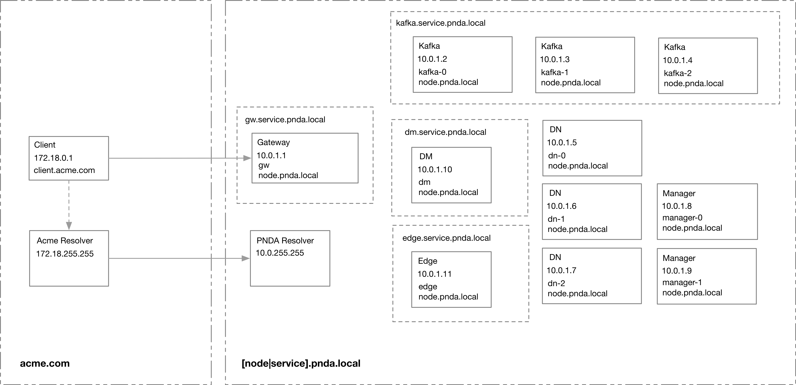
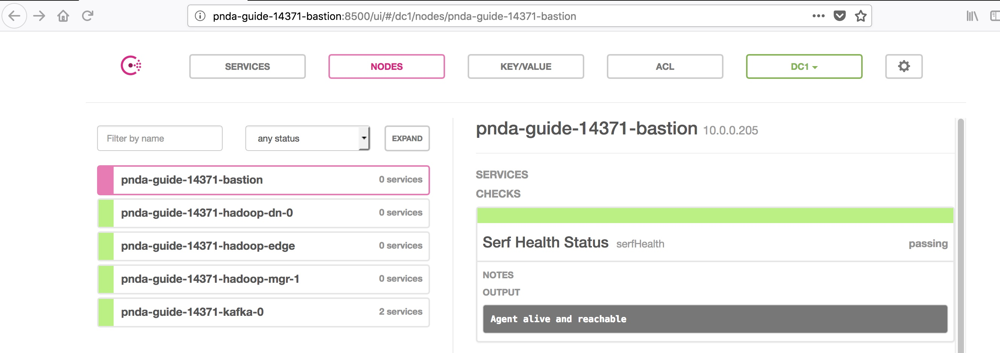

# DNS in PNDA

Consul is used to manage endpoints and deliver a service discovery feature. The DNS interface is used in order to resolve hosts and service names. It also provides a REST interface that could be used by users or operators of the platform.

More information on the DNS interface for Consul can be found in the [Consul DNS documentation](https://www.consul.io/docs/agent/dns.html)

Each node in a PNDA Cluster includes a Consul agent. These agents register with a Consul server - a single one running on the Kafka instance for the pico flavor and a quorum running on the Zookeeper instances for standard. The agents automatically keep the DNS entries in the server up to date with any changes.

## Overview



## Usage

Hosts can be referenced with their hostname or full qualified domain name:

```
<hostname>.node.<datacenter>.<domain>
e.g.
pnda-kafka-0.node.dc1.pnda.local
or just
pnda-kafka-0
```

PNDA uses default values for datacenter and domain of `dc1` and `pnda.local`.

Services can be referenced with:

```
<servicename>.service.<datacenter>.<domain>
```

The Consul DNS server is configured on each node in a PNDA cluster in resolv.conf. This defines the nameserver as the IP address where the server instance of Consul is running and the search domain as node.dc1.pnda.local. Here is a sample configuration:

```
[root@pnda-guide-14371-kafka-0 ec2-user]# cat /etc/resolv.conf
nameserver 10.0.1.98
# Generated by NetworkManager
search eu-west-1.compute.internal node.dc1.pnda.local
nameserver 10.0.0.2
```

Hostnames, fully qualified domain names, and service names can all be resolved from any node in the cluster, for example:

```
[root@pnda-guide-14371-bastion ec2-user]# ping pnda-guide-14371-kafka-0
PING pnda-guide-14371-kafka-0.node.dc1.pnda.local (10.0.1.98) 56(84) bytes of data.
```

```
[root@pnda-guide-14371-bastion ec2-user]# ping zookeeper.service.dc1.pnda.local
PING zookeeper.service.dc1.pnda.local (10.0.1.98) 56(84) bytes of data.
```

The Consul UI can be used to view the cluster topology:

