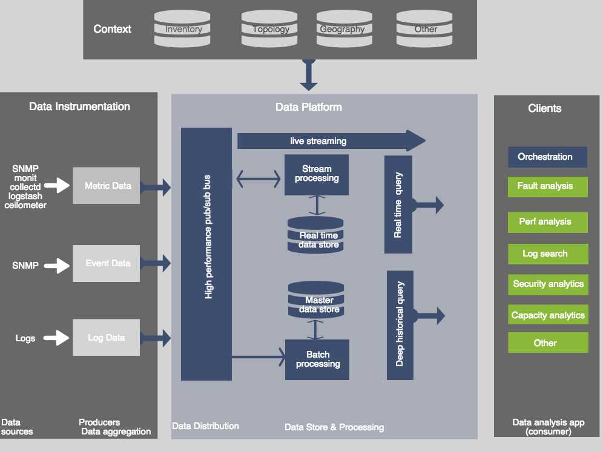

# Overview

## Vision

Innovation in the big data space is extremely rapid, but composing the multitude of technologies together into an end-to-end solution can be extremely complex and time-consuming.

The vision of PNDA is to remove this complexity, and allow you to focus on your solution instead. 

PNDA brings together a number of open source technologies to provide a simple, scalable, open big data analytics platform that supports a range of applications for networks and services covering both the Operational Intelligence (OSS) and Business intelligence (BSS) domains. PNDA also adds a number of new components to aid in the operational management and application development for the platform itself. 

## Principles and Benefits

Today, OSS & BSS system architectures typically consist of a number of point solutions integrated in silos with collections of data sources. It's common for particular data sources to be polled over and over for the same data. Sometimes you need data that was originally available, but was discarded or filtered in the integration process. Furthermore, the advent of virtualization means that the context of the data often shifts rapidly over time. This presents challenges for producing timely and accurate analysis.

PNDA addresses these issues in several ways:

### Decoupling sources from applications

By decoupling data sources from data consumers, it becomes possible to integrate data sources with PNDA once, then make that data available for any application to process. [Applications](../applications/README.md) deployed on the platform can perform horizontally scalable data processing, or client applications can directly consume streams or use one of several structured query interfaces. 

### Taking a big data approach

PNDA is inspired by modern big data architecture patterns, such as the so-called "lambda" pattern. Rather than force all incoming data into a domain-specific schema, we adopt the big data principle of storing all data in the rawest form possible, for as long as possible, in a resilient, distributed file system. This makes it possible to address as-yet-unknown use cases using data that may have been acquired months in the past, and avoids filtering and discarding potentially valuable data on ingress. Similarly, PNDA provides the necessary set of tools and technologies to tackle both near-realtime streaming use cases and complex, higher latency batch analysis, which could include machine learning applications. This allows you to gain insight into what is happening right now, and keep up with changes in context while determining longer-term trends over the complete OSS or BSS dataset.

### Scale and extend

PNDA is built entirely from scalable, open technologies. You can start small, and then grow a cluster horizontally as demand increases. As innovation in the big data industry moves forward, we are able to incorporate these improvements into PNDA with minimal effort. We also benefit from advances in areas such as security and high availability as they become available.

### Simplify and accelerate

There are many equivalent, competing technologies in the big data world, and many ways of combining them together. We've evaluated and chosen technologies based on a range of criteria: not only technical capability, but also the extent of the ecosystem and community support. Thanks to our support for iterative data science via interactive notebooks, as well as package and application management features, developing streaming and batch processing applications over your data becomes a predictable, straightforward and integrated experience.

## Data ingress

Streaming data arrives in PNDA on one or more Kafka topics via a [producer](../producer/README.md), essentially an adapter between the source technology and Kafka. We provide code that enables you to get up and running quickly with [Logstash](../producer/logstash.md) and [OpenDaylight](../producer/opendl.md), as well as examples that let you build your own PNDA-ready [producer](../producer/producer.md) using a variety of implementation languages.

Large, arbitrary datasets — often needed to contextualize streamed event data — can be ingested via our [bulk ingest](../bulkingest/README.md) tool, which uses HTTPFS to create datasets on the distributed file system directly from your client machine.

## Data distribution

PNDA uses Kafka and Zookeeper for high velocity data distribution. Applications can act as Kafka [consumers](../consumer/README.md) using a direct connection to consume incoming data on topics of interest. Alternatively, you can deploy applications on the platform that consume data and either create datasets on Hadoop or produce streams of data back to other topics on Kafka. Thus it is possible to build up chains of filtering and decorating logic over the raw data, should your use case require it. Because they run on a horizontally scalable platform, these chains will scale naturally with the platform. 

## High-volume batch processing

PNDA leverages Apache Spark for petabyte-scale batch processing and deep historical insight into data. Using Java or Scala, you can construct complex application logic, package it according to the PNDA packaging scheme and deploy using the PNDA [deployment manager](https://github.com/pndaproject/platform-deployment-manager). Thereafter, applications can be created and their lifecycle controlled via a [REST API](https://github.com/pndaproject/platform-deployment-manager/blob/master/README.md#api-documentation) or the PNDA [console](../console/README.md).

## High-velocity stream processing

PNDA uses Apache Spark Streaming to achieve high-velocity stream processing. Similarly to batch processing, you can construct your application logic using Java or Scala, and then package it for deployment and using the provided facilities. Since Spark Streaming uses the same programming model and API as Spark, it becomes possible to write your business logic once, and later decide whether it would be best run on a streaming or batch basis. This significantly shortens the development cycle, compared to technologies with orthogonal paradigms (e.g. Apache Storm with MapReduce). 

## Free-form data exploration

Data exploration is a prerequisite step before formal analysis. From a data science perspective, free-form data exploration helps the process of understanding the raw data structure, or determining how to clean or transform the data. It enables experimentation with different statistical models or machine learning algorithms, and gives early business insight into the data.   

PNDA integrates [Jupyter Notebook](https://github.com/pndaproject/example-applications/tree/master/jupyter-notebooks), a web-based application that enables interactive, free-form data exploration. With the predefined *Pyspark kernel* and PNDA [platform libraries](https://github.com/pndaproject/platform-libraries), you can load data from the distributed file system, run experiments in batch mode, and even rapid prototype big data applications. Together with the pre-configured graphic tools, you can also graphically review your application data or experimental results. 

## Structured query over big data

Once insights have been generated from data, they can be stored in the distributed file system (HDFS) or the distributed NoSQL database (HBase). This can be done using a format designed for consumption by external client applications, or other data processing applications running on the platform.

For external clients, it's beneficial to use existing interface standards. The predominant standard for structured query is SQL, in particular ANSI SQL-92. 

[Impala](../query/impala.md) is a distributed, massively parallel processing database engine. It runs as cluster of daemons deployed on the Hadoop nodes, yet presents an extended ANSI SQL-92 interface to clients. There are ODBC and JDBC drivers available, which means that you can use your favourite business intelligence toolset to explore data in PNDA as if it were held in a classic RDBMS system. 

Impala has a sophisticated query engine, which ensures that simple queries to directly fetch data execute with very low latency. This makes it suitable, for example, to drive a user interface. Meanwhile, much more complex queries are also possible via the same interface, for analysts wanting to get faster results than the equivalent batch process while using all the power and familiarity of the SQL language.

## Handling time series

Often, use cases for analytics — especially in the OSS domain — revolve around handling a large volume of metric data acquired over a period of time, and the need to access it quickly and present it effectively.

For this reason, PNDA integrates [OpenTSDB](../timeseries/opentsdb.md) and Grafana. OpenTSDB is a horizontally scalable time series database built on top of HBase. It is designed specifically to simplify and accelerate the process of storing and analyzing large amounts of time-series data, in the realm of millions of writes per second.

Grafana is a highly configurable graphical front end that can use OpenTSDB as a data source, and offers rich and engaging dashboards and sophisticated graphing capabilities. 
