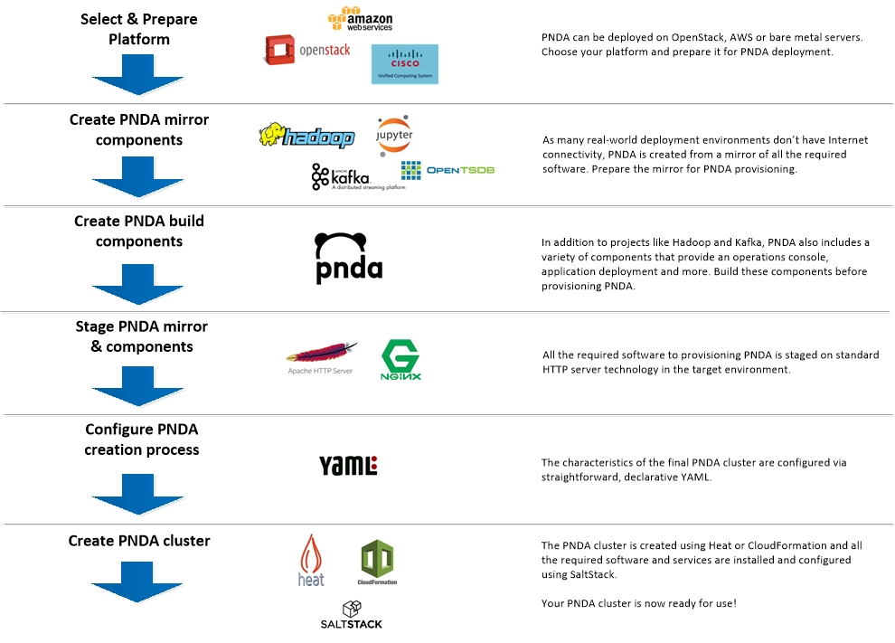

# Creating PNDA - Overview

PNDA can be deployed on OpenStack, Amazon AWS or bare metal servers. The process is similar for each platform.

To create PNDA, select a deployment target, then follow one of these tracks -

|[Creating PNDA on OpenStack](openstack/PREPARE.md)|[Creating PNDA on Amazon AWS](aws/PREPARE.md)|[Creating PNDA on bare metal servers](baremetal/PREPARE.md)|
| --- | --- | --- |

