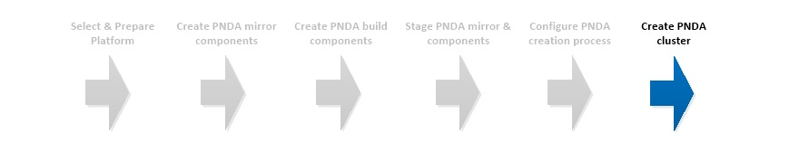

# Create PNDA cluster



## Introduction

With the target platform fully prepared, the PNDA software staged and the YAML configuration completed, the final step is to invoke the PNDA CLI to create the cluster.

## Create PNDA

#### Install CLI dependencies

On the client machine, install the pip packages required by the CLI.

```
cd cli
sudo pip install -r requirements.txt
```

#### CLI invocation

An example CLI invocation -

```
cd cli
pnda-cli.py create -e <cluster_name> -s <key_name> -f standard -o 2 -n 3 -k 2 -z 3
```

The options shown select the standard flavor, 2 open tsdb instances, 3 hadoop datanodes, 2 kafka brokers, and 3 zookeeper nodes. If you need to operate within the default EC2 instance quota of 20 instances then you can reduce this to 1 kafka and 1 zookeeper instance or use the pico flavor.

```
pnda-cli.py create -e <cluster_name> -s <key_name> -f standard -o 1 -n 1 -k 1 -z 1
pnda-cli.py create -e <cluster_name> -s <key_name> -f pico -n 1 -k 1
```

Note that CLI parameter -s refer to the key configured in the previous phase. For example, if the keypair in AWS is 'pnda' then the local private key file should be named 'pnda.pem' and you should pass '-s pnda' to the CLI.


A small cluster typically takes around 30 minutes to fully provision while a larger cluster can take 50 minutes.

#[Home](../OVERVIEW.md)

| [Home](../OVERVIEW.md) | [Prepare](PREPARE.md) | [Mirror](MIRROR.md) | [Build](BUILD.md) | [Stage](STAGE.md) | [Configure](CONFIGURE.md) | [Create](CREATE.md) | 
| --- | --- | --- | --- | --- | --- | --- |
