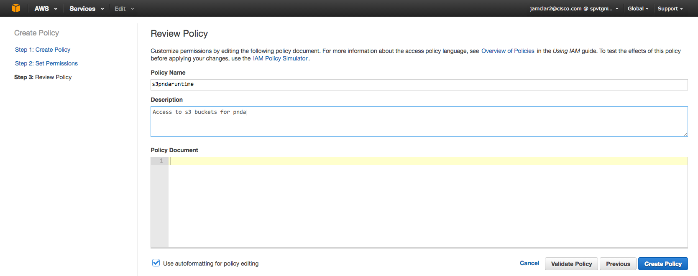
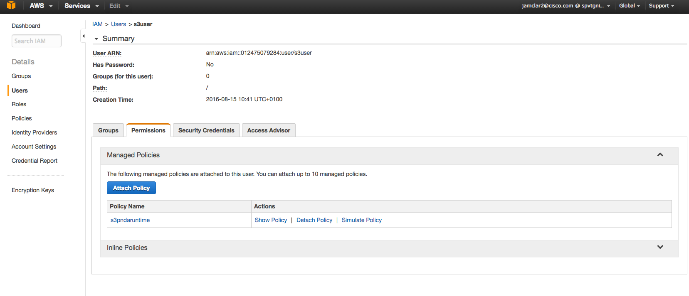

# Select & Prepare Platform


## Obtain AWS account

Sign up for an AWS account [here](https://aws.amazon.com/).

## Required resources

AWS is a ready to use public cloud platform and therefore the resources required for creating PNDA do not need to be explicitly configured. Note that depending on your account usage you may need to raise the instance or other limits.

Two PNDA flavors are available for AWS. 

#### Pico

Pico flavor is intended for development / learning purposes. It is fully functional, but does not run the core services in high-availability mode and does not provide much storage space or compute resource.

| Role | Instance type | Number required | CPUs | Memory | Storage
| --- | --- | --- | --- | --- | --- |
|  `gateway`   |  t2.medium  | 1 | 2 |  4 GB   | 40 GB
|  `edge`      |  m4.2xlarge  | 1 | 8 | 32 GB   | 50 GB
|  `mgr1`      |  m4.xlarge  | 1 | 4 | 16 GB   | 50 GB
|  `datanode`  |  c4.xlarge  | 1 | 4 |  7.5 GB | 65 GB
|  `kafka`     |  m4.large   | 1 | 2 |  8 GB | 50 GB
| -  |  - | -  | -  | -  | -  |
|  `total`     |  | 5 | 20 | 67,5 GB | 255 GB

The storage per node is allocated as:
 - 10 GB log volume (not present on saltmaster). This is provision-time configurable.
 - 20 GB operating system partition. This is configured in the templates per-node.
 - 35 GB HDFS (only on datanode). This is configured in the templates for the datanode.

#### Standard

Standard flavor is intended for meaningful PoC and investigations at scale. It runs the core services in high-availability mode and provides reasonable storage space and compute resource.

| Role | Instance type | Number required | CPUs | Memory | Storage
| --- | --- | --- | --- | --- | --- |
|  `gateway`         |  t2.medium  | 1 | 2 |  4 GB   | 170 GB
|  `saltmaster`      |  m4.large   | 1 | 2 |  8 GB | 50 GB
|  `edge`            |  t2.medium  | 1 | 2 |  4 GB   | 370 GB
|  `mgr1`            |  m4.2xlarge | 1 | 8 |  32 GB  | 370 GB
|  `mgr2`            |  m4.2xlarge | 1 | 8 |  32 GB  | 370 GB
|  `mgr3`            |  m4.2xlarge | 1 | 8 |  32 GB  | 370 GB
|  `mgr4`            |  m4.2xlarge | 1 | 8 |  32 GB  | 370 GB
|  `datanode`        |  m4.2xlarge | 3 | 8 |  32 GB  | 1194 GB
|  `opentsdb`        |  m4.xlarge  | 2 | 4 | 16 GB   | 170 GB
|  `hadoop-manager`  |  m4.xlarge  | 1 | 4 | 16 GB   | 170 GB
|  `jupyter`         |  m4.large   | 1 | 2 |  8 GB | 170 GB
|  `logserver`       |  m4.large   | 1 | 2 |  8 GB | 500 GB
|  `kafka`           |  m4.xlarge  | 2 | 4 | 16 GB   | 270 GB
|  `zookeeper`       |  m4.large   | 3 | 2 |  8 GB | 170 GB
|  `tools`           |  m4.large   | 1 | 2 |  8 GB | 50 GB
| -  |  - | -  |  - | -  | -  |
|  `total`           |   | 21 | 94 |  368 GB | 7.7TB

The storage per node is allocated as:
 - 120 GB log volume (not present on saltmaster or tools). This is provision-time configurable.
 - 1024 GB HDFS (only on datanode). This is configured in the templates for the datanode.
 - 50-250 GB operating system partition. This is configured in the templates per-node.

## Prepare AWS account

Before creating PNDA, create appropriate sets of credentials and configure object storage.

### Credentials

Two sets of credentials should be created -

1. Create a user for access to ec2 and CloudFormation
2. Create a user for access to S3 object storage

Please refer to the [AWS documentation on credentials](http://docs.aws.amazon.com/general/latest/gr/aws-security-credentials.html) for detailed instructions on how to create these.

### Object storage

PNDA makes use of object storage for -

- Storing and delivering user-created application packages
- Archiving PNDA datasets that have reached age or size thresholds

PNDA uses Amazon S3 for object storage when deploying to AWS.

### Containers and folders

Create the following containers and folders in S3 before creating a PNDA cluster -

#### Application container

This container will be used for PNDA application packages. 

1. Create or designate an S3 bucket for this purpose.
2. Create or designate at least one folder within this bucket to hold the application packages.
3. Make a note of the name, as it will used later when configuring PNDA.

#### Dataset archive container

This container will be used for PNDA dataset archives.
 
1. Create or designate an S3 bucket for this purpose.
2. Make a note of the name, as it will used later when configuring PNDA.

### Access to S3 object storage

Follow these steps to give access to the second user created above to S3 object storage.  

It's important that these credentials should be associated with access to the specific S3 buckets only as they will be stored in plain text on some of the nodes launched in AWS.

#### Create a new policy:

  1. Select Policies on the left menu and click on "Create Policy"


  2. Choose "Create Your Own Policy"


  3. Then, on Step 3, set Policy Name to "s3pndaruntime" and Description to "Access to S3 buckets for pnda" and put the following content to the Policy document. Replace ```pnda-apps``` and ```pnda-archive``` with the names you chose above.



```json
{
  "Version": "2012-10-17",
  "Statement": [
    {
      "Effect": "Allow",
      "Action": ["s3:ListBucket"],
      "Resource": ["arn:aws:s3:::pnda-apps"]
    },
    {
      "Effect": "Allow",
      "Action": [
        "s3:PutObject",
        "s3:GetObject",
        "s3:DeleteObject"
      ],
      "Resource": ["arn:aws:s3:::pnda-apps/*"]
    },
    {
      "Effect": "Allow",
      "Action": ["s3:ListBucket"],
      "Resource": ["arn:aws:s3:::pnda-archive"]
    },
    {
      "Effect": "Allow",
      "Action": [
        "s3:PutObject",
        "s3:GetObject",
        "s3:DeleteObject"
      ],
      "Resource": ["arn:aws:s3:::pnda-archive/*"]
    },
    {
      "Effect": "Allow",
      "Action": [
        "s3:CreateBucket"
      ],
      "Resource": ["arn:aws:s3:::*"]
    }    
  ]
}
```

#### Attach the policy
Go back to users list, select the user just created on 1 and attach the policy to the user using the permissions tab:




# [Next](MIRROR.md)

| [Home](../OVERVIEW.md) | [Prepare](PREPARE.md) | [Mirror](MIRROR.md) | [Build](BUILD.md) | [Stage](STAGE.md) | [Configure](CONFIGURE.md) | [Create](CREATE.md) | 
| --- | --- | --- | --- | --- | --- | --- |
