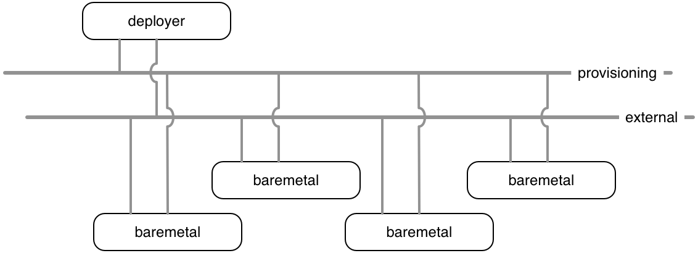

# Select & Prepare Platform

# Introduction

The PNDA bare metal deployment process is similar to the process to deploy OpenStack itself. To deploy PNDA on top of bare metal nodes, OpenStack platform services are used. The two main services involved in this process are Ironic and Heat.

The subject and content of this guide was originally developed and authored by Fabien Andrieux (fandrieu@cisco.com). 

# Preparing the bare metal cluster

The preparation phase for bare metal is more involved than the other target platforms to which PNDA can be deployed, as before creating PNDA we first bring the physical cluster under the control of the OpenStack orchestration components. Once this done, creation proceeds as per the OpenStack deployment process.

Bare metal nodes on top of which PNDA is to be deployed will need to implement an IPMI interface for power management and be able to boot using PXE to boot and deploy an operating system. We make use of the pxe_ipmitool ironic driver which is generic enough to manage power management and pxe boot on a vast majority of servers.

## Overview

The preparation steps are -

-   Identify and configure the hardware resources - servers and networks - that will be used
-   Create the Build Node
-   Gather bare-metal nodes specifications (IPMI ip address, IPMI credentials, MAC address)
-   Populate the Ironic database with node specifications
-   Introspect the nodes
-   Tag the nodes with profiles

### Identify and configure the hardware resources

Firstly, a set of suitable hardware must be commissioned and configured. This includes, for example, making sure that all disks are set up with the desired RAID configuration, network switches and routers are properly configured and so on. 

To facilitate the remainder of the process it's useful at this stage to spend some time to compile an accurate inventory of all machine capabilities including CPUs, memory and storage as well as all interfaces, MAC addresses and so on.

### Designate the Build Node

One machine must be designated as the build node.

The purpose of this node is to host the functions required to conduct both initial orchestration and subsequent updates and maintenance of the PNDA cluster.

It will have two network interfaces. One will be dedicated to provisioning and administration of the bare-metal nodes, the other one will provide direct external connectivity, as suggested below.

The build node operating system must be either a Centos 7 or Redhat Enterprise Linux 7.

On the build node, a number of additional nodes will be created, as KVMs. 

The process of creating these nodes is described in the remainder of this guide.

# References

The PNDA project homepage: [http://pnda.io](http://pnda.io/)

The OpenStack project documentation:
[http://docs.openstack.org](http://docs.openstack.org/)

The TripleO project documentation:
[http://tripleo.org](http://tripleo.org/)

#[Next](UNDERCLOUD.md)

| [Home](../OVERVIEW.md) | [Prepare](PREPARE.md) | [Undercloud](UNDERCLOUD.md) | [Saltmaster](SALTMASTER.md) | [Register](REGISTER.md) | [Mirror](MIRROR.md) | [Build](BUILD.md) | [Stage](STAGE.md) | [Configure](CONFIGURE.md) | [Create](CREATE.md) | 
| --- | --- | --- | --- | --- | --- | --- | --- | --- | --- |
