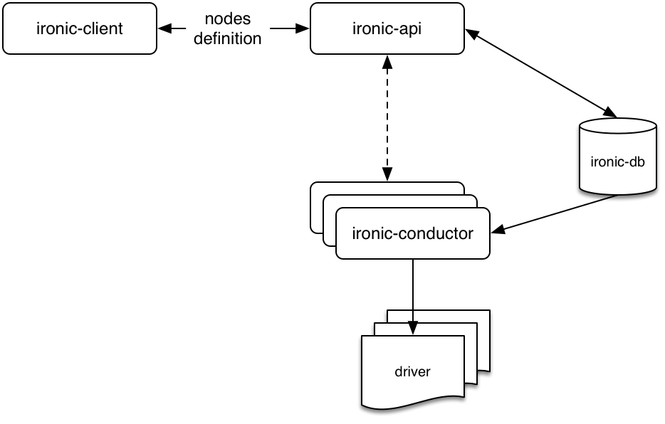
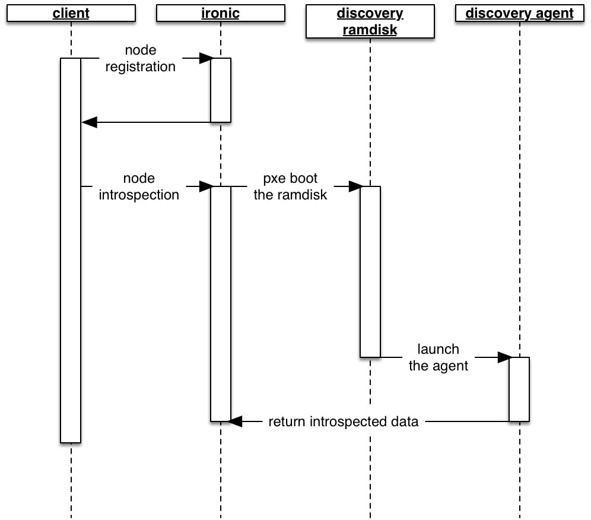

# Registering nodes with Undercloud


## Introduction

The bare-metal nodes will be provisioned and deployed using the
bare-metal service driver, namely pxe_ipmitool, which interfaces with
their IPMI interface for power management, and provides the PXE boot
chain.

They shall first be registered against the bare-metal service.



The configuration parameters necessary are the MAC address of each node,
the IPMI interface IP address, and optionally the IPMI authentication
parameters. Optionally the node can be named.

The data to be collected for these nodes look like:

	  ------------------- ----------------------- --------------------- --------------------- -----------------------
	  ***MAC address***   ***IPMI IP address***   ***IMPI username***   ***IMPI password***   ***Name (optional)***
	  xx:xx:xx:xx:xx:xx   xxx.xxx.xxx.xxx         ipmi_username        ipmi_passwd          node_name
	  ------------------- ----------------------- --------------------- --------------------- -----------------------

After having collected the nodes parameters, we will create a json file
to be imported to the baremetal management service. This json file will
enclose a list of nodes. Each node is defined in this way -

##### Example node definition

	{
	"name": "node_name",
	"pm_addr": "xxx.xxx.xxx.xxx",
	"pm_password": "impi_password",
	"pm_user": "ipmi_username",
	"pm_type": "pxe_impitool",
	"mac": [
	"xx:xx:xx:xx:xx:xx"
	],
	"cpu": "1",
	"memory": "1024",
	"disk": "10",
	"arch": "x86_64"
	}

The only mandatory parameters that need to be properly configured are
pm_addr, pm_password, pm_user, pm_type and mac.

The cpu, memory, disk, arch parameters are initialized to any default
values as these specifications will be discovered later on.

Next the bare-metal node definitions will be imported. This will result in registration with default capabilities. The next stage involves introspecting the servers to discover their real capabilities.



## Walkthrough

#### Retrieving the pnda heat templates repository

Replace the git URI if using a specific fork to provision PNDA.

```
cd
git clone https://github.com/pndaproject/pnda-heat-templates
cd pnda-heat-templates
cd
```

#### Modify the example instackenv.json

This definition must reflect the machines that will form the installation, as described above.

```
vi ~/pnda-heat-templates/instackenv.json
```

#### Creating the nova flavors

These are the flavors that will be used when provisioning Nova instances.

```
openstack flavor create --id auto --ram 131071 --disk 109 --vcpus 8 s1.small
openstack flavor create --id auto --ram 131071 --disk 109 --vcpus 8 s2.medium
openstack flavor create --id auto --ram 131071 --disk 109 --vcpus 16 s1.medium
openstack flavor create --id auto --ram 262144 --disk 109 --vcpus 16 s1.large
openstack flavor create --id auto --ram 2048 --disk 20 --vcpus 1 master

openstack flavor set --property "cpu_arch"="x86_64" --property "capabilities:boot_option"="local" --property "capabilities:profile"="master" master
openstack flavor set --property "cpu_arch"="x86_64" --property "capabilities:boot_option"="local" --property "capabilities:profile"="s1.small" s1.small
openstack flavor set --property "cpu_arch"="x86_64" --property "capabilities:boot_option"="local" --property "capabilities:profile"="s2.medium" s2.medium
openstack flavor set --property "cpu_arch"="x86_64" --property "capabilities:boot_option"="local" --property "capabilities:profile"="s1.medium" s1.medium
openstack flavor set --property "cpu_arch"="x86_64" --property "capabilities:boot_option"="local" --property "capabilities:profile"="s1.large" s1.large
```

#### Import the bare-metal nodes definitions

```
openstack baremetal import ~/pnda-heat-templates/instackenv.json
openstack baremetal list
openstack baremetal configure boot
```

This produces output similar to -

	+--------------------------------------+-------------+--------------------+
	| UUID | Power State | Provisioning State |
	+--------------------------------------+-------------+--------------------+
	| 464b81cc-6dd7-48f2-9e86-30450e592009 | power off | available |
	| fb88a389-6a73-47e7-ae8b-a4116cc36604 | power off | available |
	| a34dad17-cdb7-40ea-a305-d2c7ceedb859 | power off | available |
	| f9d4e1f5-dba5-412c-b4af-9fffedd86fb0 | power off | available |
	+--------------------------------------+-------------+--------------------+

At this point the nodes power state shall be defined (i.e. different
from None). If not, then this reveals a connection issue between the
bare-metal service driver and the nodes IPMI interfaces.

Examining one node

	ironic node-show 464b81cc-6dd7-48f2-9e86-30450e592009 |grep -A1
	properties

	| properties | {u'memory_mb': u'1024', u'cpu_arch': u'x86_64',
	u'local_gb': u'10', |
	| | u'cpus': u'1', u'capabilities': u''} |

The CPU, memory, etc represent default capabilities that will be replaced during introspection.

### Introspect nodes

```
openstack baremetal introspection bulk start
```

This produces output similar to the following -

	Starting introspection of node: 464b81cc-6dd7-48f2-9e86-30450e592009
	Waiting for introspection to finish...
	Introspection for UUID 464b81cc-6dd7-48f2-9e86-30450e592009 finished
	successfully.

	Setting manageable nodes to available...

	Node 464b81cc-6dd7-48f2-9e86-30450e592009 has been set to available.

	Introspection completed.

Examining the introspected node -

	ironic node-show 464b81cc-6dd7-48f2-9e86-30450e592009 |grep -A1
	properties

	| properties | {u'memory_mb': u'16384', u'cpu_arch': u'x86_64',
	u'local_gb': u'1000', |
	| | u'cpus': u'12', u'capabilities': u'boot_option:local'} |

The node is now registered with the right capabilities.

### Tag nodes

Once the introspection is done, we need to inspect the results to tag the nodes appropriately. 

When we provision instances using Nova, the scheduler will select hardware resources to satisfy the requirements of the given instance flavor based on the tags found against the nodes in Ironic. For example, we may tag a number of hardware resources with a flavor corresponding to 4 cpus, 4GB memory and 50GB of storage - when we create a Nova instance with this flavor any one of the matching hardware resources may be chosen.

Firstly we'll generate a simple tabular summary of the node capabilities based on the introspection output.

```
rm -rf /tmp/intro_data
mkdir -p /tmp/intro_data && cd /tmp/intro_data

for i in $(openstack baremetal list |grep -v UUID|awk {'print $2'});do
  openstack baremetal introspection data save $i | jq . | tee $i.json;
done

for i in *.json; do
  echo -n `echo $i|cut -d\. -f1 -`;
  echo -n " " ;
  jq '.cpus, .memory_mb, .extra.disk.sdb.size'  < $i | while read j; do
    echo -n "$j ";
  done;
  echo;
done | tee /tmp/int.tmp
```
We will now use this to discriminate and tag the nodes. 

Next, get lists of nodes by their profile.

```
small=`grep "16 131072 477" /tmp/int.tmp | awk {'print $1'}`
large=`grep "16 262144 10790" /tmp/int.tmp | awk {'print $1'}`
medium1=`grep "8 262144 1200" /tmp/int.tmp | awk {'print $1'}`
medium2=`grep "16 131072 4795" /tmp/int.tmp | awk {'print $1'}`
```

Next, for each profile, update the properties/capabilities in the node metadata to include the correct profile and boot_option.

```
for i in $small; do
  ironic node-update $i add properties/capabilities=profile:s1.small,boot_option:local;
done

for i in $medium1; do
  ironic node-update $i add properties/capabilities=profile:s1.medium,boot_option:local;
done

for i in $medium2; do
  ironic node-update $i add properties/capabilities=profile:s2.medium,boot_option:local;
done

for i in $large; do
  ironic node-update $i add properties/capabilities=profile:s1.large,boot_option:local;
done
```

Finally, tag the master node.

```
ironic node-update master add properties/capabilities=profile:master,boot_option:local
```

We should now have overcloud profiles created
```
openstack overcloud profiles list
+--------------------------------------+-----------+-----------------+-----------------+-------------------+
| Node UUID                            | Node Name | Provision State | Current Profile | Possible Profiles |
+--------------------------------------+-----------+-----------------+-----------------+-------------------+
| 83b1d56e-e1e4-4400-8e80-3f4413f234e7 | server15  | available       | s1.large        |                   |
| 4c9a9d5c-db06-41a9-a13d-2b31581ffb30 | server16  | available       | s1.large        |                   |
| a2122f93-9c64-4c32-8bb5-d1ba586cde35 | server17  | available       | s1.small        |                   |
| bfa73aa6-e089-4fc1-8d84-800a780f3e26 | server18  | available       | s1.medium       |                   |
| 10cedaf3-01fd-4604-bdbc-60f7a5a56476 | server19  | available       | s1.small        |                   |
| 7c111fcd-e9cc-4d45-bc15-1810c6bfb3c3 | server20  | available       | s1.medium       |                   |
| 314f18e8-f53c-40c9-8365-1b4b2432034d | server21  | available       | s1.small        |                   |
| 13328562-f0de-422a-bb50-0551bbe12996 | server22  | available       | s1.medium       |                   |
| 24ed6678-efc1-4347-886e-59216a607095 | server23  | available       | s1.small        |                   |
| 63129a64-1c11-4d17-a165-fd6786e225ab | server24  | available       | s1.large        |                   |
| 3ba9abf7-8764-4edc-b889-876957091df5 | server25  | available       | s2.medium       |                   |
| 9872bd06-0e22-4b5c-b954-d62316a8932d | server26  | available       | s1.small        |                   |
| 4b5f10a2-ce3a-4932-8b57-be7fe2f7c1db | master    | available       | None            |                   |
+--------------------------------------+-----------+-----------------+-----------------+-------------------+
```

## Sanity Check

At this point should have a fully working infrastructure ready to create Nova instances as one would in a cloud environment.

Validate this by creating a simple instance and logging into it via SSH.

```
openstack keypair create test > test.pem
chmod 600 test.pem
openstack server create --image pnda-image --flavor master --key-name test myinstance
```

```
nova list

+--------------------------------------+------------+--------+------------+-------------+--------------------+
| ID                                   | Name       | Status | Task State | Power State | Networks           |
+--------------------------------------+------------+--------+------------+-------------+--------------------+
| 53094a73-f7db-462c-ab7d-ce458af6fab8 | myinstance | BUILD  | spawning   | NOSTATE     | ctlplane=192.0.3.6 |  +--------------------------------------+------------+--------+------------+-------------+--------------------+
```

```
ssh -i test.pem cloud-user@192.0.3.6
```

Note it can be useful to follow the instance spawning progress using ```virsh console pnda-master``` on the Build Node.

# [Next](MIRROR.md)

| [Home](../OVERVIEW.md) | [Prepare](PREPARE.md) | [Undercloud](UNDERCLOUD.md) | [Saltmaster](SALTMASTER.md) | [Register](REGISTER.md) | [Mirror](MIRROR.md) | [Build](BUILD.md) | [Stage](STAGE.md) | [Configure](CONFIGURE.md) | [Create](CREATE.md) | 
| --- | --- | --- | --- | --- | --- | --- | --- | --- | --- |
