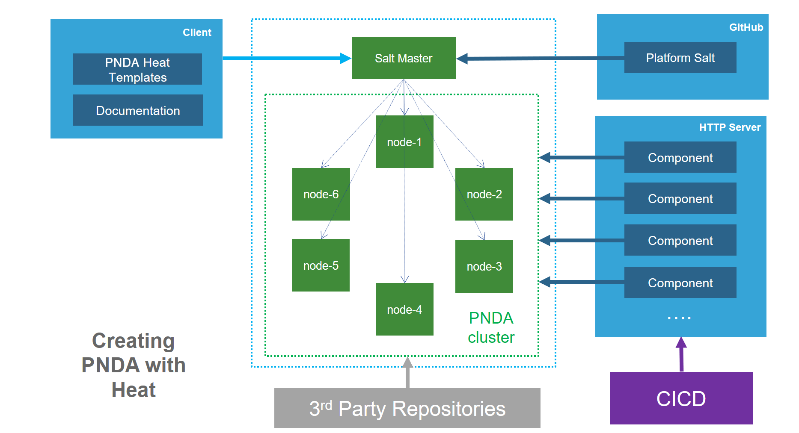

# Provisioning with Heat



## Getting the source code

The PNDA distribution is available on GitHub at:

 * [https://github.com/pndaproject](https://github.com/pndaproject)

## Requirements

### Python

For using PNDA cli, you will need python, heat and nova client. To install it on ubuntu for example, run:
```
$ sudo apt-get install python python-pip
$ sudo pip install python-heatclient python-novaclient
```

### SSH key

The heat stack will create a bastion in order to be the entry point of your cluster.
Generate a new key for being able to ssh to the bastion and then the cluster:

	ssh-keygen -t rsa -f mykey.pem

Then, import this key in OpenStakc using the horizon UI

### API Access

You will need to access the OpenStack API, for doing so, download and execute the OpenStack RC file available in the horizon UI under Compute Tab and then "Acess and Security"
This will export variables `OS_AUTH_URL`, `OS_TENANT_ID`, `OS_TENANT_NAME`, `OS_PROJECT_NAME`, `OS_REGION_NAME`, `OS_USERNAME`, `OS_PASSWORD` in the ENV which are used be the python Heat Client.

## Deploy PNDA using the CLI
       
The `heat_cli.py` script in the `cli` directory of the [pnda-heat-templates](../repos/pnda-heat-templates/README.md) repo lets you launch a PNDA deployment, and can be called as follows:

    heat_cli.py --pnda-cluster name \
      --flavor large --datanodes 4 \
      --opentsdb-nodes 4 --kafka-nodes 2 \
      --zk-nodes 3 -s key command

Here's an abbreviated form of the same command:

	heat_cli.py -e name -f large -n 4 -o 2 -k 2 -z 3 -s key command

Where:

 - **command**: Mode of operation, can be ['create', 'create-from-map', 'destroy-from-map', 'expand-from-map']
 - **-s**: key to be used for the bastion
 - **-e** or **--pnda-cluster**: Namespaced environment for machines in this cluster
 - **-n** or **--datanodes**: How many datanodes for the hadoop cluster
 - **-o** or **--opentsdb-nodes**: How many Open TSDB nodes for the hadoop cluster 
 - **-k** or **--kafka-nodes**: How many kafka nodes for the databus cluster
 - **-z** or **--zk-nodes**: How many zookeeper nodes for the databus cluster
 - **-f** or **--flavor**: PNDA flavor: "small" or "large"', choices=['small', 'large']
 - **-b** or **--branch**: Git branch to use (defaults to master)

Depending upon your needs and available resources, you can choose one of two PNDA flavors, small or large. 

The `--datanodes`, `--opentsdb-nodes`, `--kafka-nodes` and `--zk-nodes` arguments are optional. The default values depend on the size of the cluster:

| flavor | small | large |
| -- | -- | -- |
| `--datanodes` | 1 | 4 |
| `--opentsdb-nodes` | 1 | 2 |
| `--kafka-nodes` | 1 | 2 |
| `--zk-nodes` | 1 | 3 |
