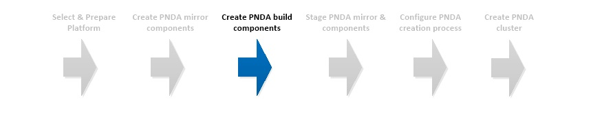

# Create PNDA build components



## Introduction

In addition to projects like Hadoop and Kafka, PNDA also includes a variety of components that provide an operations console, application deployment and more. Build these components before provisioning PNDA.

## Create build node

#### Select build node

Designate or create the PNDA build node. This could be the same machine that was used to build the mirror file sets.
 
Two types of build node are supported -

- Red Hat Enterprise Linux 7
- CentOS 7 


#### Obtain build tools

The repository [pnda](https://github.com/pndaproject/pnda) contains all the tools needed to build PNDA.

Decide which version of PNDA you want to create. All PNDA releases are desginated with tag similar to ```release/4.0``` across all repositories. 

Clone this repository at the right version to the build node.

#### Configure the proxy. (Optional)

The entire PNDA build process can be performed from behind a non-transparent proxy. 

To proceeding in this mode, first set the system configuration and then run the ```set-proxy-env.sh``` script that will set up the various proxy configurations needed by the multiple build tools.

```sh
sudo su
export http_proxy=http://<proxy_host>:<proxy_port>
export https_proxy=http://<proxy_host>:<proxy_port>
. set-proxy-env.sh
```

#### Preparing the build environment

The tools are found in the [build folder](https://github.com/pndaproject/pnda/tree/master/build).

The script ```install-build-tools.sh``` installs all the necessarily build prerequisites.

Run it with superuser privileges in the location that you wish to install your build tools.

In case you are using Redhat, you will need to override default RedHat repos by defining the following environment variables. The names should be substituted with the appropriate names for your environment.
```sh
sudo su
export RPM_OPTIONAL=rhel-7-server-optional-rpms
export RPM_EXTRAS=rhel-7-server-extras-rpms
```

For example

```sh
sudo su
cd /home/builder
./install-build-tools.sh
```

As well as installing all the required software, it may pause and ask the operator to carry out some configuration on the build environment, for example adjusting the contents of /etc/hosts.

Once it has finished, a file called ```set-pnda-env.sh``` will be found in the working directory. This script contains the necessary environment variables and other settings needed to carry out builds. It should either be added to the end of an initialization script such as ```/etc/bash.bashrc``` so that these settings are available for new shells, or it can be invoked with each build. 

For example

```sh
sudo su
cat >> /etc/bash.bashrc
. /home/builder/set-pnda-env.sh
```

Your environment is now ready to build PNDA.

## Building PNDA

The script ```build-pnda.sh``` is invoked as a non-privileged user. 

If you are running behind a non-transparent proxy, go through the [proxy configuration](#configure-the-proxy-optional) steps again for the non-privileged user (don't substitute user).

For example

```sh
cd pnda/build/
./build-pnda.sh RELEASE release/4.0
```

It is also possible to perform more complex builds including building to a specific bill-of-materials. Please refer to the [repository notes](https://github.com/pndaproject/pnda/tree/master/build).

## Build Products

All build products are assembled in the directory ```pnda-dist```.

# [Next](STAGE.md)

| [Home](../OVERVIEW.md) | [Prepare](PREPARE.md) | [Mirror](MIRROR.md) | [Build](BUILD.md) | [Stage](STAGE.md) | [Configure](CONFIGURE.md) | [Create](CREATE.md) | 
| --- | --- | --- | --- | --- | --- | --- |
