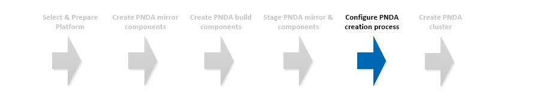

# Configure PNDA creation process



## Introduction

The PNDA creation process is controlled primarily via a YAML configuration file.

A template YAML configuration can be found in the [pnda-cli repository](https://github.com/pndaproject/pnda-cli). 

## Configure pnda_env.yaml

#### Designate client machine

Create or designate a suitable machine for running the PNDA CLI. We recommend CentOS 7.

#### Obtain code

Clone the [pnda-cli repository](https://github.com/pndaproject/pnda-cli) repository from the master branch at a specific release tag (e.g. ```release/4.0```) to the client machine.

Copy ```pnda_env_example.yaml``` to create ```pnda_env.yaml```

#### Set access credentials

Set the following fields under `openstack_parameters` section in `pnda_env.yaml` . The values can be obtained by referring to the Keystone authentication details obtained in the preparation phase.

| Field | Value |
| --- | --- |
|KEYSTONE_USER| User for creating PNDA |
|KEYSTONE_PASSWORD| Password for user |
|KEYSTONE_TENANT| Tenant for creating PNDA |
|KEYSTONE_AUTH_URL| Authorization URL | 
|KEYSTONE_AUTH_VERSION| 2 |
|KEYSTONE_REGION_NAME| Region name |

#### Object storage

Set `pnda_application_repo.PNDA_APPS_CONTAINER` to the Application container configured during the preparation phase.

Set `pnda_application_repo.PNDA_APPS_FOLDER` to the Application folder configured during the preparation phase.

Set `pnda_data_archive.PNDA_ARCHIVE_CONTAINER` to the Dataset archive container configured during the preparation phase.

#### Hadoop distribution

Decide whether you want to run the Cloudera CDH or the Hortonworks HDP Hadoop distribution.

Set `hadoop.HADOOP_DISTRO` to either `CDH` or `HDP`.

#### Set source of SaltStack provisioning scripts

The PNDA software is installed and configured using the SaltStack code found in the [platform-salt](https://github.com/pndaproject/platform-salt) repository. There are two main options to provide source for platform-salt:

1. Set `platform_salt.PLATFORM_GIT_REPO_URI` to the remote git URI and `platform_salt.PLATFORM_GIT_BRANCH` at the specified branch to be cloned during provisioning.
If authenticated access to `platform_salt.PLATFORM_GIT_REPO_URI` is required, then place the ssh key to use, named git.pem, in the top level directory of "pnda-cli" repository and also set `platform_salt.PLATFORM_GIT_REPO_HOST` to the hostname of the server.

2. A local copy of platform-salt can be used by setting (`platform_salt.PLATFORM_SALT_LOCAL`) to the path to the platform-salt folder on the local machine running pnda-cli.py.

#### PNDA mirror

Set `mirrors.PNDA_MIRROR` to the URI determined by the placement of the mirror and build components in the staging phase.

#### Other fields

There are a wide range of parameters that can be set, please refer to ```pnda_env_example.yaml``` in the [pnda-cli repository](https://github.com/pndaproject/pnda-cli) for more details.

# [Next](CREATE.md)

| [Home](../OVERVIEW.md) | [Prepare](PREPARE.md) | [Mirror](MIRROR.md) | [Build](BUILD.md) | [Stage](STAGE.md) | [Configure](CONFIGURE.md) | [Create](CREATE.md) | 
| --- | --- | --- | --- | --- | --- | --- | 
