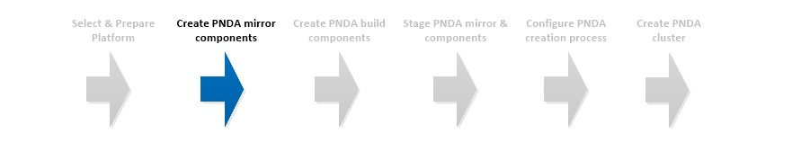

# Create PNDA mirror components



## Introduction

As many real-world deployment environments don’t have Internet connectivity and online sources are not always dependable, PNDA is created from a cache of all the required software known as the "PNDA mirror".

Before PNDA can be created, first we must create the directory structure and file sets to be placed on the PNDA mirror.

### CentOS or RHEL

PNDA can be created on CentOS or RHEL instances. Before building the PNDA mirror components, decide which instance type your deployment will use.

## Create mirror

#### Select build node

Designate or create the mirror build node. 
 
This can be a physical machine or a VM but it needs to reflect the type of mirror you wish to build and must be clean.

Two types of mirror are supported -

- Red Hat Enterprise Linux 7
- CentOS 7 

If using Red Hat, ensure the mirror is built on a clean instance that has had **absolutely no additional** packages installed via yum (i.e. git, unzip, etc) as this will interfere with the dependency calculations of which RPM packages are required on the mirror.

#### Obtain mirror build tools

The repository [pnda](https://github.com/pndaproject/pnda) contains all the tools needed to create and maintain the mirror file sets.

Decide which version of PNDA you want to create. All PNDA releases are desginated with tag similar to ```release/4.0``` across all repositories. 

Clone this repository at the right version to the mirror creation node.


#### Configure the proxy. (Optional)

The entire mirror build process can be performed from behind a non-transparent proxy. 

To proceeding in this mode, first set the system configuration and then run the ```set-proxy-env.sh``` script that will set up the various proxy configurations needed by the multiple build tools.

```sh
sudo su
export http_proxy=http://<proxy_host>:<proxy_port>
export https_proxy=http://<proxy_host>:<proxy_port>
. set-proxy-env.sh
```

#### Build mirror file sets

The build tools are found in the [mirror folder](https://github.com/pndaproject/pnda/tree/master/mirror).

To run the entire mirror creation process -

```sh
sudo su
./create_mirror.sh
```

The script automatically detects the host Linux distribution and builds the appropriate file sets.

This takes about 20 minutes to run and the output will be available in a directory named ```mirror-dist```.

##### Building parts of the mirror

The different parts of the mirror can be created separately if required. The scripts to do this are -

```
create_mirror_rpm.sh
create_mirror_misc.sh
create_mirror_python.sh
create_mirror_cdh.sh
create_mirror_hdp.sh
create_mirror_apps.sh
```

Each script creates its output in a directory named for the respective mirror type -

```
mirror_rpm
mirror_misc
mirror_python
mirror_cloudera
mirror_hdp
mirror_apps
```

For more about creating and maintaining mirrors, please refer to the [repository notes](https://github.com/pndaproject/pnda/tree/master/mirror).

# [Next](BUILD.md)

| [Home](../OVERVIEW.md) | [Prepare](PREPARE.md) | [Mirror](MIRROR.md) | [Build](BUILD.md) | [Stage](STAGE.md) | [Configure](CONFIGURE.md) | [Create](CREATE.md) | 
| --- | --- | --- | --- | --- | --- | --- |
