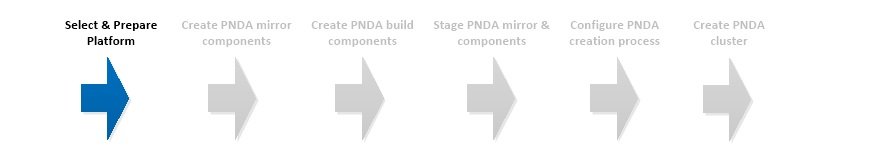

# Select & Prepare Platform

## OpenStack prerequisites

Building and configuring OpenStack is outside the scope of this guide. Please note the following -

- PNDA is regularly tested on OpenStack [Mitaka](http://releases.openstack.org) but is expected to work on versions of OpenStack from Kilo onwards.
- PNDA is deployed using Heat orchestration. We use `heat_template_version: 2015-04-30`. Please make sure this OpenStack service is available.
- PNDA makes use of the Swift object store. Please make sure this OpenStack service is available.
- Before continuing, please ensure -
	- At least one suitable tenant exists
	- It provides sufficient resources and quota to provision one of the flavors described below
	- Nova VM provisioning has been shown to work and you're able to access the VM and have the expected network connectivity (which will depend on what interfaces and networks you decide to configure).

## Required resources

The resource requirements for the default pico and standard flavor PNDA clusters are detailed below. However, you are strongly encouraged to create a PNDA flavor specifically designed for your infrastructure.

#### Pico

Pico flavor is intended for development / learning purposes. It is fully functional, but does not run the core services in high-availability mode and does not provide much storage space or compute resource.

| Role | Instance type | Number required | CPUs | Memory | Total Storage | Root Volume Storage | Log Volume Storage | Data Volume Storage
| --- | --- | --- | --- | --- | --- | --- | --- | ---
|  `gateway`   |  ec2.t2.medium  | 1 | 2 |  4 GB   | 40 GB | 30 GB | 10 GB | 0 GB
|  `edge`      |  ec2.m4.2xlarge  | 1 | 8 | 32 GB   | 40 GB | 30 GB | 10 GB | 0 GB
|  `mgr1`      |  ec2.m4.xlarge  | 1 | 4 | 16 GB   | 40 GB | 30 GB | 10 GB | 0 GB
|  `datanode`  |  ec2.c4.xlarge  | 1 | 4 |  7.5 GB | 75 GB | 30 GB | 10 GB | 35 GB
|  `kafka`     |  ec2.m4.large   | 1 | 2 |  8 GB | 40 GB | 30 GB | 10 GB | 0 GB
| -  |  - | -  | -  | -  | -  | - | - | -
|  `total`     |  | 5 | 20 | 67.5 GB | 235 GB

The storage per node is allocated as:
 - 10 GB log volume. This is provision-time configurable.
 - 30 GB operating system partition. This is configured in the instance flavor definition.
 - 35 GB HDFS (only on datanode). This is configured in the templates for the datanode.

#### Standard

Standard flavor is intended for meaningful PoC and investigations at scale. It runs the core services in high-availability mode and provides reasonable storage space and compute resource.

| Role | Instance type | Number required | CPUs | Memory | Total Storage | Root Volume Storage| Log Volume Storage| Data Volume Storage
| --- | --- | --- | --- | --- | --- | --- | --- | ---
|  `gateway`         |  ec2.t2.medium  | 1 | 2 |   4 GB  |  150 GB |  30 GB | 120 GB |    0 GB
|  `saltmaster`      |  ec2.m4.large   | 1 | 2 |   8 GB  |   50 GB |  50 GB |   0 GB |    0 GB
|  `edge`            |  ec2.t2.medium  | 1 | 2 |   4 GB  |  370 GB | 250 GB | 120 GB |    0 GB
|  `mgr1`            |  ec2.m4.2xlarge | 1 | 8 |  32 GB  |  370 GB | 250 GB | 120 GB |    0 GB
|  `mgr2`            |  ec2.m4.2xlarge | 1 | 8 |  32 GB  |  370 GB | 250 GB | 120 GB |    0 GB
|  `mgr3`            |  ec2.m4.2xlarge | 1 | 8 |  32 GB  |  370 GB | 250 GB | 120 GB |    0 GB
|  `mgr4`            |  ec2.m4.2xlarge | 1 | 8 |  32 GB  |  370 GB | 250 GB | 120 GB |    0 GB
|  `datanode`        |  ec2.m4.2xlarge | 3 | 8 |  32 GB  | 1194 GB |  50 GB | 120 GB | 1024 GB
|  `opentsdb`        |  ec2.m4.xlarge  | 2 | 4 |  16 GB  |  170 GB |  50 GB | 120 GB |    0 GB
|  `hadoop-manager`  |  ec2.m4.xlarge  | 1 | 4 |  16 GB  |  170 GB |  50 GB | 120 GB |    0 GB
|  `jupyter`         |  ec2.m4.large   | 1 | 2 |   8 GB  |  170 GB |  50 GB | 120 GB |    0 GB
|  `logserver`       |  ec2.m4.large   | 1 | 2 |   8 GB  |  500 GB | 250 GB | 250 GB |    0 GB
|  `kafka`           |  ec2.m4.xlarge  | 2 | 4 |  16 GB  |  170 GB |  50 GB | 120 GB |    0 GB
|  `zookeeper`       |  ec2.m4.large   | 3 | 2 |   8 GB  |  170 GB |  50 GB | 120 GB |    0 GB
|  `tools`           |  ec2.m4.large   | 1 | 2 |   8 GB  |   50 GB |  50 GB |   0 GB |    0 GB
| -  |  - | -  |  - | -  | -  | -  | - | -
|  `total`           |   | 21 | 94 |  368 GB | 7.53 TB

The storage per node is allocated as:
 - 120 GB log volume (not present on saltmaster and tools ). This is provision-time configurable.
 - 1024 GB HDFS (only on datanode). This is configured in the templates for the datanode.
 - 30-250 GB operating system partition. This is configured in the instance flavor definition.

### Credentials

Two sets of credentials are used to create PNDA on OpenStack.

#### SSH key pair

The PNDA cluster will be created on a private network behind a gateway node. Access to the gateway node is authenticated with a key pair. This key pair must exist in the target OpenStack tenant - create a new key pair or import and existing key pair before creating PNDA. 

#### Keystone

The creation process accesses OpenStack APIs via Keystone authentication. Ensure that you have located the credentials for Keystone authentication before continuing.
The easiest way to locate the credentials is to download the credentials file usually named <project>-openrc.sh from Horizon for the given user and tenant.

### Object storage

PNDA makes use of object storage for -

- Storing and delivering user-created application packages
- Archiving PNDA datasets that have reached age or size thresholds

PNDA uses Swift for object storage when deploying to OpenStack.

### Containers and folders

Create the following containers and folders in Swift before creating a PNDA cluster -

#### Application container

This container will be used for PNDA application packages.

1. Create or designate a Swift container for this purpose.
2. Create or designate at least one folder within this container to hold the application packages.
3. Make a note of the name, as it will used later when configuring PNDA

#### Dataset archive container

This container will be used for PNDA dataset archives.

1. Create or designate a Swift container for this purpose.
2. Make a note of the name, as it will used later when configuring PNDA

# [Next](IMAGE.md)

| [Home](../OVERVIEW.md) | [Prepare](PREPARE.md) | [Image](IMAGE.md) | [Mirror](MIRROR.md) | [Build](BUILD.md) | [Stage](STAGE.md) | [Configure](CONFIGURE.md) | [Create](CREATE.md) |
| --- | --- | --- | --- | --- | --- | --- | --- |
