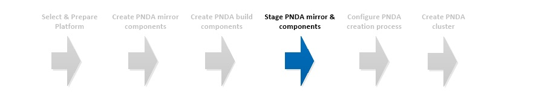

# Stage PNDA mirror & components



## Introduction

In order to make built components available during the PNDA provisioning process, they need to be staged in a location that is accessible from the target environment via HTTP.

## Create server

Create an ordinary HTTP server in the target environment or identify an existing server. The server must have connectivity with the PNDA cluster being provisioned.

See [these tips](EXAMPLES.md) for rapidly creating an HTTP server using a number of different approaches.

Your existing CICD system may already include the capability to host and serve build artifacts over HTTP. In this case, simply make use of an appropriate location on the existing resource.

## Stage files

Copy the *contents* of ```mirror-dist``` and ```pnda-dist``` from the mirror creation and build steps respectively to the HTTP server.

The final directory layout should resemble the following -

```
pnda-root
│
├── console-backend-data-logger-develop.tar.gz
├── console-backend-data-logger-develop.tar.gz.sha512.txt
├── etc
│
├── mirror_python
│   ├── packages/
│   ├── simple/
│
├── mirror_rpm
│   ├── a-rpm.rpm
│   ├── etc
│
├── etc
```

Note that ```pnda-root``` can be any location, all that is required is that the hierarchy under this is available via a known URI. For example, using a standard Apache 2 installation on RHEL 7, if the hierarchy above is placed in ```/var/www/html``` this will be available via the URI ```http://<server>/``` since ```/var/www/html``` is the default *document root*. Please refer to your HTTP server documentation for more details.

Make a note of the URI to ```pnda-root``` as this will be used in configuring the PNDA creation process.

# [Next](CONFIGURE.md)

| [Home](../OVERVIEW.md) | [Prepare](PREPARE.md) | [Mirror](MIRROR.md) | [Build](BUILD.md) | [Stage](STAGE.md) | [Configure](CONFIGURE.md) | [Create](CREATE.md) |
| --- | --- | --- | --- | --- | --- | --- |
