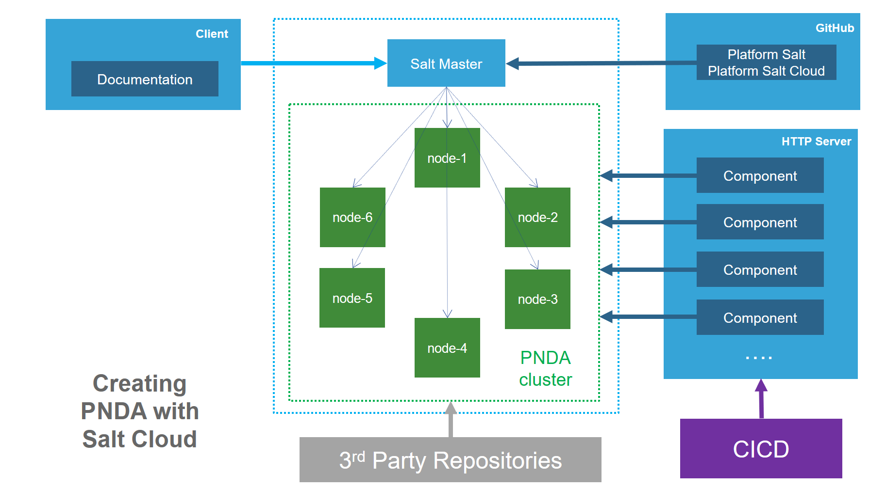

# Provisioning using Salt Cloud


If you want to provision a new cluster using salt-cloud, you will need first to have a functional and runing Salt Master as described in [Configuring a Salt Master](../provisioning/saltmaster.md).

## Getting the source code

The source code for Salt Code maps and the PNDA CLI resides in the platform-salt-cloud repository. This is installed on the Salt Master.

## Using the pnda-cli

Firstly, connect to the Salt Master.

In order to make the provisioning easier, you can use the PNDA command line tool. If you've followed the instructions in  Go to the `cli` directory, and use the tool like this:

	pnda-cli.py create -e name -f large -n 5 -o 1 -k 2 -z 3 -y

Where:

 - **command**: Mode of operation, can be ['create', 'create-from-map', 'destroy-from-map', 'expand-from-map']
 - **-y**: Do not prompt for confirmation before creating or destroying VMs
 - **-e** or **--pnda-cluster**: Namespaced environment for machines in this cluster
 - **-n** or **--datanodes**: How many datanodes for the hadoop cluster
 - **-o** or **--opentsdb-nodes**: How many Open TSDB nodes for the hadoop cluster
 - **-k** or **--kafka-nodes**: How many kafka nodes for the databus cluster
 - **-z** or **--zk-nodes**: How many zookeeper nodes for the databus cluster
 - **-f** or **--flavour**: PNDA flavour: "standard", choices=['standard']
 - **-b** or **--branch**: Git branch to use (defaults to master)

Example:

````
pnda-cli.py command -e mini-pnda -f standard -n 2 -o 1 -k 1 -z 1 -y
````

The command may take around 45 minutes to complete, so you may wish to call it using nohup as follows:

````
nohup pnda-cli.py [options] &
````


## During and after provisioning

The PNDA CLI will generate a large volume of information. The key events of interest are the completion reports from each of the Salt States. This can easily be followed by a command such as:

```
tail -f nohup.out | grep 'Failed'
```

This should report 0 for every event.


