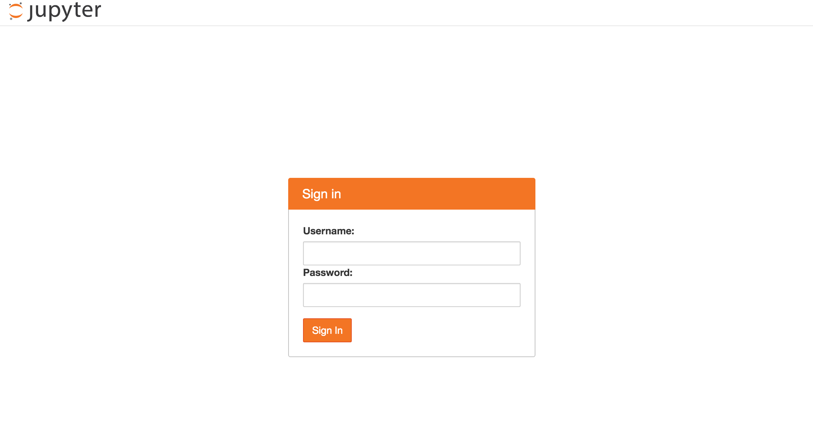
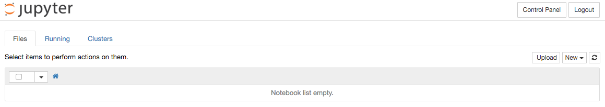

# Example Jupyter Notebooks

* [Overview](#overview)
* [Connecting](#connecting)
* [Quick start](#quick-start)
  * [Log into Jupyter Portal](#log-into-jupyter-portal)
  * [Upload example notebook](#upload-example-notebook)
  * [Open example notebook](#open-example-notebook)

## Overview

The [Jupyter Notebook](http://jupyter.org) is a web application that allows you to create and share documents that contain live code, equations, visualizations and explanatory text. In PNDA, it supports exploration and presentation of data from HDFS and HBase.

## Connecting

Along with PNDA cluster provisioning, Jupyter is deployed with three kernel supports: Python2 kernel, Python3 kernel, and PySpark (Python2) kernel. An example Jupyter notebook is also provided with details instructions on how to rapid prototype using Jupyter PySpark kernel. In particular the example noteobook gives an example usage of platform libraries to load HDFS data and perform interactive data analytics. 

By default, Jupyter is installed on `edge` node or `Jupyter` node depending on your cluster's flavour (i.e. small or large). In order to access Jupyter portal go to: 

* http://[cluster-name]-cdh-edge:8000 (small flavour)
* http://[cluster-name]-chd-jupyter:8000 (large flavour)

## Quick start

### Log into Jupyter portal

You should see a jupyter login page as below. 

   

Use pnda/pnda to login, you will be redirected to a notebook list view. By default the list is empty.

   

### Upload example notebook

Clone example-jupyter-notebooks repository. Click the upload button and select the example notebook (`example-jupyter-notebooks/notebooks/Example Platform-library PySpark Notebook.ipynb`) from your local repository.

   

### Open example notebook

Click the link `Example Platform-library PySpark Notebook.ipynb`.

   

