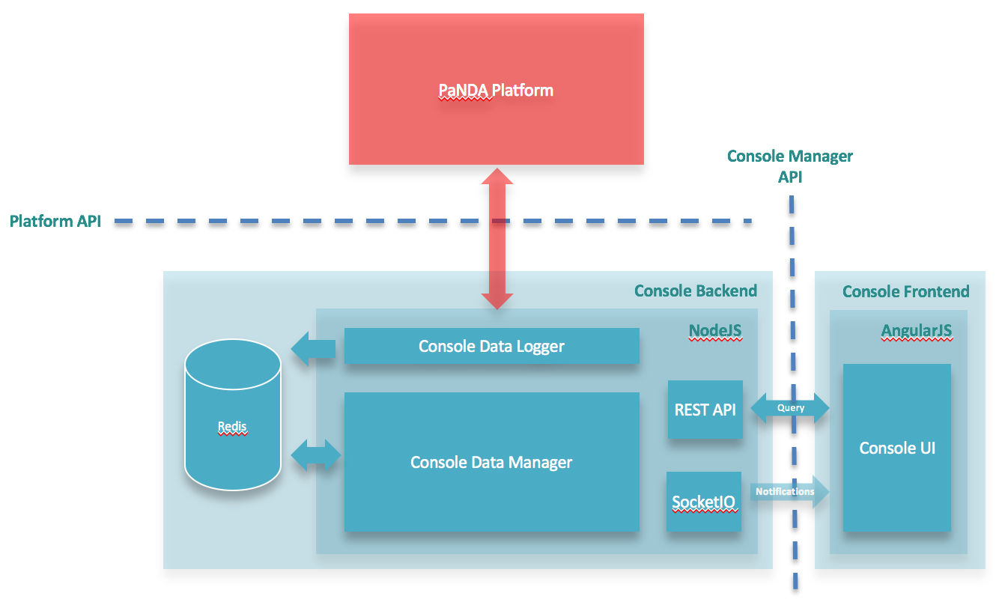
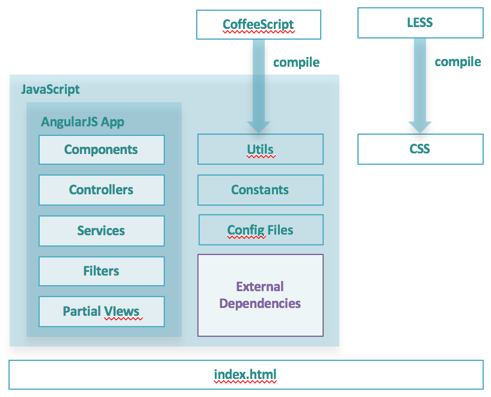

# Platform Console Frontend

The PNDA console frontend provides an overview of all the PNDA components in real time.

It is a web application implemented in [Node.js], and has dependencies on [Grunt], [Twitter Bootstrap], [AngularJS], [AngularStrap], [CoffeeScript], [LESS] and [GreenSock].

## Features

The PNDA console provides a bird's eye view of a PNDA cluster, organized by tab into the following pages:

### Home

The home page shows health statistics of various different components which make up PNDA. Components are grouped into categories, including data distribution, data processing, data storage, applications, etc.

Components are displayed in green if everything is functioning properly, yellow if there is a warning, or red if there is an error. Some components show additional details on the home page, such as the amount of data in the HDFS file system. Click on the (i) icon next to any component to see a popup with more information.

### Metrics

The metrics page lists the metrics for all components in a single table. In addition, it includes key performance indicators (KPIs) for installed applications. 

You can filter the list by typing part of a metric name into the search field. For example, type __HDFS__ to match __hadoop.HDFS.health__, __hadoop.HDFS.files_total__, etc. 

Any warnings will be displayed in yellow, and any errors will be displayed in red. The overall platform health section at the top of the page shows an overview of all warnings and errors. Click the More Info link for more information about a warning or error. 

### Packages

The packages page lets you browse available packages, and packages that have been deployed. You can deploy or undeploy an individual package. Packages are independently deployable units of application layer functionality. Each package consists of one or more components, each of which has a defined type.

### Apps

The apps page lets you create and manage applications, which are instances of packages. You can see the status of each application, and start or stop them. Click an application name for more detailed information, with tabs for the overview, deployment properties, logs, statistics and metrics (application key performance indicators, or KPIs). 

### Datasets

The datasets page lets you manage the data retention policy of each dataset in the cluster. The mode popup menu lets you choose whether to archive or delete data that has exceeded the capacity. The policy popup menu lets you choose whether to limit data by age in days, or size in gigabytes. After you have made changes, click the Save button to review and confirm the changes that will be made.  

## Stack

* Persistence store: Redis
* AngularJS on the client
* CSS based on Twitter's bootstrap

## Build

* Powered by Grunt.js
* Test written using frisby
* Build supporting jshint, jscs, jsdocs to lint code & indicate errors if any.
* Twitter's bootstrap with LESS templates processing integrated into the build
* Jenkins integration


## Architecture

The following diagram shows an overview of the PNDA console:



### Application Structure



### Folder Structure
In `console-frontend`, you have the following structure:

* `node_modules` contains build tasks for Grunt along with other, user-installed, Node packages
* `js` contains all the javascript files.
* `conf` contains all the configuration files
* `partials` contains all HTML files.
* `less` contains all the LESS files used.
* `css` contains all the CSS files.

## Deployment

If you are provision a PNDA, console will be automatically up and running for you and can be accessed using this URL: 

`http://<edge-node-ip>`

**Note:** Replace the IP with the edge node IP of your cluster.

We use nginx web server to run console in a PNDA cluster.

## Development

### Installation

The console front-end application uses Grunt as an automation tool.

Grunt and Grunt plugins are installed and managed via npm, the Node.js package manager. Grunt 0.4.x requires stable Node.js versions >= 0.8.0. Odd version numbers of Node.js are considered unstable development versions.

Before setting up Grunt ensure that your npm is up-to-date by running npm update -g npm (this might require sudo on certain systems).

In order to get started, you'll want to install Grunt's command line interface (CLI) globally. You may need to use sudo (for OSX, *nix, BSD etc) or run your command shell as Administrator (for Windows) to do this.

```sh
$ npm install -g grunt-cli
```

### Install dependencies

Dependencies are listed in package.json. The only thing you need to do is to the run the following command from the console-frontend directory in order to download all the dependencies:

```sh
$ npm install
```

### Run the web app

For development, we're running a simple [express] webserver running on [node.js].

The following command does a build (compiles LESS files into CSS files), launches a webserver (which will open a window in your default browser), and watch for modifications on specified files or directories to automatically recompile your LESS files and live reload your page when anything changes.

```sh
$ grunt serve
```

You can also specify the port to run the node app on, and the live reload port with the following command:

```sh
$ grunt serve --port 8009 --lrport 1339
```

### Deployment

For deployment, grunt is used to process the source into a website that can be served by nginx. For example, [LESS] files are compiled to CSS, and [CoffeeScript] files are compiled to JavaScript. 


   [node.js]: <http://nodejs.org>
   [Twitter Bootstrap]: <http://twitter.github.com/bootstrap/>
   [express]: <http://expressjs.com>
   [AngularJS]: <http://angularjs.org>
   [AngularStrap]: <http://mgcrea.github.io/angular-strap/>
   [Grunt]: <http://gruntjs.com/getting-started>
   [LESS]: <http://lesscss.org/>
   [GreenSock]: <http://greensock.com/>
