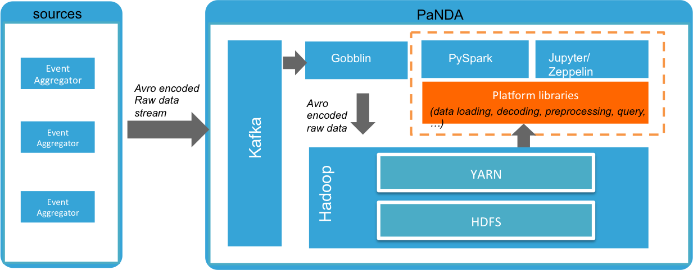

# Platform Libraries

* [Overview](#overview)
  * [Data analytics on PNDA](#data-analytics-on-pnda)
  * [Package overview](#package-overview)
* [Quick start](#quick-start)
* [Build from source](#build-from-source)
  * [Build the library](#build)
  * [Run tests](#run-tests)
  * [Deploy](#deploy)
  * [Configure](#configure)
  * [Interactive notebooks usage](#interactive-notebooks-usage)
* [API Specifications](#api-specifications)
  * [platformlibs.common_helpers module](#platformlibscommon_helpers-module) 
  * [paltformlibs.config_helper module](#platformlibsconfig_helper-module)
  * [platformlibs.data_handler module](#platformlibsdata_handler-module)
  * [platformlibs.simple_data_handler module](#platformlibssimple_data_handler-module)
  * [platformlibs.json_data_handler moudle](#platformlibsjson_data_handler-module)
  * [platformlibs.xr_data_handler module](#platformlibsxr_data_handler-module)
* [Custom implementations](#custom-implementations)

## Overview ##

#### Data analytics on PNDA ####

When streaming raw event data to PNDA cluster via Kafka, raw data are encoded using an Avro schema with extra metadata information. These metadata include timestamp, data source, host ip. The raw data that are encoded in bytes along with metadata are persistent in HDFS and are organized on a per source, per year, per month, per day, and per hour basis. 

In order to make sense of data, an application developer will need to extract data from a specific folder, decode against PNDA avro schema, and incorpate the data into data analytics processes. Instead of duplicate these common processes for each application, one can use platform libraries, a python library that hides low-level data operations by providing ready-to-use functions to access PNDA data and perform data analytics using Spark. Most importantly, the platform library can be used as an extension framework for custom data preprocessing and custom data operations. 

As the diagram below, the platform libraries place an abstract layer upon low-level HDFS interfaces and allows you to rapidly develop PySpark applications or interactive notebooks (empowered by Jupyter or Zeppelin). 



#### Package overview ####
```
+-- Platformlibs
|   +-- common_helpers: defines pnda-specific utility functions
|   +-- config_helper: define configuration utility (currently loading and parsing INI file only) 
|   +-- data_handler
|       +-- DataHandler: abstract data handler class
|   +-- simple_data_handler
|       +-- SimpleDataHandler: default data handler class that provides loading data form hdfs as Spark RDD only. (no business logics implemented)
|   +-- json_data_handler
|       +-- JsonDataHandler: Json data handler class that assumes 'rawdata' is encoded in JSON format. 
|   +-- xr_data_handler.
    	+-- class XrDataHandler: a sample implementation for XR telemetry data handler.
```
## Quick start ##

By default for every successfully provisioned PNDA cluster, the library is pre-installed on a 'edge node'. Follow the steps to start loading data:

```
$ sudo -u hdfs pyspark --master yarn-client --jars /opt/cloudera/parcels/CDH/lib/spark/lib/spark-examples.jar 
>>> from platformlibs.simple_data_handler import SimpleDataHandler
>>> source = 'your data source name' # is the folder name under /user/pnda/PNDA_datasets/datasets/source=?
>>> path = 'year=?/month=?/hour=?' # any sub-directory under /user/pnda/PNDA_datasets/datasets/source=?
>>> handler = SimpleDataHandler(sc, source, path)
>>> rdd = handler.rdd
>>> ...
```
## Build from source ##

If your PNDA cluster does not have this library pre-installed, or you would like to use this platform on another PNDA cluster node, Follow these steps to get started from the edge node:

#### Build ####

Once you clone the repsitory, run a build process as follows:

```
  sudo pip install -r requirements.txt
	python setup.py bdist_egg
```

The build process generates an 'eggy' distribution at `./dist/platformlibs-<VERSION>-py2.7.egg`.

#### Run tests ####

Running unittests on either PNDA cluster or your local cluster requires these dependencies. Run the followings to install:

```
	sudo pip -r test_requirements.txt
	source install-spark.sh
```

and run unittests:

```
	nosetests tests
```

#### Deploy ####

Until this is automated, these steps are mandatory for deploying eggs.
The egg must be installed on the Zeppelin node in the cluster using **easy_install**. 

```
	sudo easy_install /path/to/platformlibs-<VERSION>-py2.7.egg
```

#### Configure ####

Platform libaries requires loading configuration file from `/etc/platformlibs/platformlibs.ini`, which maintains access details to Cloudera Manager. The default configurations are defined along with PNDA cluster provisioning. If the username and password have been changed, you will need update the configuration file accordingly. An example configuration file is given below:

```
[cm]
cm_host=192.168.0.105
cm_user=admin
cm_pass=admin
```

#### Interactive notebooks usage ####

Configure in the Zeppelin/Jupyter's pyspark interpreter settings with

```
	--py-files=/path/to/platformlibs-<VERSION>-py2.7.egg
```

**Note:** You may need to restart pyspark interpreter before using this library. If you are using this library in your Spark App, simply copy and paste this library to your app. 


You can use the egg along with pyspark interactive console or Zeppelin/Jupyter by injecting the library into runtime by adding the following statement in your code:

```
	sc.addPyFile('/path/to/platformlibs-<VERSION>-py2.7.egg')
```

## API Specifications ##

#### platformlibs.common_helpers module ####

A collection of builtin helper functions
* **platformlibs.common_helpers.flatten_dict**
 * **Description**: return a flattened dictionary
  * **Args:**
    * input_d: read-only source dictionary
    * result: output dictionary
    ```
    >>> from platformlibs import common_helpers
    >>> common_helpers.flatten_dict({'a':[{'b':1}, {'c':[{'d':2}]}]})
    {'a-c-d': 2, 'a-b': 1}
    ```
* **platformlibs.common_helpers.get_hdfs_uri**
 * **Description**: return a hdfs root path URI
  * **Args:**
    * hostname: cloudera manager host name of a PNDA cluster
    ```
    >>> from platformlibs import common_helpers
    >>> common_helpers.get_hdfs_uri("test-dev-cm", "admin", "admin")
    hdfs://HDFS-HA
    ```
    
#### platformlibs.config_helper module ####

* **platformlibs.config_helper.get_config**
 * **Description**: parse configuration file and return a configuration dictionary
  * **Args:**
    * filename: INI configuration file path
    ```
    >>> from platformlibs import config_helper
    >>> config_helper.get_config('/etc/platformlibs/platformlibs.init)
    {'cm_host':'pnda-cluster-cdh-cm', 'cm_user':'admin', 'cm_pass':'admin'}
    ```
    
#### platformlibs.data_handler module ####

* **platformlibs.data_handler.DataHandler**(spark_context, data_source, file_path)
 * Abstract DataHandler Class
 * **rdd**
   * **Description**: Decode avro datasets and return an RDD instance
    * **Args:**
      * datasource : data source type (e.g. netflow or telemetry)
      * path: hdfs related directory or file path
 * **preprocess**
   * **Description**: Preprocessing abstract interface
    * **Args:**
      * raw_data: the input RDD

 * **list_host_ips**
   * **Description**: abstract interface that returns list of (<host ip>:total_stats) pairs
  
 * **list_metric_ids**
   * **Description**: abstract interface that returns list of (<host ip>, [(<metric_id>, total_stats)) pairs aggregated by descending order on per host basis
    * **Args:**
      * limit: the limit of numer of metrics of each host
      * filters: filtering rules
 * **execute_query**
   * **Description**: return time-series data
    * **Args:**
      * filters: filtering rules

#### platformlibs.simple_data_handler module ####

* **platformlibs.simple_data_handler.SimpleDataHandler**(spark_context, data_source, file_path)
  * **Description**: default data handler class that provides loading data form hdfs as Spark RDD only. (no business logics implemented)
  * **preprocess**
    * **Description**: decode avro-formatted data
    * **Args:**
      * raw_data: the input RDD
    ```
    >>> from platformlibs.simple_data_handler import JsonDataHandler
    >>> handler = SimpleDataHandler(sc, 'test', 'year=2015/month=11/day=02/hour=11')
    >>> rdd = handler.rdd
    >>> rdd.count()
    3451792
    ```

#### platformlibs.json_data_handler module ####

* **platformlibs.json_data_handler.JsonDataHandler**(spark_context, data_source, file_path)
  * **Description**: Json data handler that assumes 'rawdata' is encoded in JSON format
  * **preprocess**
    * **Description**: decode avro-formatted data and decode json-formatted raw data value 
    * **Args:**
      * raw_data: the input RDD
    ```
    >>> from platformlibs.json_data_handler import JsonDataHandler
    >>> handler = JsonDataHandler(sc, 'netflow', 'year=2015/month=11/day=02/hour=11')
    >>> rdd = handler.rdd
    >>> rdd.take(1)
    [{u'src': u'netflow', 'rawdata': {u'flow_sampler_id': u'0', u'in_bytes': u'46', u'protocol': u'6', u'first_switched': u'2015-11-02T10:59:44.999Z', u'flowset_id': u'256', u'ipv4_dst_addr': u'128.107.253.30', u'src_mask': u'0', u'src_as': u'0', u'ipv4_src_addr': u'64.39.105.23', u'last_switched': u'2015-11-02T10:59:44.999Z', u'version': u'9', u'flow_seq_num': u'1255692034', u'direction': u'0', u'l4_src_port': u'48965', u'ipv4_next_hop': u'128.107.80.58', u'dst_as': u'0', u'in_pkts': u'1', u'dst_mask': u'30', u'l4_dst_port': u'21064', u'output_snmp': u'3', u'src_tos': u'0', u'tcp_flags': u'0', u'input_snmp': u'106'}, u'timestamp': 1446462002000, u'host_ip': u'172.17.153.41'}]
    ```
 * **list_host_ips**
   * **Description**: Returns list of (<host ip>:total_stats) pairs
   ```
   >>> handler.list_host_ips()
   [('10.33.64.11', 292829), ('10.33.76.2', 269228), ('10.33.76.1', 158514), ('172.17.153.41', 156710), ('172.30.194.7', 67920), ('172.30.194.8', 25140), ('172.30.194.51', 5477), ('172.17.153.27', 4902), ('10.33.69.19', 1838), ('172.30.194.117', 359)]
   ```
 * **list_metric_ids**
   * **Description**: Returns list of (<host ip>, [(<metric_id>, total_stats)) pairs aggregated by descending order on per host basis
    * **Args:**
      * limit: the limit of numer of metrics of each host
       * filters: filtering rules (supported filters include 'host_ips':[], 'start_ts':int, 'end_ts':int, 'data_sources':[])
   ```
   >>> handler.list_metric_ids(limit=1, filters={'host_ips':['10.33.64.11', '172.17.153.27'], 'start_ts':1446462002000, 'end_ts':1446462004000, 'data_sources':['netflow']})
   [('10.33.64.11', [(u'mul_dst_bytes', 246)]), ('172.17.153.27', [(u'mul_dst_pkts', 2117)])]
   ```
 * **execute_query**
   * **Description**: return time-series data
    * **Args:**
      * filters: filtering rules (supported those as list_metric_ids plus 'metrics':[])
   ```
   >>> handler.execute_query(filters={'host_ips':['10.33.64.11'], 'start_ts':1446462002000, 'end_ts':1446462004000, 'data_sources':['netflow'], 'metrics':['in_bytes']})
   [((u'in_bytes', u'10.33.64.11'), [(1446462002000, u'1616'), (1446462004000, u'60')])]
   ```

#### platformlibs.xr_data_handler module ####
* **platformlibs.xr_data_handler.XrDataHandler**(spark_context, data_source, file_path, cm_host, cm_user='admin', cm_pass='admin')
 * Custom implementation of XR Telemetry data handler
 * **list_metric_ids**
   * **Description**: Returns list of (<host ip>, [(<metric_id>, total_stats)) pairs aggregated by descending order on per host basis
    * **Args:**
      * limit: the limit of numer of metrics of each host
      * filters: filtering rules (supported filters inherited from SimpleDataHandler class plus 'metric_type':'<mpls|ipsal|infra>')
   ```
   >>> from platformlibs.xr_data_handler import XrDataHandler
   >>> handler = XrDataHandler(sc, 'telemetry', 'year=2015/month=08/day=14/hour=06', 'test-dev-cm', 'admin', 'admin')
   >>> handler.list_host_ips()
   [('192.168.0.4', 5226), ('192.168.0.8', 5226), ('192.168.0.9', 5226), ('192.168.0.1', 5148), ('192.168.0.6', 5148), ('192.168.0.10', 5148)]
   >>> handler.list_metric_ids(limit=1, filters={'host_ips':['192.168.0.4'], 'metric_type':'ipsla'})
   [{'metrics': [(u'ipslastats.Aggregated.54.NonDistributed.Target.SpecificStats.UDPJitterStats.PacketLossDS', 402)], 'host_ip': '192.168.0.4'}]
   >>> handler.list_metric_ids(limit=1, filters={'host_ips':['192.168.0.4'], 'metric_type':'mpls'})
   [{'metrics': [(u'mplstesummary.BidirTailLSPs', 67)], 'host_ip': '192.168.0.4'}]
   >>> handler.list_metric_ids(limit=1, filters={'host_ips':['192.168.0.4'], 'metric_type':'infra'})
   [{'metrics': [(u'ribprefix.RoutePath-Flags64', 2010)], 'host_ip': '192.168.0.4'}]
   ```
   
## Custom implementations ##

By default, platform libraries assumes the raw event data are encoded in json format. If your data come with different encoding formats, you will need to provide your own implementations. 

Two options are avaialble:

1. Custom "preprocess" implementation and render your raw data to be json formatted. With this option, you can reuse operations implemented by default. 
2. Custom implemenation of opertional interfaces for your custom data formats. 
