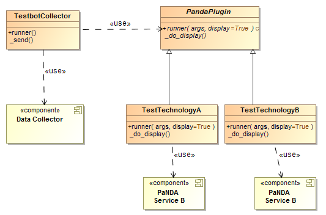

# Platform Testing

This project consists of a set of modules which test various aspects of the platform and provide feedback to a data collection service. 

### Blackbox

Functionalities of various platform services are tested without looking at the internal code structure. The main focus of black box testing is on the validation of the functional requirements.

### Whitebox

Validate & measure internal structure and working of various platform services.

## Design

The tests are organized as a set of plugins and a plugin runner. Each plugin encapsulates the detail of the technology it interacts with - the runner simply runs the specified plugin passing any parameters.

All plugins are expected to support methods to display their results on the stdout in a consistent manner and all plugins return their results in a consistent format which the runner then forwards on to the data collection service.

## Usage

Platform testing have been developed in order to support multiple services in an agnostic way. That's why we use a set of plugins which are managed by the monitor.py script.

The plugin should be in the plugins folder corresponding to its name and should implement a TestbotPlugin python script with a runner method. 

Once done, you call the plugin like this:

	python -B monitor.py --plugin YOUR_PLUGIN --display --postjson http://127.0.0.1:3001/metrics --extra "--plugin_args_1 value1 --plugin_args_2 value2"

Where:

 - **--display**: used to display information on the stdout
 - **--postjson**: in case you would like to send your result to the PNDA console, this should then be compliant with the data collector specification

		{
			"data": [ {
			"source": "myservice",
			"metric": "mymetric",
			"value": "ERROR",
			"causes": ["something went wrong"],
			"timestamp": 1684313134
			}],
			"timestamp": 1794643131
		}

 - **--extra**: this is a way to send plugin arguments, without any limitations and the management of this is managed by the plugin itself.

# Plugins

## Zookeeper Blackbox

The Zookeeper Blackbox plugin uses the KazooClient in order to connect to a Zookeeper host or ensemble and then test that the nodes are working. It provides the list of nodes (IP and port) that are currently working and the ones that could be dead.

Argument to **--plugin**:

- **zookeeper**

Arguments to **--extra**:

- **--zconnect**: connection string for Zookeeper

Example:

	--zconnect 127.0.0.1:2181,127.0.0.1:2182

## CDH

The CDH plugin obtains a set of key performance indicators from the CM API.

Argument to **--plugin**:

- **cdh**

Arguments to **--extra**:

- **--cmhost**: host for CM API authentication
- **--cmport**: port for CM API authentication
- **--cmuser**: user for CM API authentication
- **--cmpassword**: password for CM API authentication

Example:

	--cmhost localhost --cmport 7180 --cmuser admin --cmpassword password

## CDH Blackbox

The CDH Blackbox plugin runs a series of tests against key services from the perspective of a client, for example creating tables in HBase, reading from them and writing to them, querying data through Impala and so on. It also measures the performance of these tests, for example capturing the latency of the Impala read operation.

It also queries the CM API for its view on Hadoop service health. These indicators are combined with the results of the other tests and an algorithm computes a set of final health status indicators per service which are sent with all the other results to the data collection service.

Argument to **--plugin**:

- **cdh_blackbox**

Arguments to **--extra**:

- **--cmhost**: host for CM API authentication
- **--cmport**: port for CM API authentication
- **--cmuser**: user for CM API authentication
- **--cmpassword**: password for CM API authentication
- **--hbaseport**: port to address HBase (endpoint autodiscovered)
- **--hiveport**: port to address Hive (endpoint autodiscovered)
- **--impalaport**: port to address Impala (endpoint autodiscovered)

Example:

	--cmhost localhost --cmport 7180 --cmuser admin --cmpassword password --hbaseport 1111 --hiveport 2222 --impalaport 3333

## Deployment Manager Blackbox

The Deployment Manager Blackbox plugin checks that the main API is working. First you will need to specify the endpoint of the deployment manager, and then you can check that the `/repository/packages` and `/packages` APIs are working. The tool will check that the HTTP response code is as expected, and that the JSON is valid. The tool creates metrics for the deployment manager, including health and response times. 

Argument to **--plugin**:

- **dm_blackbox**

Arguments to **--extra**:

- **--dmendpoint**: HTTP entry point for Deployment Manager

Example:

	--dmendpoint http://192.168.103.4:5000
	
## Kafka

The blackbox test on kafka used the KazooClient, Kafka and avro module in order to get deeper details about the health of Kafka by getting all the JMX information. We use the reference documentation of Kafka regarding the [Kafka manotoring](http://kafka.apache.org/documentation.html#monitoring). For using JMX MBean in python, you need to have in place a JMX Proxy that will convert everything in JSON, see [JMX Proxy](https://github.com/mk23/jmxproxy) for more information.

Argument to **--plugin**:

- **kafka**

Arguments to **--extra**:

- **--zconnect**: connection string for Zookeeper
- **--brokerlist**: connection string for Kafka JMX

Example:

	--zconnect 127.0.0.1:2181,127.0.0.1:2182 --brokerlist 127.0.0.1:9050,127.0.0.1:9051

## Kafka Blackbox

The blackbox test on kafka used the KazooClient, Kafka and avro module in order to:
 
1. connect to Zookeeper host or ensemble and then test that the nodes are working. 
2. get the broker information within zookeeper 
3. [OPTIONAL] send avro encoded message to an internal test topic on the right Kafka broker and ensure we well received previous sent messages

Argument to **--plugin**:

- **kafka_blackbox**

Arguments to **--extra**:

- **--zconnect**: connection string for Zookeeper
- **--prod2cons**: send avro encoded message and check we consume them

Example:

	--zconnect 127.0.0.1:2181,127.0.0.1:2182 --prod2cons