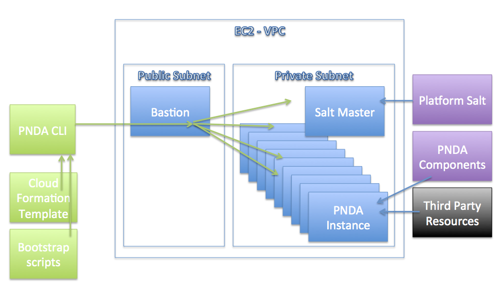

# PNDA AWS Templates
This repository contains resources for launching PNDA on [Amazon Web Services](https://aws.amazon.com/) (AWS).

# Overview



- The blocks in green are provided by this repository.
- Cloud formation templates are used to create the instances and other cloud infrastructure in EC2.
- PNDA is launched in a private network in a custom VPC as specified by the cloud formation templates. For security reasons all access is then controlled via a bastion node, the only one with a public IP address. The CLI generates some sample ssh configuration files to help with accessing the cluster via the bastion.
- The instances are bootstrapped to install the saltstack provisioning system.
- The platform-salt salt scripts are used to install PNDA from PNDA components and third party components.

# Steps to provision PNDA on AWS

1. Obtain an AWS account.

2. Create a bucket in S3 for PNDA applications. A bucket for archived data is automatically created by PNDA. The names of these buckets are configured in pnda_env.yaml (see step 7 below). AWS credientials should be created for an IAM user with access to these specific S3 buckets only. For help creating a user with these permissions, please refer [here](s3help.md).

3. Clone this pnda-aws-templates repository from the master branch at a specific release tag e.g. `release/x.x.x`.

4. Copy ```pnda_env_example.yaml``` to create ```pnda_env.yaml```

5. Edit pnda_env.yaml with an Ubuntu 14.04 or Redhat Enterprise Linux 7 image ID (`cloud_formation_parameters.imageId`). This should be the AWS default ubuntu or Redhat AMI for the region you are provisioning into. If using an Ubuntu AMI set `ec2_access.OS_USER` to ubuntu; for a Redhat AMI set `ec2_access.OS_USER` to ec2-user.

6. Edit pnda_env.yaml with [AWS credentials](http://docs.aws.amazon.com/AWSSimpleQueueService/latest/SQSGettingStartedGuide/AWSCredentials.html) to use to launch the cloud formation stack (`ec2_access.AWS_ACCESS_KEY_ID` and `ec2_access.AWS_SECRET_ACCESS_KEY`). These credentials should have permissions to launch cloud formation stacks and are only ever stored on the client machine.

7. Edit pnda_env.yaml with a version of platform-salt to use. Platform-salt installs PNDA software on the cloud instances created by the PNDA CLI. There are two main options:
   - A local copy of platform-salt can be used by setting (`platform_salt.PLATFORM_SALT_LOCAL`) to the path to the platform-salt folder on the local machine running pnda-cli.py.
   - A remote git URI to be cloned from the cloud during provisioning (`platform_salt.PLATFORM_GIT_REPO_URI` and `platform_salt.PLATFORM_GIT_BRANCH`).  If authenticated access to `platform_salt.PLATFORM_GIT_REPO_URI` is required then place the ssh key to use, named git.pem, in the top level directory of this repository and also set `platform_salt.PLATFORM_GIT_REPO_HOST` to the hostname of the server.
   - **Note** Please ensure that the local clone of platform-salt or the `PLATFORM_GIT_BRANCH` correspond to the same release/x.x.x tag that this pnda-aws-templates repository was cloned at.

8. Edit pnda_env.yaml with the names of the buckets to use for PNDA applications (`pnda_application_repo.PNDA_APPS_CONTAINER`) and PNDA archived data (`pnda_data_archive.PNDA_ARCHIVE_CONTAINER`) and the credentials to access them. These credentials should be created for IAM user(s) with access to the specific S3 buckets only as these credentials will be stored in plain text on some of the nodes launched in AWS. For help creating a user with these permissions, please refer [here](s3help.md).

9. Edit pnda_env.yaml with the PNDA mirror IP address (`mirrors.PNDA_MIRROR`). The PNDA mirror server provides a webserver for the binaries for the pnda components plus all the third party resources. [This documentation contains instructions](https://github.com/pndaproject/pnda/blob/develop/CREATING_PNDA.md) on how to set up a PNDA mirror.

10. Create [an ssh keypair](http://docs.aws.amazon.com/AWSEC2/latest/UserGuide/ec2-key-pairs.html) to use when creating the EC2 instances for PNDA as ```key_name```. Place the private key ```key_name.pem``` in the root of the pnda-aws-templates directory. Ensure that key_name.pem has 0600 permissions. For example, if the keypair in AWS is 'pnda' then the local private key file should be named 'pnda.pem' and the corresponding cli parameter should be '-s pnda'.

11. Install pip packages required by the CLI 
    ```sh
    cd cli
    sudo pip install -r requirements.txt
    ```
    
12. Create a cluster:
    ```sh
    cd cli
    pnda-cli.py create -e <cluster_name> -s <key_name> -f standard -o 2 -n 3 -k 2 -z 3
    ``` 
    The options shown select the standard flavor, 2 open tsdb instances, 3 hadoop datanodes, 2 kafka brokers, and 3 zookeeper nodes. If you need to operate within the default EC2 instance quota of 20 instances then you can reduce this to 1 kafka and 1 zookeeper instance or use the pico flavor.
    ```sh
    pnda-cli.py create -e <cluster_name> -s <key_name> -f standard -o 1 -n 1 -k 1 -z 1
    pnda-cli.py create -e <cluster_name> -s <key_name> -f pico -n 1 -k 1
    ```

# Cloud Formation Templates

The cloud formation templates for PNDA can be edited directly to make modications as required.

The organisation and contents of the cloud formation templates is described [here](cloud-formation/README.md).
