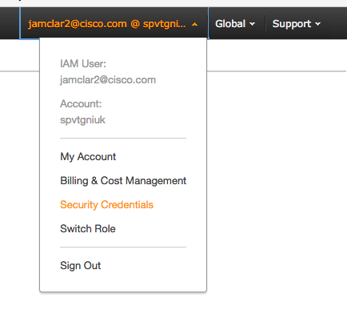

## Creating a user and API key with S3 Access only

As mentioned in the instructions the client_env.sh file should include two sets of AWS credentials:
 - AWS_ACCESS_KEY_ID and AWS_SECRET_ACCESS_KEY: these require access to EC2 and cloud formation for creating PNDA. These keys are only ever stored on the client machine.
 - S3_ACCESS_KEY_ID and S3_SECRET_ACCESS_KEY: these require access to S3, specifically the buckets created for application packages and for archived data.

To create an API key with access only to the specific S3 buckets:

 - Create a new user and record the credentials generated by Amazon:

  1. Select security credentials on top right menu for your account


  2. Select User and the left menu and click on "Create new User"


 - Create a new policy:

  1. Select Policies on the left menu and click on "Create Policy"


  2. Choose "Create Your Own Policy"


  3. Then, on Step 3, set Policy Name to "s3pndaruntime" and Description to "Access to S3 buckets for pnda" and put the following content to the Policy document:


```json
{
  "Version": "2012-10-17",
  "Statement": [
    {
      "Effect": "Allow",
      "Action": ["s3:ListBucket"],
      "Resource": ["arn:aws:s3:::pnda-apps"]
    },
    {
      "Effect": "Allow",
      "Action": [
        "s3:PutObject",
        "s3:GetObject",
        "s3:DeleteObject"
      ],
      "Resource": ["arn:aws:s3:::pnda-apps/*"]
    },
    {
      "Effect": "Allow",
      "Action": ["s3:ListBucket"],
      "Resource": ["arn:aws:s3:::pnda-archive"]
    },
    {
      "Effect": "Allow",
      "Action": [
        "s3:PutObject",
        "s3:GetObject",
        "s3:DeleteObject"
      ],
      "Resource": ["arn:aws:s3:::pnda-archive/*"]
    },
    {
      "Effect": "Allow",
      "Action": [
        "s3:CreateBucket"
      ],
      "Resource": ["arn:aws:s3:::*"]
    }    
  ]
}
```

 - Go back to users list, select the user just created on 1 and attach the policy to the user using the permissions tab:
