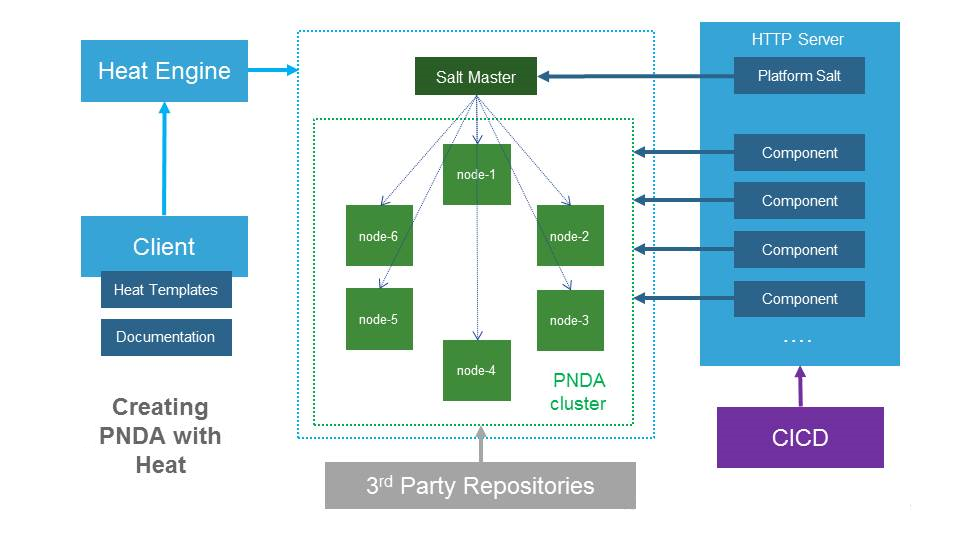

# PNDA Heat Templates



## Requirements

### Python

To use the PNDA command line interface, you will need to install the python, heat and nova clients. To install them on Ubuntu, run:

```sh
$ sudo apt-get -y update
$ sudo apt-get -y install python python-pip python-dev
$ cd cli
$ sudo pip install -r requirements.txt
```

### Git credentials

The stack will make use of git repositories. In case git authentication is required, a private key is required. It is then necessary to have an ssl keypair, whose public key is registered in the git server. To authenticate against the server the private key value must be passed. By default a `deploy` file must be present in the templates directory. If you already own a keypair, it probably stands in the `.ssh` subdirectory of your home directory. If this keypair is registered against the git server, it is only necessary to copy its content into the `deploy` file.

```sh
$ cd pnda-heat-templates
$ cp ~/.ssh/id_rsa deploy
```

If you do not own a keypair or if your public key value is not stored on the git server, please follow this guide to [generate a public key](https://git-scm.com/book/be/v2/Git-on-the-Server-Generating-Your-SSH-Public-Key).

Also uncomment `#deploy` and specifiy url of your git repo in `pnda_env.yaml` file

## Deploy PNDA using the CLI

### Pre-requisite

As a pre-requisite to use the CLI, it is necessary to setup some openstack required environment variables. The easy way to do so is to retrieve an rc file from the horizon dashboard of your OpenStack platform, in the context of the targeted OpenStack project. Once retrieved just source it.

```sh
$ . <project>-openrc.sh
```

### Environment configuration

The Heat PNDA stack default parameters can be set in the `pnda_env.yaml` file. Please refer to the file [ENVIRONMENTS.md](environments.md) in the pnda-heat-templates repository for a full description of every configuration point. 

As this file is specific to the target environment it needs to be created by the PNDA integrator. You can start by renaming the example `pnda_env_example.yaml` to `pnda_env.yaml` or create your own following this guide and the instructions in `ENVIRONMENTS.md`.

A brief summary of the main points follows.

You MUST update the `KEYSTONE CREDENTIALS` section in the `pnda_env.yaml` file with your openstack credentials in order for PNDA to use swift. For example:

    keystone_user: 'pnda'
    keystone_password: '32165468321654'
    keystone_tenant: 'pnda'
    keystone_auth_url: 'https://openstack.example.com:5000/v2.0'
    keystone_region_name: 'europe'

You MUST edit the `pnda_apps_container`, `pnda_apps_folder` parameters to change which location to use for the application repository in Swift.  For example:

    pnda_apps_container: 'pnda.applications'
    pnda_apps_folder: 'releases'

You MUST edit the `pnda_archive_container` to point to the Swift container where data will be archived. For example:

    pnda_archive_container: 'pnda_archives'

You can optionally add the `JavaMirror`, `ClouderaParcelsMirror` and `AnacondaParcelsMirror` parameters to point to your private mirrors of the Sun Oracle Java tarball and Cloudera Parcels mirror. It can make deployment faster.  For example:

    JavaMirror: 'http://pnda-mirror.example.com/java/jdk/8u74-b02/jdk-8u74-linux-x64.tar.gz'
    ClouderaParcelsMirror: 'http://pnda-mirror.example.com/mirror/archive.cloudera.com/cdh5/parcels/5.9.0/'

### Package repository 

The default backend storage for the package repository is Swift and so you should have the containers created as defined with the parameters 'pnda_apps_container' and 'pnda_apps_folder' as describe just above.
So then, for the package repository backend storage type, it is the 'fstype' argument of the heat cli, it could be either:

- 'swift': in case you will store your packages within Swift so the configuration will be:
```
  package_repository_fs_type: 'swift'
```

- 's3': in case you will want to use AWS S3 so the configuration will be:
```
  # AWS configuration
  S3_ACCESS_KEY_ID=xxxx
  S3_SECRET_ACCESS_KEY=xxxx
  AWS_REGION=xxxx
```
- 'sshfs': if you want to have the packages on another host which will be connected from the package repository host. For more information about sshfs, go to [SSHFS libfuse](https://github.com/libfuse/sshfs). The configuration will be:

```
  package_repository_fs_location_path: '/opt/pnda/packages'
  package_repository_sshfs_user: 'cloud-user'
  package_repository_sshfs_host: '127.0.0.1'
  package_repository_sshfs_path: '/mnt/packages'
  package_repository_sshfs_key: pr_key
```
Do not forget also to copy the key.pem file used by sshfs to connect to the remote host:
```sh
$ cd pnda-heat-templates
$ cp PATH/key.pem pr_key
```

- 'volume': in case of the standard flavor, we have attached a volume in order to be able to store lot of packages and this is mount by default on the edge node. The configuration will be:

```
  package_repository_fs_location_path: '/mnt/packages'
```

- 'local': if you want the packages to be store localy on the package repository node. The configuration will be:

```
  package_repository_fs_location_path: '/opt/pnda/packages'
```

### The CLI

The `heat_cli.py` scripts allows to launch a PNDA deployment. It sits in the `cli` subdirectory.

```sh
$ cd cli
$ ./heat_cli.py
usage: heat_cli.py [-h] [-y] [-e PNDA_CLUSTER] [-n DATANODES]
                   [-o OPENTSDB_NODES] [-k KAFKA_NODES] [-z ZK_NODES]
                   [-f {standard}] [-b BRANCH] [-s KEYPAIR]
                   {create,destroy}
```
"the `-s KEYPAIR` will be used to connect to the bastion instance through ssh. KEYPAIR refers to the name given to the public key of the pair in the target OpenStack tenant. Therefore, a pre-requisite is that you should create a new OpenStack keypair, or import an existing one to the OpenStack platform.

Make sure you have access to the private key of KEYPAIR otherwise you will not be able to connect to the bastion node and access the cluster."

There are various PNDA flavors: this allows changing role distribution across the resources.

### Creating a PNDA cluster

We create a standard deployment named `cation`. We specify 3 data nodes, 1 opentsdb node, 2 kafka nodes, 3 zookeeper nodes:

```sh
$ ./heat_cli.py -e cation -n 3 -o 1 -k 2 -z 3 -f standard -s <existing_neutron_keypair> create
+--------------------------------------+------------------+--------------------+----------------------+--------------+
| id                                   | stack_name       | stack_status       | creation_time        | updated_time |
+--------------------------------------+------------------+--------------------+----------------------+--------------+
| 80d510fe-8fb5-4fbc-b4ba-a65cafa12103 | cation           | CREATE_IN_PROGRESS | 2016-04-11T12:47:22Z | None         |
+--------------------------------------+------------------+--------------------+----------------------+--------------+
+-----------------------+------------------------------------------------------------------------------------------------------------------------+
| Property              | Value                                                                                                                  |
+-----------------------+------------------------------------------------------------------------------------------------------------------------+
| capabilities          | []                                                                                                                     |
| creation_time         | 2016-04-11T12:47:22Z                                                                                                   |
| description           | No description                                                                                                         |
| disable_rollback      | True                                                                                                                   |
| id                    | 80d510fe-8fb5-4fbc-b4ba-a65cafa12103                                                                                   |
| links                 | http://XXX.XXX.XXX.XXX:8004/v1/7875ed368a8043449c9dc58aac73ab7e/stacks/cation/80d510fe-8fb5-4fbc-b4ba-a65cafa12103 (self) |
| notification_topics   | []                                                                                                                     |
| parameters            | {                                                                                                                      |
|                       |   "OS::project_id": "7875ed368a8043449c9dc58aac73ab7e",                                                                |
|                       |   "private_net_cidr": "10.10.10.0/24",                                                                                 |
|                       |   "EdgeFlavor": "m1.xlarge",                                                                                           |
|                       |   "private_net_pool_end": "10.10.10.200",                                                                              |

[...]

| stack_user_project_id | d4e029af62ee4b9bbc7c038e2b5ef350                                                                                       |
| template_description  | No description                                                                                                         |
| timeout_mins          | None                                                                                                                   |
| updated_time          | None                                                                                                                   |
+-----------------------+------------------------------------------------------------------------------------------------------------------------+
2016-04-11 12:47:23Z [cation]: CREATE_IN_PROGRESS  Stack CREATE started
2016-04-11 12:47:23Z [saltmaster_sec_group]: CREATE_IN_PROGRESS  state changed
2016-04-11 12:47:24Z [highstate_config]: CREATE_IN_PROGRESS  state changed
2016-04-11 12:47:24Z [swift_config]: CREATE_IN_PROGRESS  state changed
2016-04-11 12:47:24Z [PndaSecGroup]: CREATE_IN_PROGRESS  state changed
2016-04-11 12:47:25Z [private_net]: CREATE_IN_PROGRESS  state changed
2016-04-11 12:47:25Z [orchestrate_config]: CREATE_IN_PROGRESS  state changed
2016-04-11 12:47:25Z [router]: CREATE_IN_PROGRESS  state changed
2016-04-11 12:47:26Z [install_config]: CREATE_IN_PROGRESS  state changed
2016-04-11 12:47:26Z [Key]: CREATE_IN_PROGRESS  state changed
2016-04-11 12:47:26Z [orchestrate_config]: CREATE_COMPLETE  state changed
2016-04-11 12:47:27Z [saltmaster_sec_group]: CREATE_COMPLETE  state changed
2016-04-11 12:47:27Z [router]: CREATE_COMPLETE  state changed
2016-04-11 12:47:27Z [install_config]: CREATE_COMPLETE  state changed
2016-04-11 12:47:27Z [private_net]: CREATE_COMPLETE  state changed
2016-04-11 12:47:27Z [swift_config]: CREATE_COMPLETE  state changed
2016-04-11 12:47:27Z [highstate_config]: CREATE_COMPLETE  state changed
2016-04-11 12:47:27Z [Key]: CREATE_COMPLETE  state changed
2016-04-11 12:47:27Z [PndaSecGroup]: CREATE_COMPLETE  state changed
2016-04-11 12:47:27Z [private_subnet]: CREATE_IN_PROGRESS  state changed
2016-04-11 12:47:29Z [private_subnet]: CREATE_COMPLETE  state changed
2016-04-11 12:47:29Z [saltmaster_port]: CREATE_IN_PROGRESS  state changed
2016-04-11 12:47:30Z [router_interface]: CREATE_IN_PROGRESS  state changed
2016-04-11 12:47:31Z [saltmaster_port]: CREATE_COMPLETE  state changed
2016-04-11 12:47:31Z [router_interface]: CREATE_COMPLETE  state changed
2016-04-11 12:47:31Z [saltmaster_server]: CREATE_IN_PROGRESS  state changed
2016-04-11 12:48:04Z [saltmaster_server]: CREATE_COMPLETE  state changed
2016-04-11 12:48:04Z [deploy_install]: CREATE_IN_PROGRESS  state changed
2016-04-11 12:50:40Z [deploy_install]: CREATE_COMPLETE  state changed
2016-04-11 12:50:40Z [pnda_cluster]: CREATE_IN_PROGRESS  state changed
2016-04-11 12:53:31Z [pnda_cluster]: CREATE_COMPLETE  state changed
2016-04-11 12:53:31Z [deploy_swift]: CREATE_IN_PROGRESS  state changed
2016-04-11 12:54:36Z [deploy_swift]: CREATE_COMPLETE  state changed
2016-04-11 12:54:36Z [deploy_highstate]: CREATE_IN_PROGRESS  state changed
2016-04-11 13:01:34Z [deploy_highstate]: CREATE_COMPLETE  state changed
2016-04-11 13:01:34Z [deploy_orchestrate]: CREATE_IN_PROGRESS  state changed
2016-04-11 13:33:31Z [deploy_orchestrate]: CREATE_COMPLETE  state changed
2016-04-11 13:33:31Z [cation]: CREATE_COMPLETE  Stack CREATE completed successfully

[...]

 Stack cation CREATE_COMPLETE
```

## Anatomy of a PNDA stack

If we examine the previously created stack :

```sh
$ heat stack-list -n | grep cation
| 80d510fe-8fb5-4fbc-b4ba-a65cafa12103 | cation                                                                  | CREATE_COMPLETE | 2016-04-11T12:47:22Z | None         | None                                 |
| d8c4e4aa-b4de-4742-a430-d85553e66987 | cation-pnda_cluster-obz7kxxsnatx                                       | CREATE_COMPLETE | 2016-04-11T12:50:40Z | None         | 80d510fe-8fb5-4fbc-b4ba-a65cafa12103 |
| 3ed6689c-45c1-4201-aab2-96beb2a82974 | cation-pnda_cluster-obz7kxxsnatx-bastion-ccdyikzg2gar                  | CREATE_COMPLETE | 2016-04-11T12:50:44Z | None         | d8c4e4aa-b4de-4742-a430-d85553e66987 |
| 7e911922-a4d5-416b-a69f-5ec3871f2677 | cation-pnda_cluster-obz7kxxsnatx-edge-pribufdbiz3s                     | CREATE_COMPLETE | 2016-04-11T12:50:45Z | None         | d8c4e4aa-b4de-4742-a430-d85553e66987 |
| cc35476a-e5ab-4620-9d38-0f28ce2dc84d | cation-pnda_cluster-obz7kxxsnatx-cm-anaz62owf25q                       | CREATE_COMPLETE | 2016-04-11T12:50:46Z | None         | d8c4e4aa-b4de-4742-a430-d85553e66987 |
| fa48786c-84c1-42ed-adac-167e850b396b | cation-pnda_cluster-obz7kxxsnatx-manager1-pkyrsg6kywg5                 | CREATE_COMPLETE | 2016-04-11T12:50:49Z | None         | d8c4e4aa-b4de-4742-a430-d85553e66987 |
| d5c7baf7-0115-4b97-ac6c-2a9ae2a9f8e4 | cation-pnda_cluster-obz7kxxsnatx-opentsdb-pdzsym7ukyvz                 | CREATE_COMPLETE | 2016-04-11T12:50:52Z | None         | d8c4e4aa-b4de-4742-a430-d85553e66987 |
| f4bd32b0-9df8-40eb-a13f-b8ee3f7c5260 | cation-pnda_cluster-obz7kxxsnatx-zookeeper-2pqkyjnmt4b4                | CREATE_COMPLETE | 2016-04-11T12:50:52Z | None         | d8c4e4aa-b4de-4742-a430-d85553e66987 |
| 689e88ca-0ea0-4747-8753-dfbcd25c0bcd | cation-pnda_cluster-obz7kxxsnatx-opentsdb-pdzsym7ukyvz-0-koz6d4y52euh  | CREATE_COMPLETE | 2016-04-11T12:50:54Z | None         | d5c7baf7-0115-4b97-ac6c-2a9ae2a9f8e4 |
| 436f9371-8430-4937-9580-bd923d9e8f78 | cation-pnda_cluster-obz7kxxsnatx-tools-rlnmhbimn7le                    | CREATE_COMPLETE | 2016-04-11T12:50:55Z | None         | d8c4e4aa-b4de-4742-a430-d85553e66987 |
| 482f1e2a-ba44-48f3-92d5-3aa7f4e15515 | cation-pnda_cluster-obz7kxxsnatx-zookeeper-2pqkyjnmt4b4-0-ekw7zjofmcr6 | CREATE_COMPLETE | 2016-04-11T12:50:56Z | None         | f4bd32b0-9df8-40eb-a13f-b8ee3f7c5260 |
| d7e4d502-4057-4afa-be87-fd27c93323c0 | cation-pnda_cluster-obz7kxxsnatx-dn-c47jwj3v4idx                       | CREATE_COMPLETE | 2016-04-11T12:50:57Z | None         | d8c4e4aa-b4de-4742-a430-d85553e66987 |
| 557f23e6-205b-4ad4-8ef3-d489c692ca46 | cation-pnda_cluster-obz7kxxsnatx-tools-rlnmhbimn7le-0-ww3hsajtgf6v     | CREATE_COMPLETE | 2016-04-11T12:50:58Z | None         | 436f9371-8430-4937-9580-bd923d9e8f78 |
| ca0ed237-3026-44b9-8bb9-7813913f561a | cation-pnda_cluster-obz7kxxsnatx-kafka-cz7budcvxmvk                    | CREATE_COMPLETE | 2016-04-11T12:50:58Z | None         | d8c4e4aa-b4de-4742-a430-d85553e66987 |
| 52e1a7ed-c7f4-419d-b7d5-6749dcc498a4 | cation-pnda_cluster-obz7kxxsnatx-dn-c47jwj3v4idx-0-yykdys4kctd6        | CREATE_COMPLETE | 2016-04-11T12:50:59Z | None         | d7e4d502-4057-4afa-be87-fd27c93323c0 |
| 8e0318ed-5b1b-46f7-ae0f-766fb8077a82 | cation-pnda_cluster-obz7kxxsnatx-kafka-cz7budcvxmvk-0-r2e7tx2lmlkb     | CREATE_COMPLETE | 2016-04-11T12:51:00Z | None         | ca0ed237-3026-44b9-8bb9-7813913f561a |
```

A PNDA deployment is a heat stack, and nested stacks deploying a cluster made of again another nested stack per role/cluster. Each line in the previous output describes a heat stack which can be examinded again.

We can have a look at the resources of the stack :

```sh
$ heat resource-list cation
+----------------------+-------------------------------------------------------------------------------------+------------------------------+-----------------+----------------------+
| resource_name        | physical_resource_id                                                                | resource_type                | resource_status | updated_time         |
+----------------------+-------------------------------------------------------------------------------------+------------------------------+-----------------+----------------------+
| deploy_highstate     | 2bc4d5ba-441d-439e-ba41-f2ebb3009b76                                                | OS::Heat::SoftwareDeployment | CREATE_COMPLETE | 2016-04-11T12:47:22Z |
| deploy_orchestrate   | 04c82c5a-470c-4bbf-8105-6b602b0e3994                                                | OS::Heat::SoftwareDeployment | CREATE_COMPLETE | 2016-04-11T12:47:22Z |
| deploy_swift         | 92ca062d-ed22-4167-a02f-31ee4eb902c9                                                | OS::Heat::SoftwareDeployment | CREATE_COMPLETE | 2016-04-11T12:47:22Z |
| pnda_cluster        | d8c4e4aa-b4de-4742-a430-d85553e66987                                                | OS::Pnda::cluster           | CREATE_COMPLETE | 2016-04-11T12:47:22Z |
| Key                  | cation                                                                              | OS::Nova::KeyPair            | CREATE_COMPLETE | 2016-04-11T12:47:23Z |
| PndaSecGroup        | 5852df8a-2c10-4d27-b11e-acdfcc2b40f2                                                | OS::Neutron::SecurityGroup   | CREATE_COMPLETE | 2016-04-11T12:47:23Z |
| deploy_install       | e625e78c-15b1-430f-ae69-6bb41f05efd4                                                | OS::Heat::SoftwareDeployment | CREATE_COMPLETE | 2016-04-11T12:47:23Z |
| highstate_config     | 1cd5fbee-c6b9-4596-858f-deac94dc1060                                                | OS::Heat::SoftwareConfig     | CREATE_COMPLETE | 2016-04-11T12:47:23Z |
| install_config       | b664a413-0a2e-46c8-b6ba-3303045a582c                                                | OS::Heat::SoftwareConfig     | CREATE_COMPLETE | 2016-04-11T12:47:23Z |
| orchestrate_config   | f70201c2-5814-41b2-bdb1-9158903a8a4e                                                | OS::Heat::SoftwareConfig     | CREATE_COMPLETE | 2016-04-11T12:47:23Z |
| private_net          | c232c59f-9cb7-457f-aa8b-50bc285ba14f                                                | OS::Neutron::Net             | CREATE_COMPLETE | 2016-04-11T12:47:23Z |
| private_subnet       | 54156224-3749-496c-b39c-bd5c6121e9d6                                                | OS::Neutron::Subnet          | CREATE_COMPLETE | 2016-04-11T12:47:23Z |
| router               | 31a1a963-d686-4488-aa66-5d655f416308                                                | OS::Neutron::Router          | CREATE_COMPLETE | 2016-04-11T12:47:23Z |
| router_interface     | 31a1a963-d686-4488-aa66-5d655f416308:subnet_id=54156224-3749-496c-b39c-bd5c6121e9d6 | OS::Neutron::RouterInterface | CREATE_COMPLETE | 2016-04-11T12:47:23Z |
| saltmaster_port      | 94177921-9829-4630-93aa-ba50117980c0                                                | OS::Neutron::Port            | CREATE_COMPLETE | 2016-04-11T12:47:23Z |
| saltmaster_sec_group | b06b1142-3c7e-4115-8b04-5424071fd134                                                | OS::Neutron::SecurityGroup   | CREATE_COMPLETE | 2016-04-11T12:47:23Z |
| saltmaster_server    | d5f4f0d7-70e0-4d54-bb94-11766e25c471                                                | OS::Nova::Server             | CREATE_COMPLETE | 2016-04-11T12:47:23Z |
| swift_config         | b49e4621-995e-4779-b360-1067f9082928                                                | OS::Heat::SoftwareConfig     | CREATE_COMPLETE | 2016-04-11T12:47:23Z |
+----------------------+-------------------------------------------------------------------------------------+------------------------------+-----------------+----------------------+
```

And ultimately the resources from the nested stacks as well :

```sh
$ heat resource-list -n 5 cation                                                                                                                                                        [113/489]
+----------------------+-------------------------------------------------------------------------------------+------------------------------+-----------------+----------------------+---------------------------------------
----------------------------------+
| resource_name        | physical_resource_id                                                                | resource_type                | resource_status | updated_time         | stack_name
                                  |
+----------------------+-------------------------------------------------------------------------------------+------------------------------+-----------------+----------------------+---------------------------------------
----------------------------------+
| deploy_highstate     | 2bc4d5ba-441d-439e-ba41-f2ebb3009b76                                                | OS::Heat::SoftwareDeployment | CREATE_COMPLETE | 2016-04-11T12:47:22Z | cation
                                  |
| deploy_orchestrate   | 04c82c5a-470c-4bbf-8105-6b602b0e3994                                                | OS::Heat::SoftwareDeployment | CREATE_COMPLETE | 2016-04-11T12:47:22Z | cation
                                  |
| deploy_swift         | 92ca062d-ed22-4167-a02f-31ee4eb902c9                                                | OS::Heat::SoftwareDeployment | CREATE_COMPLETE | 2016-04-11T12:47:22Z | cation
                                  |
| pnda_cluster        | d8c4e4aa-b4de-4742-a430-d85553e66987                                                | OS::Pnda::cluster           | CREATE_COMPLETE | 2016-04-11T12:47:22Z | cation
                                  |
| Key                  | cation                                                                              | OS::Nova::KeyPair            | CREATE_COMPLETE | 2016-04-11T12:47:23Z | cation
                                  |
| PndaSecGroup        | 5852df8a-2c10-4d27-b11e-acdfcc2b40f2                                                | OS::Neutron::SecurityGroup   | CREATE_COMPLETE | 2016-04-11T12:47:23Z | cation
                                  |
| deploy_install       | e625e78c-15b1-430f-ae69-6bb41f05efd4                                                | OS::Heat::SoftwareDeployment | CREATE_COMPLETE | 2016-04-11T12:47:23Z | cation
                                  |
| highstate_config     | 1cd5fbee-c6b9-4596-858f-deac94dc1060                                                | OS::Heat::SoftwareConfig     | CREATE_COMPLETE | 2016-04-11T12:47:23Z | cation
                                  |
| install_config       | b664a413-0a2e-46c8-b6ba-3303045a582c                                                | OS::Heat::SoftwareConfig     | CREATE_COMPLETE | 2016-04-11T12:47:23Z | cation
                                  |
| orchestrate_config   | f70201c2-5814-41b2-bdb1-9158903a8a4e                                                | OS::Heat::SoftwareConfig     | CREATE_COMPLETE | 2016-04-11T12:47:23Z | cation
                                  |
| private_net          | c232c59f-9cb7-457f-aa8b-50bc285ba14f                                                | OS::Neutron::Net             | CREATE_COMPLETE | 2016-04-11T12:47:23Z | cation
                                  |
| private_subnet       | 54156224-3749-496c-b39c-bd5c6121e9d6                                                | OS::Neutron::Subnet          | CREATE_COMPLETE | 2016-04-11T12:47:23Z | cation
                                  |
| router               | 31a1a963-d686-4488-aa66-5d655f416308                                                | OS::Neutron::Router          | CREATE_COMPLETE | 2016-04-11T12:47:23Z | cation
                                  |
| router_interface     | 31a1a963-d686-4488-aa66-5d655f416308:subnet_id=54156224-3749-496c-b39c-bd5c6121e9d6 | OS::Neutron::RouterInterface | CREATE_COMPLETE | 2016-04-11T12:47:23Z | cation
                                  |
| saltmaster_port      | 94177921-9829-4630-93aa-ba50117980c0                                                | OS::Neutron::Port            | CREATE_COMPLETE | 2016-04-11T12:47:23Z | cation
                                  |
| saltmaster_sec_group | b06b1142-3c7e-4115-8b04-5424071fd134                                                | OS::Neutron::SecurityGroup   | CREATE_COMPLETE | 2016-04-11T12:47:23Z | cation
                                  |
| saltmaster_server    | d5f4f0d7-70e0-4d54-bb94-11766e25c471                                                | OS::Nova::Server             | CREATE_COMPLETE | 2016-04-11T12:47:23Z | cation
                                  |
| swift_config         | b49e4621-995e-4779-b360-1067f9082928                                                | OS::Heat::SoftwareConfig     | CREATE_COMPLETE | 2016-04-11T12:47:23Z | cation
                                  |
| bastion              | 3ed6689c-45c1-4201-aab2-96beb2a82974                                                | OS::Pnda::bastion           | CREATE_COMPLETE | 2016-04-11T12:50:41Z | cation-pnda_cluster-obz7kxxsnatx
                                  |
| cm                   | cc35476a-e5ab-4620-9d38-0f28ce2dc84d                                                | OS::Pnda::cm                | CREATE_COMPLETE | 2016-04-11T12:50:41Z | cation-pnda_cluster-obz7kxxsnatx
                                  |
| edge                 | 7e911922-a4d5-416b-a69f-5ec3871f2677                                                | OS::Pnda::edge              | CREATE_COMPLETE | 2016-04-11T12:50:41Z | cation-pnda_cluster-obz7kxxsnatx
                                  |
| opentsdb             | d5c7baf7-0115-4b97-ac6c-2a9ae2a9f8e4                                                | OS::Heat::ResourceGroup      | CREATE_COMPLETE | 2016-04-11T12:50:41Z | cation-pnda_cluster-obz7kxxsnatx
                                  |
| DNSecGroup           | fb6e6b38-40d1-4b80-85a1-626969c8dbe7                                                | OS::Neutron::SecurityGroup   | CREATE_COMPLETE | 2016-04-11T12:50:42Z | cation-pnda_cluster-obz7kxxsnatx
                                  |
| KafkaSecGroup        | 958ada28-4e65-47c6-929c-e2b4445313ad                                                | OS::Neutron::SecurityGroup   | CREATE_COMPLETE | 2016-04-11T12:50:42Z | cation-pnda_cluster-obz7kxxsnatx
                                  |
| OpentsdbSecGroup     | 191320d3-3ecf-47e8-8e6b-bb259a282e05                                                | OS::Neutron::SecurityGroup   | CREATE_COMPLETE | 2016-04-11T12:50:42Z | cation-pnda_cluster-obz7kxxsnatx
                                  |
| ToolsSecGroup        | 4141c2fb-ee52-4828-a125-433234f1b14b                                                | OS::Neutron::SecurityGroup   | CREATE_COMPLETE | 2016-04-11T12:50:42Z | cation-pnda_cluster-obz7kxxsnatx
                                  |
| ZKSecGroup           | 332fe76d-4c66-486a-8b8c-6f4550ea8588                                                | OS::Neutron::SecurityGroup   | CREATE_COMPLETE | 2016-04-11T12:50:42Z | cation-pnda_cluster-obz7kxxsnatx
                                  |
| dn                   | d7e4d502-4057-4afa-be87-fd27c93323c0                                                | OS::Heat::ResourceGroup      | CREATE_COMPLETE | 2016-04-11T12:50:42Z | cation-pnda_cluster-obz7kxxsnatx
                                  |
| kafka                | ca0ed237-3026-44b9-8bb9-7813913f561a                                                | OS::Heat::ResourceGroup      | CREATE_COMPLETE | 2016-04-11T12:50:42Z | cation-pnda_cluster-obz7kxxsnatx
                                  |
| manager1             | fa48786c-84c1-42ed-adac-167e850b396b                                                | OS::Pnda::manager1          | CREATE_COMPLETE | 2016-04-11T12:50:42Z | cation-pnda_cluster-obz7kxxsnatx
                                  |
| tools                | 436f9371-8430-4937-9580-bd923d9e8f78                                                | OS::Heat::ResourceGroup      | CREATE_COMPLETE | 2016-04-11T12:50:42Z | cation-pnda_cluster-obz7kxxsnatx
                                  |
| zookeeper            | f4bd32b0-9df8-40eb-a13f-b8ee3f7c5260                                                | OS::Heat::ResourceGroup      | CREATE_COMPLETE | 2016-04-11T12:50:42Z | cation-pnda_cluster-obz7kxxsnatx
                                  |
| floatingIP           | 0c45ee3f-0817-4cd7-852f-c2331cb367e9                                                | OS::Neutron::FloatingIP      | CREATE_COMPLETE | 2016-04-11T12:50:44Z | cation-pnda_cluster-obz7kxxsnatx-bast
ion-ccdyikzg2gar                  |
| install_config       | 03f94be1-2673-43eb-ae22-1f90ef71e2f6                                                | OS::Heat::SoftwareConfig     | CREATE_COMPLETE | 2016-04-11T12:50:44Z | cation-pnda_cluster-obz7kxxsnatx-bast
ion-ccdyikzg2gar                  |
| install_deployment   | 8a83fe6a-e494-4460-b9a0-1bd2860be5e0                                                | OS::Heat::SoftwareDeployment | CREATE_COMPLETE | 2016-04-11T12:50:44Z | cation-pnda_cluster-obz7kxxsnatx-bast
ion-ccdyikzg2gar                  |
| port                 | ecbb0a84-9da8-4ed4-af52-4d58c97fe029                                                | OS::Neutron::Port            | CREATE_COMPLETE | 2016-04-11T12:50:44Z | cation-pnda_cluster-obz7kxxsnatx-bast
ion-ccdyikzg2gar                  |
| sec_group            | 6447961b-b12c-4719-a068-4a8cb4161b3a                                                | OS::Neutron::SecurityGroup   | CREATE_COMPLETE | 2016-04-11T12:50:44Z | cation-pnda_cluster-obz7kxxsnatx-bast
ion-ccdyikzg2gar                  |
| server               | 62b63880-a80a-4142-adc7-6a0e258546c1                                                | OS::Nova::Server             | CREATE_COMPLETE | 2016-04-11T12:50:44Z | cation-pnda_cluster-obz7kxxsnatx-bast
ion-ccdyikzg2gar                  |
| install_config       | 3c54dbfc-5fcc-4b8f-bef4-b443806363f5                                                | OS::Heat::SoftwareConfig     | CREATE_COMPLETE | 2016-04-11T12:50:45Z | cation-pnda_cluster-obz7kxxsnatx-edge
-pribufdbiz3s                     |
| install_deployment   | 3c7e3df2-1520-4eec-84e7-4ef764c95614                                                | OS::Heat::SoftwareDeployment | CREATE_COMPLETE | 2016-04-11T12:50:45Z | cation-pnda_cluster-obz7kxxsnatx-edge
-pribufdbiz3s                     |
| port                 | 1628aace-0f3f-4edb-8152-31fb6c098a03                                                | OS::Neutron::Port            | CREATE_COMPLETE | 2016-04-11T12:50:45Z | cation-pnda_cluster-obz7kxxsnatx-edge
-pribufdbiz3s                     |
| sec_group            | 510b83e9-bf7c-424e-8dc1-a8dc60bc701a                                                | OS::Neutron::SecurityGroup   | CREATE_COMPLETE | 2016-04-11T12:50:45Z | cation-pnda_cluster-obz7kxxsnatx-edge
-pribufdbiz3s                     |
| server               | feeff5db-e3c6-4035-8654-38bf70f09677                                                | OS::Nova::Server             | CREATE_COMPLETE | 2016-04-11T12:50:45Z | cation-pnda_cluster-obz7kxxsnatx-edge
-pribufdbiz3s                     |
| install_config       | 219ea1b4-730d-4e0a-8928-70de06c0cf20                                                | OS::Heat::SoftwareConfig     | CREATE_COMPLETE | 2016-04-11T12:50:46Z | cation-pnda_cluster-obz7kxxsnatx-cm-a
naz62owf25q                       |
| install_deployment   | 24d36818-2447-4161-8b22-40e5c9373e2f                                                | OS::Heat::SoftwareDeployment | CREATE_COMPLETE | 2016-04-11T12:50:46Z | cation-pnda_cluster-obz7kxxsnatx-cm-a
naz62owf25q                       |
| port                 | 9992d132-918b-4121-a8d9-d17078bdbbdc                                                | OS::Neutron::Port            | CREATE_COMPLETE | 2016-04-11T12:50:46Z | cation-pnda_cluster-obz7kxxsnatx-cm-a
naz62owf25q                       |
| sec_group            | 01ce3f03-1740-4769-924c-5698206c7714                                                | OS::Neutron::SecurityGroup   | CREATE_COMPLETE | 2016-04-11T12:50:46Z | cation-pnda_cluster-obz7kxxsnatx-cm-a
naz62owf25q                       |
| server               | 3a71802d-c5f7-40f7-aae2-56ea64b25071                                                | OS::Nova::Server             | CREATE_COMPLETE | 2016-04-11T12:50:46Z | cation-pnda_cluster-obz7kxxsnatx-cm-a
naz62owf25q                       |
| install_config       | b6e42e21-d4eb-4c71-b5be-29ac4bd514d8                                                | OS::Heat::SoftwareConfig     | CREATE_COMPLETE | 2016-04-11T12:50:49Z | cation-pnda_cluster-obz7kxxsnatx-mana
ger1-pkyrsg6kywg5                 |
| install_deployment   | 0388f83f-dab8-4398-a812-1fae1d3648c4                                                | OS::Heat::SoftwareDeployment | CREATE_COMPLETE | 2016-04-11T12:50:49Z | cation-pnda_cluster-obz7kxxsnatx-mana
ger1-pkyrsg6kywg5                 |
| port                 | 51fb1400-7067-4434-9dce-3b714efb0eaa                                                | OS::Neutron::Port            | CREATE_COMPLETE | 2016-04-11T12:50:49Z | cation-pnda_cluster-obz7kxxsnatx-mana
ger1-pkyrsg6kywg5                 |
| sec_group            | ae76a14a-3f4d-4309-a0b9-3f54ea24072b                                                | OS::Neutron::SecurityGroup   | CREATE_COMPLETE | 2016-04-11T12:50:49Z | cation-pnda_cluster-obz7kxxsnatx-mana
ger1-pkyrsg6kywg5                 |
| server               | 8cd4101f-efa3-4fe3-9a2e-8ba55fcd1885                                                | OS::Nova::Server             | CREATE_COMPLETE | 2016-04-11T12:50:49Z | cation-pnda_cluster-obz7kxxsnatx-mana
ger1-pkyrsg6kywg5                 |
| 0                    | 482f1e2a-ba44-48f3-92d5-3aa7f4e15515                                                | OS::Pnda::zookeeper         | CREATE_COMPLETE | 2016-04-11T12:50:52Z | cation-pnda_cluster-obz7kxxsnatx-zookeeper-2pqkyjnmt4b4                |
| 0                    | 689e88ca-0ea0-4747-8753-dfbcd25c0bcd                                                | OS::Pnda::opentsdb          | CREATE_COMPLETE | 2016-04-11T12:50:52Z | cation-pnda_cluster-obz7kxxsnatx-opentsdb-pdzsym7ukyvz                 |
| install_deployment   | d8016fcb-ee82-43c8-ae63-dbd87bd607cc                                                | OS::Heat::SoftwareDeployment | CREATE_COMPLETE | 2016-04-11T12:50:54Z | cation-pnda_cluster-obz7kxxsnatx-opentsdb-pdzsym7ukyvz-0-koz6d4y52euh  |
| port                 | 3741d558-040e-4899-aa09-0acd55fa5ed1                                                | OS::Neutron::Port            | CREATE_COMPLETE | 2016-04-11T12:50:55Z | cation-pnda_cluster-obz7kxxsnatx-opentsdb-pdzsym7ukyvz-0-koz6d4y52euh  |
| 0                    | 557f23e6-205b-4ad4-8ef3-d489c692ca46                                                | OS::Pnda::tools             | CREATE_COMPLETE | 2016-04-11T12:50:56Z | cation-pnda_cluster-obz7kxxsnatx-tools-rlnmhbimn7le                    |
| install_config       | 95cca8b6-e463-4383-803e-8c5729714834                                                | OS::Heat::SoftwareConfig     | CREATE_COMPLETE | 2016-04-11T12:50:56Z | cation-pnda_cluster-obz7kxxsnatx-opentsdb-pdzsym7ukyvz-0-koz6d4y52euh  |
| server               | e8f63fb4-36cd-4e2d-be3b-c4e2e58d2da8                                                | OS::Nova::Server             | CREATE_COMPLETE | 2016-04-11T12:50:56Z | cation-pnda_cluster-obz7kxxsnatx-opentsdb-pdzsym7ukyvz-0-koz6d4y52euh  |
| 0                    | 52e1a7ed-c7f4-419d-b7d5-6749dcc498a4                                                | OS::Pnda::dn                | CREATE_COMPLETE | 2016-04-11T12:50:57Z | cation-pnda_cluster-obz7kxxsnatx-dn-c47jwj3v4idx                       |
| install_config       | dd671a45-fb27-4b76-a10d-807bf87fd7b0                                                | OS::Heat::SoftwareConfig     | CREATE_COMPLETE | 2016-04-11T12:50:57Z | cation-pnda_cluster-obz7kxxsnatx-zookeeper-2pqkyjnmt4b4-0-ekw7zjofmcr6 |
| install_deployment   | 87147bbb-7a4d-46e9-8d27-0a45a0678f84                                                | OS::Heat::SoftwareDeployment | CREATE_COMPLETE | 2016-04-11T12:50:57Z | cation-pnda_cluster-obz7kxxsnatx-zookeeper-2pqkyjnmt4b4-0-ekw7zjofmcr6 |
| port                 | 6b55e5d5-6309-4a38-ad58-8fe588ab7f57                                                | OS::Neutron::Port            | CREATE_COMPLETE | 2016-04-11T12:50:57Z | cation-pnda_cluster-obz7kxxsnatx-zookeeper-2pqkyjnmt4b4-0-ekw7zjofmcr6 |
| server               | 834e3201-316b-4b77-81c8-6e48af9f6476                                                | OS::Nova::Server             | CREATE_COMPLETE | 2016-04-11T12:50:57Z | cation-pnda_cluster-obz7kxxsnatx-zookeeper-2pqkyjnmt4b4-0-ekw7zjofmcr6 |
| install_config       | d1d4046a-6537-411d-9bb1-846243215801                                                | OS::Heat::SoftwareConfig     | CREATE_COMPLETE | 2016-04-11T12:50:58Z | cation-pnda_cluster-obz7kxxsnatx-tools-rlnmhbimn7le-0-ww3hsajtgf6v     |
| install_deployment   | e2acf060-ad02-4785-9900-1cf71c365097                                                | OS::Heat::SoftwareDeployment | CREATE_COMPLETE | 2016-04-11T12:50:58Z | cation-pnda_cluster-obz7kxxsnatx-tools-rlnmhbimn7le-0-ww3hsajtgf6v     |
| 0                    | 8e0318ed-5b1b-46f7-ae0f-766fb8077a82                                                | OS::Pnda::kafka             | CREATE_COMPLETE | 2016-04-11T12:50:59Z | cation-pnda_cluster-obz7kxxsnatx-kafka-cz7budcvxmvk                    |
| port                 | 7061585f-3b60-41b4-a458-3ad443f59adf                                                | OS::Neutron::Port            | CREATE_COMPLETE | 2016-04-11T12:50:59Z | cation-pnda_cluster-obz7kxxsnatx-dn-c47jwj3v4idx-0-yykdys4kctd6        |
| port                 | c2ad7911-67ed-4632-8a9f-2e2238ce2836                                                | OS::Neutron::Port            | CREATE_COMPLETE | 2016-04-11T12:50:59Z | cation-pnda_cluster-obz7kxxsnatx-tools-rlnmhbimn7le-0-ww3hsajtgf6v     |
| server               | 38fd7a6b-e846-410d-90ba-dd222e5aabd9                                                | OS::Nova::Server             | CREATE_COMPLETE | 2016-04-11T12:50:59Z | cation-pnda_cluster-obz7kxxsnatx-tools-rlnmhbimn7le-0-ww3hsajtgf6v     |
| install_config       | b678c181-2e12-4d0b-9a8c-1cd85cb78348                                                | OS::Heat::SoftwareConfig     | CREATE_COMPLETE | 2016-04-11T12:51:00Z | cation-pnda_cluster-obz7kxxsnatx-dn-c47jwj3v4idx-0-yykdys4kctd6        |
| install_deployment   | 6d46cb0b-0066-4b24-bb53-fc3a1b92c2dd                                                | OS::Heat::SoftwareDeployment | CREATE_COMPLETE | 2016-04-11T12:51:00Z | cation-pnda_cluster-obz7kxxsnatx-dn-c47jwj3v4idx-0-yykdys4kctd6        |
| server               | d4013a0c-8ae5-4bda-a101-2b618471cfdd                                                | OS::Nova::Server             | CREATE_COMPLETE | 2016-04-11T12:51:00Z | cation-pnda_cluster-obz7kxxsnatx-dn-c47jwj3v4idx-0-yykdys4kctd6        |
| volume               | ccd54e94-ed5d-40de-9e44-7ac0ea68c599                                                | OS::Cinder::Volume           | CREATE_COMPLETE | 2016-04-11T12:51:00Z | cation-pnda_cluster-obz7kxxsnatx-dn-c47jwj3v4idx-0-yykdys4kctd6        |
| volume_attachment    | ccd54e94-ed5d-40de-9e44-7ac0ea68c599                                                | OS::Cinder::VolumeAttachment | CREATE_COMPLETE | 2016-04-11T12:51:00Z | cation-pnda_cluster-obz7kxxsnatx-dn-c47jwj3v4idx-0-yykdys4kctd6        |
| install_config       | f35da354-b6af-47c2-b242-10e0cda7f697                                                | OS::Heat::SoftwareConfig     | CREATE_COMPLETE | 2016-04-11T12:51:01Z | cation-pnda_cluster-obz7kxxsnatx-kafka-cz7budcvxmvk-0-r2e7tx2lmlkb     |
| install_deployment   | 2f62cb64-19c7-4cb5-ac9e-57d1f57f520e                                                | OS::Heat::SoftwareDeployment | CREATE_COMPLETE | 2016-04-11T12:51:01Z | cation-pnda_cluster-obz7kxxsnatx-kafka-cz7budcvxmvk-0-r2e7tx2lmlkb     |
| port                 | 11b75015-7178-4830-a1a4-dbab9a360562                                                | OS::Neutron::Port            | CREATE_COMPLETE | 2016-04-11T12:51:01Z | cation-pnda_cluster-obz7kxxsnatx-kafka-cz7budcvxmvk-0-r2e7tx2lmlkb     |
| server               | c420c207-ae8e-47de-b81d-c3551ce3254e                                                | OS::Nova::Server             | CREATE_COMPLETE | 2016-04-11T12:51:01Z | cation-pnda_cluster-obz7kxxsnatx-kafka-cz7budcvxmvk-0-r2e7tx2lmlkb     |
+----------------------+-------------------------------------------------------------------------------------+------------------------------+-----------------+----------------------+-------------------------------------------------------------------------+
```

Examining the provisioned instances :

```sh
$ nova list | grep cation
| 61f96b51-264a-4e76-8b2b-d0d287f24be8 | cation-lab-0-bastion     | ACTIVE | -          | Running     | cation-lab-0-net=192.168.10.18, 10.60.18.34 |
| e8091ceb-222f-4d91-b5bf-04943da01558 | cation-lab-0-cdh-cm      | ACTIVE | -          | Running     | cation-lab-0-net=192.168.10.19              |
| 953c4e1e-6671-49ee-aced-838547f71514 | cation-lab-0-cdh-dn-0    | ACTIVE | -          | Running     | cation-lab-0-net=192.168.10.31              |
| af64183c-e674-4824-8fb0-bcaf193e7ea7 | cation-lab-0-cdh-dn-1    | ACTIVE | -          | Running     | cation-lab-0-net=192.168.10.35              |
| a802878e-32a9-49fe-9d6a-3b431d6f888c | cation-lab-0-cdh-dn-2    | ACTIVE | -          | Running     | cation-lab-0-net=192.168.10.36              |
| a6d86587-04ca-4385-8871-faf3fd67061b | cation-lab-0-cdh-edge    | ACTIVE | -          | Running     | cation-lab-0-net=192.168.10.24              |
| 22c6fcd0-ebfe-4bd9-ae48-401f6a83dcbb | cation-lab-0-cdh-jupyter | ACTIVE | -          | Running     | cation-lab-0-net=192.168.10.20              |
| 35987268-b218-4f46-9fa1-6a81ea7a982a | cation-lab-0-cdh-mgr1    | ACTIVE | -          | Running     | cation-lab-0-net=192.168.10.17              |
| 7c9f25d8-ee58-4d43-9177-d0a40e19b6c6 | cation-lab-0-cdh-mgr2    | ACTIVE | -          | Running     | cation-lab-0-net=192.168.10.16              |
| a7411e57-34b0-4d87-ad62-1d1b471cfe5e | cation-lab-0-cdh-mgr3    | ACTIVE | -          | Running     | cation-lab-0-net=192.168.10.14              |
| eebf2ac7-d25e-49db-8b70-78c3b7c49774 | cation-lab-0-cdh-mgr4    | ACTIVE | -          | Running     | cation-lab-0-net=192.168.10.15              |
| fcb087ab-789f-4a13-891a-71ac70fc2b3f | cation-lab-0-collector   | ACTIVE | -          | Running     | cation-lab-0-net=192.168.10.38, 10.60.18.57 |
| e7941b24-dec3-405c-b61d-cbedd315b0c8 | cation-lab-0-kafka-0     | ACTIVE | -          | Running     | cation-lab-0-net=192.168.10.25              |
| b3ba4c44-939d-4fc4-bc88-c2657ffafc52 | cation-lab-0-kafka-1     | ACTIVE | -          | Running     | cation-lab-0-net=192.168.10.23              |
| 9854cc56-780f-49d8-bd11-1e2086ab886a | cation-lab-0-logserver   | ACTIVE | -          | Running     | cation-lab-0-net=192.168.10.22              |
| 4aca9943-b5f1-4599-8fdb-0f9f4b4df3c4 | cation-lab-0-opentsdb-0  | ACTIVE | -          | Running     | cation-lab-0-net=192.168.10.37              |
| 95a21ded-71ab-4576-9850-3ab0ac82938d | cation-lab-0-saltmaster  | ACTIVE | -          | Running     | cation-lab-0-net=192.168.10.13              |
| aa4c214d-1d9a-423e-b8e4-43bcaec2fa5c | cation-lab-0-tools-0     | ACTIVE | -          | Running     | cation-lab-0-net=192.168.10.28              |
| 49090d85-3d2b-4135-b1e7-f28c00b982fd | cation-lab-0-zookeeper-0 | ACTIVE | -          | Running     | cation-lab-0-net=192.168.10.32              |
| bf1cbadb-5910-45ec-8aaf-918f2b7f4231 | cation-lab-0-zookeeper-1 | ACTIVE | -          | Running     | cation-lab-0-net=192.168.10.29              |
| cae2fd4d-6d81-4c29-b75f-b15510329a7c | cation-lab-0-zookeeper-2 | ACTIVE | -          | Running     | cation-lab-0-net=192.168.10.26              |

```

The only instance reachable from outside the deployment is the bastion instance. It can be sshed:

```sh
$ ssh -i <your_private_key file> cloud-user@10.60.18.197
```

From the bastion instance you can then ssh to the other instances using the dynamically created private key whose file sits in the cloud-user home directory.

```sh
cloud-user@cation-bastion:~$ ls -l
total 4
-rw------- 1 cloud-user cloud-user 1675 Apr 11 12:51 cation-pnda_cluster-obz7kxxsnatx-bastion-ccdyikzg2gar.pem
```

ssh to the saltmaster instance:

```sh
cloud-user@cation-bastion:~$ ssh -i cation-pnda_cluster-obz7kxxsnatx-bastion-ccdyikzg2gar.pem salt
The authenticity of host 'salt (10.10.10.13)' can't be established.
ECDSA key fingerprint is 67:f4:3d:79:7e:a1:7f:94:59:6e:83:ba:2d:bd:23:1c.
Are you sure you want to continue connecting (yes/no)? yes
Warning: Permanently added 'salt,10.10.10.13' (ECDSA) to the list of known hosts.
Welcome to Ubuntu 14.04.4 LTS (GNU/Linux 3.13.0-83-generic x86_64)

[...]

cloud-user@cation-saltmaster:~$
```
## References

Some interesting links:

* [Debugging TripleO Heat templates (Steve Hardy blog)](http://hardysteven.blogspot.com/2015/04/debugging-tripleo-heat-templates.html)
* [TripleO heat templates project](https://github.com/openstack/tripleo-heat-templates)
* [OpenStack TripleO project documentation](http://docs.openstack.org/developer/tripleo-docs/)
* [OpenStack Heat project documentation](http://docs.openstack.org/developer/heat/)
